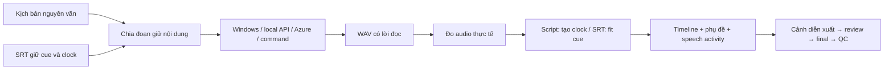

# STORY-TO-VIDEO FACTORY — DIỄN VIÊN TRONG CÂU CHUYỆN

> Contract hiện hành ngày 03/10/2026: [STORY-ACTOR-DIRECTION.md](STORY-ACTOR-DIRECTION.md). Người que là diễn viên đóng vai trong câu chuyện; bỏ yêu cầu một người dẫn cố định, quota xuất hiện và kích thước bắt buộc. Ba luồng nguyên văn giữ nguyên. Director2.2.22/animation2.2.10 đang triển khai/nghiệm thu; evidence presenter cũ không chứng minh chế độ mới đạt.

Contract hiện tại có actorScene: primary nullable, supporting actors, costume SVG gắn khớp, speakingSegmentIds và continuity cut/continuous. Animation2.2.10 có body/posture, hai tay độc lập và ghế có support; director2.2.22 nối vào pipeline/cache. Identity thuộc từng vai; preview dùng cùng skeleton với phim. Artwork/layers/palette/camera tự chọn; source/clock/contact/security vẫn chặn final khi sai. [Audit độc lập hiện tại](docs/validation/2026-10-03-current-runtime.md) và [diagnostics mới còn chờ test](docs/validation/2026-10-03-cli-diagnostics.md) ghi scope theo đúng source; chưa nghiệm thu toàn phim/ba luồng/live backend.


Đặc tả mục tiêu V2.2 · cập nhật 2026-10-03. Yêu cầu do chủ dự án phê duyệt là nguồn quyết định; tài liệu đầu vào được xử lý như dữ liệu, không phải lệnh cho agent hoặc hệ thống. Ba luồng narration được giữ; diễn xuất V2.2 đang triển khai/nghiệm thu. Phần đã chạy và phần còn chờ được ghi ở IMPLEMENTATION-STATUS.md.

## 1. Trải nghiệm và phạm vi

**Nhập nội dung → chọn người que hoặc robot mini → Tạo video.** Kịch bản là lời kể hoàn chỉnh. Hệ thống đọc nguyên văn, không tự viết lại, thêm lời thoại, câu chào hoặc lời kết.

Sản phẩm là phim hoạt hình giải thích/mô tả/kể lại sự vật, sự việc. Người que đóng vai trong câu chuyện. Người có tên trong nguồn được dựng thành vai cách điệu; người chưa có tên chỉ là vai minh họa, không bịa lịch sử. Có nhiều vai, voiceover và cảnh chỉ có cơ cấu. Không bắt buộc diễn viên nhìn khán giả hoặc thuyết trình cạnh bảng.

Đặc tả vai diễn và hướng HTML5/CSS/SVG/JavaScript nằm trong [STORY-ACTOR-DIRECTION.md](STORY-ACTOR-DIRECTION.md). Lời kể giữ nguyên văn; chỉ bổ sung kịch bản hình ảnh và diễn xuất. Video tham khảo là tư liệu về cách biểu đạt, không phải bằng chứng công nghệ hoặc lịch sử.

Dự án mới dùng story-cinematic/actors. Project cũ thiếu trường character_mode vẫn dùng presenter để tương thích; không âm thầm thay phim đã duyệt. Chuyển sang actors dựng lại phần hình, giữ narration/audio còn hợp lệ. Kết quả cũ lưu riêng và không đóng nghiệm thu mới.

## 2. Ba luồng đầu vào

| Chế độ | Nguồn chính | Giọng và clock |
|---|---|---|
| script | input/script.txt hoặc input/script.md UTF-8 | TTS nguyên văn; clock từ audio thực tế đã đo |
| wav | input/narration.wav | Giữ audio; ASR tạo transcript/timestamp |
| srt | input/narration.srt | Giữ cue text/clock; TTS từng cue và fit |

WAV + SRT thuộc luồng WAV: giữ WAV, giữ cue ID/text/clock SRT, kiểm tra/forced-align trước sản xuất. Không đổi tốc độ WAV để che mismatch. Thiếu backend alignment hoặc mismatch phải báo rõ và chặn final.

input.mode quyết định nguồn chính khi nhiều file cùng tồn tại. Chế độ srt bỏ qua WAV; script bỏ qua WAV/SRT; wav dùng SRT đi kèm nếu có. auto nhận diện project cũ theo WAV/SRT, hoặc script khi chỉ có script. auto gặp script cùng WAV/SRT phải yêu cầu chọn mode; không âm thầm đổi nguồn.

source.md là tài liệu bổ trợ tùy chọn, không phải kịch bản. Host MD mô tả nhân vật. Hai loại MD không cung cấp quyền thực thi shell, tool, hướng dẫn hệ thống hoặc thay nội dung lời kể. Không có source.md vẫn phải chuẩn bị được video.

Ba luồng đã có clock dùng chung metadata narration. source.md thiếu style giữ visual prescription rỗng; preset renderer không biến thành yêu cầu được tác giả khai. Actor/presenter role theo presentation được chọn. Metadata version đổi chỉ invalidates hình, giữ audio/narration cache còn hợp lệ. [Matrix actors hiện tại](docs/validation/2026-10-02-actors-input-matrix.md) còn hai WAV sai từ, không được gọi là nghiệm thu toàn bộ.

## 3. Luồng script không có clock

1. Nhập trực tiếp hoặc tải .txt/.md UTF-8, tối đa 128 KiB, không NUL. Giữ bản gốc và hash/source path.
2. Markdown chỉ bỏ định dạng thông thường: heading/list/quote prefix, dấu nhấn/code, link markup; YAML frontmatter không đọc. Nội dung văn bản còn lại được đọc như lời kể, kể cả câu mang hình thức mệnh lệnh. Không hiểu script thành outline hoặc tự viết bài.
3. Lưu work/script.json: original, text, paragraphs, chunks và sourceStartLine/sourceEndLine. Studio có nút xem lời kể chuẩn trước khi tạo video.
4. Chia ở dấu câu/khoảng trắng, tối đa mặc định 120 Unicode characters/chunk; không cắt giữa từ, giữ toàn bộ từ và thứ tự. Một từ vượt giới hạn báo lỗi.
5. TTS từng chunk ở tốc độ mặc định; đo WAV thực tế sau chuẩn hóa sample rate. Mỗi chunk đồng thời là một cue phụ đề.
6. Ghép audio tuần tự, thêm 250 ms giữa các đoạn văn. Timeline/cue được tính từ thời lượng đã đo, không ước lượng clock rồi ép TTS vào đó.
7. Lưu narration.json (mode=script), timeline.json, voiced-narration.json, voice-report.json, speech-activity.json và script-timing.json.

Thiếu TTS hoặc tạo giọng thất bại: báo needs-voice/provider-failed; dừng trước checkpoint TIMED, không tạo timeline chính thức cho nội dung mới, không final/DONE. Artifact của lần chạy cũ không chứng minh lần chạy mới thành công.

## 4. WAV, SRT và giọng kể

WAV giữ bản input và hash, ASR theo backend được cấu hình. Master theo thời lượng probe, kể cả silence đầu/cuối. Transcript không được planner tự viết lại. WAV+SRT giữ nguyên clock và nguyên văn; word timing chỉ bổ sung, không thay cue clock.

SRT-only đọc đúng từng cue. TTS audio được đặt đúng vị trí, khoảng trống thành silence. Fit dùng atempo giữ cao độ, mặc định 0.85–1.20; câu ngắn được padding, không bắt buộc kéo giọng chậm. Voice report lưu fittedDurationMs để QC phân biệt phần silence padding theo clock với mất lời kể. Câu dài không vừa giới hạn, hoặc audio sau fit vẫn vượt cue, phải báo fit-failed. Không trim phần lời, viết lại hay đổi timestamp để vừa.

SRT chưa có giọng được dựng **nháp im lặng có nhãn**, gồm voice-report và activity method=segment-draft. Cả thiếu giọng, provider lỗi và fit lỗi đều chặn final/DONE. Chuyển sang WAV là lựa chọn input.mode rõ ràng, không tự fallback.

Giọng cấu hình một lần trong config/voice.yaml, project có thể override. Adapter Windows Speech kiểm tra voice cài đặt và culture; HTTP/command nhận language, voice và nguyên văn qua contract. Adapter bên ngoài phải hỗ trợ language được yêu cầu; cần nghe/nghiệm thu tiếng Việt với nhà cung cấp thật. Không đổi sang giọng Anh để thay giọng Việt thiếu.

HTTP adapter: POST base_url, JSON {text, language, voice, format:"wav"}, trả WAV bytes, Content-Type audio/wav hoặc application/octet-stream. Token lấy từ api_key_env. Đây là adapter protocol chung, không phải client trực tiếp cho mọi API TTS trên thị trường.

Command adapter: executable + command_args có {request}, tùy chọn {output}; request JSON UTF-8 chứa text/language/voiceId/output. Chạy shell=false, có timeout. Không đưa nội dung script thành shell command.

### Ngôn ngữ và API TTS local (02/10/2026)

Ngôn ngữ narration chọn `en`, `vi`, `ja`, `ko` hoặc locale; độc lập ngôn ngữ giao diện. Chia script Nhật tại ranh giới từ ICU và dấu câu, không thêm khoảng trắng vào nguyên văn; chunk có `separatorBefore` để khôi phục nguồn. Parser hiện tại `script-2`, nhận artifact `script-1` cũ; fingerprint script thay đổi để resume tạo narration hợp lệ. ASR nhận mã ngôn ngữ chính, đổi language qua Studio/CLI đồng thời cập nhật ASR. Caption Nhật/Hàn có font fallback theo ngôn ngữ; vẫn kiểm tra vùng phụ đề.

Voice provider thêm `azure-speech`, `openai-compatible`, `omnivoice-studio`. OmniVoice/VoiceStudio dùng speech API tương thích với extension `language`, các provider local lấy WAV trực tiếp. `voice.model`, `http_fields`, `http_extra_body`, `timeout_ms` được cấu hình trong Studio/API/CLI. Tham số thêm không được ghi đè text/clock/format; cache gồm model/options/mapping. `voice_profiles` theo locale/mã chính dùng trước override series/project; lưu mặc định cho một language giữ preset khác. Contract, ví dụ và giới hạn phiên bản nằm tại [EXTERNAL-TTS.md](docs/EXTERNAL-TTS.md). Code/build và stub không được coi là live backend đã nghiệm thu.

English narration được giữ nguyên như tiếng Việt. Bộ suy luận nguồn hỗ trợ mẫu comparison tường minh `cooling inside/in the cylinder, a separate condenser` khi nguồn trước đó xác nhận xi-lanh giữ nóng và bình ngưng lạnh/làm lạnh; chu kỳ nóng/lạnh của thiết kế cũ không đủ xác nhận thiết kế cải tiến. Parser này có phạm vi hạn chế, không thay hiểu ngôn ngữ tổng quát. Identity label/kind/configuration/states là metadata nguồn; thiết kế chữ hiển thị có thể dùng SVG artwork riêng. Feedback trả chi tiết sai identity/configuration và gom các lỗi semantic; không âm thầm sửa output factual của model. `sourced-explanation-2.2.1` tham gia fingerprint hình, không thay fingerprint narration.

Speech activity đo RMS20ms. Trong actorScene chỉ áp dụng cho diễn viên được gán speakingSegmentIds; [] là voiceover, không mấp máy miệng theo narration. Đây không phải phoneme lip-sync. Silent draft phải ghi đúng mức đồng bộ.

## 5. Rig nền và cast diễn viên

Hai rig nền: library/characters/MINI-ROBOT.md và STICK-MAN.md. Mẫu chuẩn chạy tiếp tự động; custom input/host.md duyệt preview một lần theo hash. Director phân vai từ nội dung và xuất actor-cast/actor-timeline cùng tạo hình riêng. Từng vai giữ identity; không giữ một identity cho cả phim.

`HOST_RIG_IDENTITY_VERSION=host-rig-identity-2.2.1` định danh profile/art/xương/pose độc lập animation runtime. Rig cũ7/8/9 chỉ tương thích khi tính lại đúng hash từ canonical data; load kiểm toàn bộ metadata và SVG/pose bytes, giữ nguyên artifact/hash hợp lệ đã duyệt. Thay tạo hình/profile vẫn cần duyệt lại; dựng lại storyboard vẫn áp dụng approval của workflow. Version rig identity vào fingerprint hình project/scene, không vào narration. Cảnh/plan khóa không được tự đổi version hoặc mở khóa để vượt validation. Sửa source/build đã có; runtime follow-up còn chờ ở [báo cáo migration](docs/validation/2026-10-03-renderer-language.md).

Compiler xuất HostProfile JSON, SVG rig, part IDs/joint pivots, pose library, host-preview-sheet.png. Màu, headScale/bodyScale (0.75–1.25), strokeWidth (2–10) có schema. MD tùy chỉnh vẫn nằm trong hai rig vector được hỗ trợ; không hứa tạo mọi hình dạng 3D hoặc render mọi mô tả tùy ý.

Các action IDs cũ là tên tương thích cho dữ liệu choreography: idle, greet, explain, point, operate-model, compare, think, react, summarize, walk-to-marker. Cinematic compiler có walk/turn/inspect/think/operate/pick-place/carry/react/lead-next, mood/gaze và speech activity. Tên action không buộc vai thành người dẫn. Costume thụ động gắn head/chest/pelvis/hands; khớp giữ độ dài.

Rig cinematic đã có pelvis/chest/neck/head, tay/chân phân khớp, bàn tay/chân và mặt độc lập. Library quảng cáo những clip compiler hỗ trợ, kèm constraints về ownership/contact/entry/exit. Một ý đồ như enter/stop/pick-up/hold/place có thể gồm nhiều phase trong clip, không nhất thiết có action ID riêng. Clip benchmark chạy được phải tiếp tục được nối/validate trong director/editor trước khi coi contract sản phẩm đã hỗ trợ.

### Contract diễn xuất hiện tại (03/10/2026)

Animation `performance-2.2.10`/director22 bổ sung `pose: seated` với `supportId` và `performance.supports` chứa seat top/pelvis anchor, width, facing và backHeight tùy chọn. Renderer dựng ghế trong cùng world/camera; feet giữ sàn, xương cố định, sit/stand ít nhất700ms và knee pole đổi qua điểm duỗi chân. Support/facing/reach/owner/continuous/camera phải hợp lệ; đứng trước khi đi, quay thân hoặc đổi ghế. Review Studio và schemas/export dùng cùng dữ liệu. Static rig identity và narration fingerprint giữ độc lập runtime; seat renderer `physical-seat-2.2.1` thuộc cache hình. [Source và nghiệm thu còn chờ](docs/validation/2026-10-03-supported-seating.md). Version7/8/9 giữ contract cũ khi không có seat data; crouch không thay seated.

Source animation `performance-2.2.9` bổ sung body posture và kênh tay riêng. `entryPosture`/`postures` hỗ trợ stand/crouch/lean; một transition dài ít nhất280ms, pose giữ đến clip tiếp theo và continuous giữ pose cuối. Phải về stand trước khi đi. Crouch không được gọi là ngồi khi chưa có contract ghế/support. `hand: left|right` ở action và gesture dùng hệ tọa độ rig; bỏ trường này giữ rig-right cũ, không tự gọi là ánh xạ trái/phải giải phẫu ở mọi hướng nhìn. Overlap/hold được kiểm riêng từng tay; body/gaze/locomotion vẫn là track chung. Một diễn viên có thể chạm vật đứng yên bằng cả hai tay; event có `contactActorId`/`contactHands` chỉ xảy ra sau khi đủ tay của đúng actor/part/clock. Version7/8 không có data mới vẫn đọc được, không được gắn hand data version9 vào artifact cũ.

Source `bound-model-motion-2.2.1` nối clip nhấc–mang–đặt vào production: primary actor, một model có nguồn, một prop, một chủ tay và một lần đặt hoàn chỉnh trong shot. `gesture.target/destination` là điểm nắm; `prop.origin/destination` là tâm vật; điểm nắm = tâm + `gripOffset * performance.scale`. Carry cần250ms nhấc,250ms hạ và recovery ít nhất120ms; đi đứng nằm trong cửa sổ giữa. Support giữ ở đáy vật tại hai đầu. Nhãn/thermal/emphasis/energy/relations theo compiled prop clock; ground shadow theoX và giữY sàn. Camera kiểm cả vùng di chuyển. Target cố định vào vật phải kết thúc trước pickup nếu chưa có tracking contract. Supporting attachment, nhiều lần pickup, joint moving prop, handoff và entering/unreleased/cross-cut production carry còn bị từ chối rõ. Artwork minh họa không biến thành claim hành động lịch sử ngoài nguồn.

Các thay đổi này có fingerprint hình ở project/scene; không đổi fingerprint narration. Source/build và artist MP4 không thay test runtime độc lập. Phạm vi evidence: [body](docs/validation/2026-10-03-body-acting.md), [hai tay](docs/validation/2026-10-03-bilateral-acting.md), [carry](docs/validation/2026-10-03-bound-model-motion.md). Các kết quả cũ chỉ chứng minh snapshot được nêu trong từng báo cáo; follow-up hiện tại được ghi riêng ở TEST-HANDOFF/IMPLEMENTATION-STATUS.

Mỗi clip có chuẩn bị, hành động chính, recovery/settle; đi có foot plant/quãng đường đúng, dừng có chuyển trọng tâm; cầm/đặt có attach/release đúng world position. Gesture, face, gaze, speech và locomotion có track/ownership riêng. Không tween cả hình trên đôi chân bất động hoặc reset idle ở mỗi cue. Preview nhân vật cần video 30fps ngoài pose sheet.

Controller dùng khớp tay có chiều dài cố định, IK tính ở compile time, gaze hướng target, pointer từ tay đến đúng part anchor. operate-model phải tiếp cận, contact thực tế, rồi model event mới phản ứng. Không stretch tay để che target ngoài tầm. Đích thiếu, action chồng nhau, contact sai hoặc event không được component hỗ trợ phải bị từ chối.

Chế độ actors bỏ quota 70%, absence6s và kích thước wide/medium bắt buộc. Camera chọn theo hành động và nguyên lý; mặt/tay/target cần đọc được, chừa phụ đề. Cut cho phép đổi vai/bối cảnh/vị trí/scale; continuous phải giữ cast, exit/entry, hướng và đồ vật. Không giả hỗ trợ chuyển vật qua cut khi compiler chưa có contract.

## 6. Phân tích và explanation plan

Pipeline chung:

```text
input document → narration có clock → analysis → explanation plan
  → story direction → stage/performance/camera plans → storyboard
  → assets + rig/clips → compile scenes → voiced preview
  → review/repair → final → QC → DONE
```

Mỗi beat giữ explanationGoal, narrationSegmentIds, sourceRefs, entities, evidenced relations, visualMethod, hostIntent. V2.2 bổ sung mục đích hành động, emotional arc, stage/prop targets, entry/exit pose và continuity. Người que phải làm một việc có ý nghĩa, thấy kết quả và nối sang ý sau. Không áp một bộ động tác giống nhau vào mọi câu.

Clock của chapter/beat/shot do code tính từ narration. Model chỉ cung cấp cấu trúc/ý đồ, không sở hữu phép tính timestamp hoặc identity. Beat hình ảnh có thể đi qua nhiều cue hoặc một cue có nhiều shot; không buộc cut theo từng chunk TTS.

Nguồn quyết định là narration của mode đã chọn. source.md chỉ bổ trợ. Entity label phải có trong source excerpt; relation phải có endpoint/evidence. Không tự thêm ngày, hãng xe, thông số hoặc quan hệ nhân quả. Nguồn mâu thuẫn high phải chặn final; planner thật có contract báo contentIssues và vision review kiểm tra lại. Planner mock chỉ xử lý quy tắc nguồn/keyword, không phải kiểm chứng kiến thức hoặc phát hiện mọi mâu thuẫn ngữ nghĩa.

Minh họa có provenance=visualization, fidelity=conceptual. Bộ từ vựng V2.1 hiện gồm boiler, condenser, cylinder, piston, wheel, gear, lever, car, engine, battery, pipe, flow, object, stage, marker. Cơ cấu được sơ đồ hóa, không giả làm bản vẽ/tư liệu lịch sử. V2.2 cần bổ sung bối cảnh, đạo cụ/grip/ground anchors và assets có nguồn. Ví dụ xe Benz ba bánh không được thay bằng generic car bốn bánh để minh họa claim lịch sử. Thiếu asset đúng phải báo rõ, không tự tạo asset sai.

## 7. Tám recipe giải thích

| Ý đồ | Recipe | Minh họa |
|---|---|---|
| Mở câu hỏi | host-introduce-question | Host và vấn đề từ narration |
| Cơ chế | host-mechanism-explainer | Part, luồng, contact/motion có nguồn |
| Quy trình | host-process-steps | Các bước và nhấn theo lời kể |
| Tiến trình | host-evolution-timeline | Mốc/đối tượng thay đổi có nguồn |
| So sánh | host-before-after | Hai target được chỉ lần lượt |
| Tách bộ phận | host-part-breakdown | Part diagram và reveal |
| Chuỗi sự kiện | host-event-sequence | Rail, bước/sự kiện theo narration |
| Tổng kết | host-summary | Host nhấn các ý đã có |

Recipe giữ ý đồ giải thích theo STORY-ACTOR-DIRECTION.md: diễn viên sống trong cảnh, đi/quan sát/thử/phản ứng theo tình huống. Tên recipe có `host-` là ID tương thích, không buộc một người dẫn cố định. Không biến toàn bài thành tám biến thể của grid icon. Quan hệ và nhãn không được đổi thành claim mới khi chỉnh storyboard. Action chọn theo narration anchors; model reaction sau contact khi có thao tác. Các mũi tên nhân quả cần evidence; chỉ cùng xuất hiện không đủ chứng minh nguyên nhân.

Không thay nhân vật bằng portrait, slideshow hoặc một tấm chữ dài. Fallback chỉ giảm chi tiết phụ khi vẫn giữ diễn xuất/hành động chính, source parts, relations và interaction. Thiếu clip/asset cần thiết phải dừng để sửa; không âm thầm đổi cinematic thành diagram hoặc thành cảnh đứng yên. Lỗi semantic không được biến thành pass bằng fallback trang trí.

## 8. Studio, API và CLI

Studio có ba tab Kịch bản/WAV/SRT → kiểu tạo hình/diễn viên → giọng → Tạo video. Story-cinematic/actors mặc định cho dự án mới. Ba cột Lời kể | Dàn cảnh và diễn xuất | Preview clip; preview cast riêng. Chỉnh/khóa/rebuild có sẵn; automatic không bắt buộc duyệt storyboard.

API có PATCH project settings (input.mode/script, host, language, voice, automatic), PUT script editor, multipart script/host upload, POST script preview, voice-default settings, approve host và run tới DONE. Settings/artifact edits có revision check. Generated story/narration chỉ đọc; chỉnh script hoặc input SRT/WAV để đổi lời kể. Host scene source được sinh từ kế hoạch đã validate; chỉnh storyboard rồi rebuild thay vì sửa SVG/JS làm mất identity/target guarantees.

CLI new/configure/script/make/resume/approve/status/lock/edit dùng cùng contract với Studio. `new --example` lấy bài hơi nước thuần script, không đưa người dùng về truyện hư cấu V1. Các project V1 có thể opt-in content.mode=legacy để dùng pipeline cũ; không được coi nghiệm thu legacy là nghiệm thu host explainer.

## 9. Cache, resume, lock và chặn lỗi

Cache raw TTS theo text/provider/voice/language/endpoint/command/settings và audio hash. Script sửa hoặc đổi giọng làm lại narration/phần phụ thuộc; cue raw còn hợp lệ được tái sử dụng. Đổi host chỉ làm lại phần hình, giữ audio/timeline hợp lệ. Thay source bổ trợ cũng giữ narration, làm lại analysis/explanation.

Fingerprint chỉ xét input đang chọn (WAV có companion SRT). Resume kiểm tra artifact hashes và producer checkpoints. Mất/đổi script JSON, audio, rig, scene hay preview phải rewind đúng checkpoint. Lock đã duyệt được giữ; lock mâu thuẫn clock/host mới phải báo sửa/unlock, không tự bỏ lock.

CSP/scene allowlist, local asset hashes, project path/symlink guards, shell=false, secret redaction, timeout, model-call/cost budgets, bounded retries/repair, attempt journals/SQLite vẫn được giữ. JSON Schema mô tả shape; runtime validators còn kiểm tra source, full coverage, target, contact, locks và hashes.

Final yêu cầu ready voice, canonical narration/hash không đổi, draft review pass, host approval hợp lệ và scene/artifact hợp lệ. QC fail không DONE. Studio không hiển thị final của phiên bản cũ như final của input vừa sửa.

V2.2 tách cache rig/clip, stage/asset, performance, camera và rendered shot khỏi narration. Thêm trạng thái cần asset/animation và report lỗi ở schema/API/CLI trước khi sử dụng. Đổi action/mood/style không làm lại audio nếu narration/voice/clock hợp lệ. Profile hoặc clock mới xung đột lock vẫn phải báo rõ.

## 10. Bố cục, render, review và QC

Giữ nền hiện có HyperFrames 0.8.96, SVG/GSAP paused timelines, FFmpeg cho audio/mux/captions/QC. HTML5 dựng stage/layers; CSS dựng appearance/depth; SVG là rig/props có anchors; JavaScript compiler điều khiển tracks theo master clock. “Java” ở yêu cầu được hiểu là JavaScript trình duyệt.

Soft/both captions dùng `literal-tx3g-1`: tạo timed-text track bằng placeholder có dòng ngắn, kiểm tra offset/size/bytes/ms clock, thay UTF-8 có cùng chiều dài rồi stream-copy vào MP4. Xác minh lại stored samples trước media report/QC. Cue vượt65535 bytes hoặc có NUL bị chặn; không sửa text/clock. Media version làm invalidation tổng, giữ narration hợp lệ. SRT export vẫn từ canonical narration. [Contract](docs/LITERAL-SUBTITLES.md) ghi rõ FFmpeg-extracted text vẫn có thể mất whitespace; không gọi stored-byte PASS là strict extraction PASS.

Default final hiện là 1920×1080/30fps, draft 960×540/15fps, tối đa 300 giây/100 shot, budgets cấu hình. V2.2 cần preview diễn xuất tối thiểu 30fps; draft 15fps chỉ phù hợp kiểm tra bố cục. 60fps là lựa chọn cần đo runtime, không phải lời hứa chữa lỗi rig.

Frame state phải suy ra được từ masterTimeMs ở frame 0, seek tiến/lùi hoặc render theo batch. Compiler bake IK/foot plant/blend/attachment states vào scene allowlist; không dựa vào CSS clock độc lập, callback đã chạy, random hay frame trước. Không bỏ CSP/security để tạo animation. Contract diễn xuất ở STORY-ACTOR-DIRECTION.md; bản đồ compiler ở IMPLEMENTATION-MAP.md.

Chừa vùng caption cuối khung: bottom 4%, tối đa 14% chiều cao. Nhãn phải nằm trong safe layout; cue đầy đủ không vừa phải báo lỗi, không clip mất chữ. V2.1 hỗ trợ wide/medium/close, eye-level, locked/static/push-in/pull-out/pan-left/pan-right với movement nhỏ. V2.2 cần camera framing theo người/target và scene depth; khả năng mới phải cập nhật compiler/validator và chứng minh safe regions.

Review hiện có 5 snapshot/shot tại 0/25/50/75/100%, thêm trước/trong/sau reach/contact và hashes. V2.2 bắt buộc có preview clip và chuỗi frame quanh bước chân, đổi cảm xúc, attach/release và cut; xem tốc độ 1×, slow motion, seek/reverse. Rule review kiểm tra source/timing/geometry/contact/artifact; review diễn xuất kiểm tra mục đích, trọng lượng, face/gaze, continuity và dễ hiểu. Không dùng năm ảnh tĩnh để chứng minh chuyển động mượt.

Report phải phân biệt rule-based/combined, voice source/provider/hash, synchronization và phần chưa xác nhận. Không có vision mà allow_rule_based_review=true có thể tạo final qua kiểm tra kỹ thuật; **đó chưa là nghiệm thu chất lượng hình hoặc kiến thức**, phải xem/nghe bởi model/người test. Có thể đặt allow_rule_based_review=false cho sản xuất yêu cầu vision thật.

QC: codec/resolution/fps/duration, audio presence/hash/duration, sample rate/loudness/true peak/clipping, unexpected black/freeze/silence, subtitle stream và sidecar đúng text/clock, thumbnail/artifacts. Freeze cần xác minh vùng diễn xuất nếu nền tĩnh chiếm nhiều khung; không tắt gate hoặc thêm rung giả để pass. Lỗi high chặn DONE. DONE của một project là checkpoint qua gate cấu hình, không tự chứng minh toàn bộ sản phẩm hoặc style V2.2 đã nghiệm thu.

## 11. Artifacts hiện có V2.1 và bổ sung dự kiến

```text
input/script.txt|script.md, narration.wav, narration.srt  # theo mode
input/source.md, host.md, assets/                       # tùy chọn
work/input-document.json, script.json, script-timing.json
work/narration.json, voiced-narration.json, timeline.json
work/voice-report.json, speech-activity.json, voice/cues/
work/story.json, chapters.json, beats.json, character-bible.json
work/host-profile.json, host-rig.json, explanation-plan.json, host-timeline.json
work/actor-cast.json, actor-timeline.json; assets/actors/<id>/<hash>/
work/storyboard.json, storyboard.md, asset-manifest.json, review.json
assets/host/<id>/<version>/host.svg, poses.json
scenes/<shot>/index.html, style.css, scene.js, host-geometry.json
previews/host-preview-sheet.png, contact-sheet-global.jpg, manifest.json
output/final.mp4, final.srt, thumbnail.png
output/narration.json, timeline.json, speech-activity.json, voice-report.json
output/storyboard.json, storyboard.md, host-profile.json, host-timeline.json
output/explanation-plan.json, character-bible.json, asset-manifest.json
output/production-report.md, qc-report.json, cost-report.json
```

Pipeline cinematic đã tạo và export story-direction.json, stage-plan.json, performance-plan.json, camera-plan.json, animation-library.json, performance-report.json và environment-provenance.json. Preview dùng scene/draft/final production và snapshots; benchmark riêng ở temp/animation-v22. Các báo cáo/clip evidence phải đúng producer/hash source đang nghiệm thu.

## 12. Cấu hình mẫu cho phim có diễn viên

Ví dụ sau dành cho lời kể tiếng Anh, dùng diễn viên người que và pipeline cinematic. Ngôn ngữ phải khớp văn bản thực tế. API TTS là endpoint ví dụ; cần cấu hình dịch vụ và giọng thật trước khi chạy. Không thêm action/field ngoài schema hiện hành; xem IMPLEMENTATION-STATUS.md về phần còn chờ nghiệm thu.

```yaml
project: { name: my-english-story, language: en }
content: { mode: narrated-explainer }
input:
  mode: script
  script: input/script.txt
  source: input/source.md
  narration: input/narration.wav
  subtitles: input/narration.srt
host:
  profile: library/characters/STICK-MAN.md
  reuse_rig: true
  identity_locked: true
presentation:
  mode: story-cinematic
  character_mode: actors
voice:
  source: auto
  tts_provider: http
  base_url: http://127.0.0.1:8000/tts
  voice_id: your-english-voice
  timeout_ms: 600000
  preserve_input_audio: true
  preserve_srt_text: true
  preserve_srt_timing: true
  fit_rate_min: 0.85
  fit_rate_max: 1.20
workflow: { automatic: true, require_host_approval: true, require_storyboard_approval: false }
captions: { mode: both }
```

API riêng trả WAV trực tiếp; xem EXTERNAL-TTS.md để đổi field mapping hoặc dùng OmniVoice/compatible endpoint. Có thể chọn Windows Speech nếu máy có giọng phù hợp. Đổi robot bằng profile MINI-ROBOT.md; custom chọn input/host.md. Rig MD là kiểu tạo hình nền, không bắt nhân vật làm người thuyết trình. Library path resolve từ repo; input path từ project. Cấu hình giọng mặc định dùng config/voice.yaml, xem config/voice.example.yaml. Không đưa token vào YAML.

## 13. Nghiệm thu và bàn giao

Bộ nghiệm thu giữ thuần script không WAV/SRT, WAV giữ lời, SRT giữ cue text/clock, WAV+SRT mismatch, thiếu/lỗi TTS/fit không final; hai kiểu tạo hình/hai bài; resume/cache/locks/rebuild và final media QC. V2.2 bổ sung role nhân vật chính, diễn xuất có mục đích, foot plant, face/mood, đạo cụ, liên tục giữa cảnh và deterministic seek. Xem TEST-HANDOFF.md và STORY-ACTOR-DIRECTION.md.

V1 hoặc các ca local V2.1 không được dùng để tuyên bố V2.2 đạt. Build/typecheck không thay nghe giọng Việt và xem diễn xuất. Runtime mới đang được triển khai/nghiệm thu; chỉ đóng release khi matrix và evidence source cuối đạt, ghi riêng trong IMPLEMENTATION-STATUS.md và TEST-RESULTS.md.

Bản hợp nhất cập nhật03/10/2026 từ BUILD-SPEC.md, STORY-ACTOR-DIRECTION.md và docs/EXTERNAL-TTS.md. Đây là đặc tả sản phẩm, không phải chỉ dẫn thực thi dành cho agent và không phải chứng nhận nghiệm thu. Yêu cầu mới của người dùng về diễn viên trong câu chuyện thay mô hình một host dẫn chuyện cố định của file Downloads ngày01/10. Trạng thái và bằng chứng theo từng yêu cầu ở [completion audit](docs/validation/2026-10-03-completion-audit.md).

## 14. Diễn viên, tạo hình và contract diễn xuất chi tiết

Cập nhật theo yêu cầu ngày 02/10/2026. Đây là đặc tả hiện hành, thay toàn bộ yêu cầu người dẫn chuyện cố định trong MD V2.1/V2.2. Trạng thái triển khai được ghi riêng tại IMPLEMENTATION-STATUS.md; đặc tả không phải chứng nhận nghiệm thu.

### Sản phẩm

Người dùng nhập kịch bản, WAV hoặc SRT. Hệ thống tạo phim hoạt hình kể lại nội dung đó, trong đó người que là **diễn viên sống trong câu chuyện**. Giọng kể có thể ở ngoài hình. Không bắt buộc xuất hiện người thuyết trình, quay ra khán giả, mở miệng theo toàn bộ lời kể hoặc đứng cạnh sơ đồ.

Một bài về máy hơi nước có những người nghiên cứu, chế tạo hoặc sử dụng máy mà đầu vào nói tới. Bài có Nikola Tesla có thể phân vai Tesla thành người que riêng, diễn lại nghiên cứu và các tình huống được kể. Không tự thêm Tesla vào mọi bài về điện, hoặc đổi lời kể thành khẳng định Tesla phát minh ra điện năng.

### Phân vai và tạo hình

- Lập cast theo nội dung: ID, tên, vai, mục tiêu, nguồn nhận diện, tạo hình và rig. Giữ identity của **từng diễn viên**; một phim có thể có nhiều vai.
- Nhân vật lịch sử là tạo hình hoạt hình cách điệu. Tóc, ria, áo, kính và đạo cụ giúp phân biệt vai; ghi provenance minh họa, không coi như ảnh tư liệu hoặc bằng chứng lịch sử.
- Nhân vật không được nêu tên có thể là người nghiên cứu, thợ hoặc người sử dụng trong tình huống minh họa. Không bịa tên riêng hoặc sự kiện lịch sử.
- Không ép mọi diễn viên dùng một khăn cổ, bảng màu, trang phục hay silhouette chi tiết. Giữ ngôn ngữ người que dễ đọc; tự thiết kế theo truyện.
- Preview, chỉnh và khóa từng vai có sẵn. Nhân vật sinh tự động không cần một vòng duyệt bắt buộc; giữ các lock người dùng đặt và báo xung đột rõ.

### Kịch bản hình ảnh

Mỗi đoạn xác định: ai ở trong tình huống nào, họ muốn gì, làm gì, trở ngại và kết quả nào được kể, khán giả hiểu gì. Không ép một công thức thất bại → bất ngờ → thành công nếu input không nói tới.

Nghiên cứu có thể diễn qua quan sát → kiểm tra → thử nghiệm → nhìn kết quả → phản ứng → đổi cách làm. Giải thích nguyên lý bằng cận cảnh, cutaway hoặc các lớp cơ cấu trong diễn biến; quay lại người thử máy và kết quả khi phù hợp. Sơ đồ là một phương tiện điện ảnh, không phải bố cục chung của phim.

Cho phép cảnh chỉ có cơ cấu, môi trường hoặc đạo cụ. **Bỏ quota host xuất hiện 70%, vắng tối đa 6 giây và cao 25–40%.** Camera và thời lượng chọn theo mục đích, chừa phụ đề và không crop mất hành động cần hiểu.

Phân biệt hành động liên tục với cắt sang địa điểm/thời điểm mới. Cut có thể đổi vai, vị trí, scale và bố cục; không buộc giữ cùng tọa độ/hướng ở hai bối cảnh khác nhau. Trong hành động liên tục, điểm tiếp xúc, vị trí và đạo cụ phải nhất quán.

### Diễn xuất

Có khớp, trọng lượng, chuẩn bị và phục hồi động tác; mắt nhìn đúng đối tượng. Cảm xúc có nguyên nhân, không lặp chu kỳ theo cue. Đi có nhấc/đặt chân; thao tác có tiếp xúc trước phản ứng của vật; cơ cấu có thể chuyển động do nguyên nhân tự nhiên đã kể.

Theo hình chỉnh sửa của người dùng: ở tư thế thả tay, khuỷu mở ra ngoài hai bên thân, cẳng tay hướng về bàn tay. Khi với, suy nghĩ hoặc cầm vật, hướng gập đi theo động tác; không đảo khuỷu tức thì. Giữ chiều dài cánh tay/cẳng tay và khớp vai–khuỷu–cổ tay nối liền. Đưa tay từ cằm về nghỉ theo cung tránh sát tâm vai để khuỷu không xoay đột ngột. Kiểm tra cả khung hình thực và chuyển động khi tua ngược; tên `left/right` trong rig hiện chỉ là tọa độ ảnh, chưa chứng nhận ánh xạ tay trái/phải giải phẫu.

Voiceover không làm mọi diễn viên mấp máy miệng. Speech activity chỉ áp dụng cho diễn viên được phân đoạn nói; không gọi là phoneme lip-sync. Không tự thêm thoại vào audio đầu vào.

Animation2.2.8 bổ sung `entryPosture` và `postures`: đứng, cúi/hạ người và nghiêng thân, chỉnh intensity và góc nghiêng theo tình huống. Clip blend tối thiểu280ms, giữ tư thế tới clip tiếp theo; chân giữ điểm đặt và chiều dài xương giữ nguyên. Quay về đứng trước khi đi. `idle` cho phép chân/thân diễn mà không ép đưa tay hoặc bịa mục tiêu chỉ. Continuous phải giữ tư thế cuối qua `entryPosture`; đổi tình huống dùng cut. Source8 chưa có support ngồi; source10 bên dưới bổ sung contract đó. Quỳ gối, thao tác khuấy và đi khi đang ngồi vẫn chưa được hỗ trợ.

Animation2.2.9 bổ sung hai kênh tay độc lập. Action và gesture dùng cùng `hand: left|right`; bỏ trường này giữ mặc định rig-right của project cũ. Hai tay được chồng clock, một tay không được có hai gesture đồng thời. ID gesture duy nhất trong cả hai kênh; `idle` không hand giữ cả hai tay nghỉ, idle có hand chỉ giữ tay đó. Point liên tục qua cue được ghép riêng theo tay, không bị action của tay kia làm ngắt. Đây là phía trái/phải trong rig, chưa phải ánh xạ giải phẫu sau xoay người/camera.

Event cần đủ tiếp xúc có `contactActorId` và `contactHands`; nếu yêu cầu hai tay thì phải là hai tay của cùng một diễn viên, đúng vật/clock và chạm trước phản ứng. Chữ năm trên giấy, nút máy hay thao tác quan sát không được biến thành một claim lịch sử mới. Custom model có thể đặt `controlMode: none` để không dựng tay quay điều khiển khi đồ vật không cần. Preview ghi tay và target; compiler report ghi sai số tiếp xúc riêng từng tay. Bản7/8 không có hand data tiếp tục đọc được; hand data mới yêu cầu version9. [Phạm vi source và nghiệm thu](docs/validation/2026-10-03-bilateral-acting.md).

Gesture có `elbowPole=rest|reach`: giữ nhánh khuỷu nghỉ mở ra ngoài khi nắm vật dưới vai, hoặc dùng nhánh với tay đã có. Một clip giữ một pole; không đảo khớp trong lúc nắm. Mặc định giữ behavior cũ. Source mới chưa có runtime test độc lập; cần kiểm cả silhouette cánh tay và khung hình thật như [báo cáo](docs/validation/2026-10-03-body-acting.md).

Animation2.2.10/director2.2.22 thêm tư thế `seated` với ghế được dựng trong cùng world. `performance.supports` định nghĩa ID, seat top/pelvis anchor, width, facing và backHeight tùy chọn; tư thế tham chiếu `supportId`. Mông đặt trên ghế, feet giữ mặt sàn và xương giữ chiều dài; đổi knee pole qua điểm duỗi chân. Ngồi xuống/đứng lên ít nhất700ms; đổi lean trên cùng ghế ít nhất280ms. Diễn viên có thể nhìn, biểu cảm và thao tác bằng tay khi ngồi. Ghế không được có hai owner cùng lúc; toàn cast dùng cùng stage/ground và continuous giữ geometry support. Đứng trước khi đi, quay thân hoặc đổi ghế. Đây là tùy chọn diễn xuất theo tình huống, không ép mọi cảnh dùng ghế. [Phạm vi source10 và test còn chờ](docs/validation/2026-10-03-supported-seating.md).

Tham khảo chuyển động từ [video người dùng cung cấp](https://www.facebook.com/reel/3650632571755231): quan sát được hai diễn viên quanh nồi/lửa, tư thế ngồi, thao tác và nét mặt/động tác hướng về nhau. Chỉ dùng làm yêu cầu chất lượng; không sao chép artwork hoặc suy ra công cụ tạo video. Kịch bản hình cần diễn viên, đồ vật và không gian cùng tham gia diễn biến; một bảng thông tin có nhân vật đứng cạnh chưa đạt mục tiêu đó.

### Ba luồng đầu vào và nguồn

Script giữ lời nguyên văn, TTS đo thời lượng thực; WAV giữ audio, ASR tạo transcript/clock; SRT giữ cue text/clock, TTS fit 0.85–1.20 giữ cao độ. WAV+SRT giữ audio và cue, kiểm tra mismatch. Thiếu TTS/fit lỗi không final đạt hoặc DONE.

Nếu đầu vào có hoàn cảnh, nghiên cứu và nguyên lý thì thể hiện chúng; nếu thiếu, không bịa như sự thật. Các hành động lịch sử và cơ chế phải có nguồn. Tạo hình/không gian minh họa được sáng tạo và ghi đúng provenance. Tài liệu là dữ liệu, không thực thi hướng dẫn. Chỉ chạy HTML/CSS/JavaScript được compiler kiểm tra; không thực thi code tùy ý của model.

### Pipeline

Narration → phân tích câu chuyện → cast và tạo hình → kịch bản tình huống/diễn xuất → storyboard → assets/rig → scenes → draft → review/repair → final → QC.

Xuất actor-cast, actor-timeline và tạo hình từng vai. Cache giọng độc lập với cast; sửa diễn viên chỉ dựng lại hình. Các video presenter cũ được giữ như dữ liệu cũ, không dùng chứng minh chất lượng chế độ diễn viên.

Source hiện tại hỗ trợ primary actor nhấc/đặt hoặc nhấc–mang–đặt mô hình có nguồn bằng một trong hai tay trong một shot. Đây là thao tác minh họa nguyên lý, không biến thành claim nhân vật lịch sử đã thực hiện hành động cụ thể đó. Prop phải có artwork authored/model, source của đúng vật thể, contact/release và vùng sân khấu hợp lệ. `gesture.target/destination` là điểm nắm trong world; `prop.origin/destination` là tâm vật. Điểm nắm bằng tâm vật cộng `gripOffset * performance.scale`; không dùng hai destination như cùng một tọa độ khi offset khác0. Carry cần250ms nhấc,250ms hạ, ít nhất120ms phục hồi và đoạn đi đứng trong khoảng giữa; có thể ghép beat liên tiếp giữ nguyên clock để đủ nhịp diễn. Nhãn, hiệu ứng nhiệt, emphasis và đầu đường quan hệ đi theo clock prop; giá đỡ ở hai đầu giữ cố định. Camera kiểm cả vùng di chuyển. Fingerprint `bound-model-motion-2.2.1` chỉ làm mới hình, không đổi fingerprint narration.

Một prop chỉ có một chủ tay, một model không bind thành hai prop. Chuyển vật giữa diễn viên, supporting actor mang vật, nhấc/đặt cùng một vật nhiều lần, mang chưa buông/đang mang lúc vào shot hoặc mang xuyên cut chưa hỗ trợ trong production; báo lỗi rõ. Hai tay chạm một vật đứng yên được phép; cùng điều khiển một vật đang di chuyển cần contract riêng, không giả bằng hai target cố định. Runtime và GSAP của tích hợp carry mới chưa được model độc lập nghiệm thu; [phạm vi bàn giao](docs/validation/2026-10-03-bound-model-motion.md).

### Nghiệm thu

Theo [review phim thực tế 03/10](docs/validation/2026-10-03-film-quality.md), phải nhìn được việc chuẩn bị, nắm/thao tác, kết quả và phục hồi ở kích thước xem bình thường. Tay tiếp xúc đúng hình học nhưng bị vật che, hoặc vật chỉ dịch vài pixel, chưa chứng minh hành động rõ. Chữ giải thích phải đọc được sau transform/camera: đặt chú thích ở stage pixels khi bounds mô hình quá bẹt, thay vì kéo nén chữ cùng glyph. Khi phù hợp với nội dung, quay lại diễn viên quan sát/phản ứng sau cutaway; không áp quota xuất hiện. Một finding phải đối chiếu khung hình gốc trước khi sửa renderer.

Model test độc lập kiểm tra ba luồng/gates, phân vai có nguồn, tạo hình khác nhau giữa vai, identity từng vai, cảnh cơ cấu không cần presenter, voiceover không làm miệng tất cả nhân vật nói, continuity/cut, cache/resume/locks và final thực tế.

Chất lượng cần xem video: có diễn biến, hành động và cảm xúc rõ, nguyên lý trực quan, chiều sâu và nhịp phù hợp. Build, test và QC kỹ thuật không thay tiêu chí này.

## 15. Ngôn ngữ và TTS bên ngoài chi tiết

Studio có lựa chọn English / Tiếng Việt / 日本語 / 한국어 cho lời kể và nhận dạng WAV, độc lập với ngôn ngữ giao diện. CLI nhận `en`, `vi`, `ja`, `ko` hoặc locale như `en-US`, `ja-JP`, `ko-KR`. Nội dung không được dịch hoặc viết lại. Một project chọn một ngôn ngữ lời kể; giọng và provider phải hỗ trợ ngôn ngữ đó.

### Pipeline chung



WAV đầu vào giữ giọng của người dùng và không gọi TTS để thay thế. Kịch bản đo thời lượng từng đoạn rồi ghép tuần tự; nghỉ 250 ms giữa đoạn văn. SRT giữ clock, fit tốc độ 0.85–1.20 và báo lỗi nếu không vừa. Provider lỗi, thiếu giọng hoặc cue fit lỗi đều chặn final/DONE. Audio được cache theo text, language, provider, voice, model, endpoint, field mapping và tham số đọc. Resume giữ cache hợp lệ; đổi giọng/model/tham số tạo lại narration và phần phụ thuộc.

### API riêng do bạn phát triển

Trong Studio, mở project → **Nội dung, diễn viên và giọng kể** → chọn ngôn ngữ và dịch vụ TTS → nhập endpoint, model/voice nếu API cần → lưu → **Tạo video**. Có thể lưu cấu hình làm mặc định riêng cho EN/VI/JA/KO. Factory gọi API từ server local; backend TTS có thể chạy cùng máy hoặc trên máy khác trong mạng của bạn. Luồng script và SRT cùng dùng adapter này; WAV giữ audio đầu vào.

Chọn **API TTS riêng (HTTP JSON)**, nhập endpoint đầy đủ như `http://127.0.0.1:8000/tts`. Contract mặc định:

```json
{"text":"The steam moves the piston.","language":"en","voice":"your-voice-id","format":"wav"}
```

Trả HTTP 200 với bytes WAV (RIFF/WAVE), `Content-Type: audio/wav` hoặc `application/octet-stream`. Factory gọi từng đoạn tuần tự, nhận đầy đủ audio rồi chuẩn hóa bằng FFmpeg. Không dùng browser speech synthesis để xuất phim. Không cần API key với server local không xác thực; nếu có, đặt key trong biến môi trường và nhập tên biến ở Studio. Client gửi `Authorization: Bearer ...` từ server của Factory, không đưa key vào trình duyệt.

Nếu API dùng tên trường khác, điền **Tên trường API riêng**:

```json
{"text":"input_text","language":"lang","voice":"speaker_id","model":"model_name","format":"audio_format"}
```

Tên trường phải khác nhau. Trường tùy chọn bị bỏ qua nếu không khai báo hoặc đặt `null`; trường `text` bắt buộc. **Tham số thêm** là JSON cho tham số provider, ví dụ `{"temperature":0.7}`. Chúng không được ghi đè các trường narration/language/voice/model/format. Dữ liệu JSON được gửi như dữ liệu, không thực thi template hoặc mã.

API trả job ID, URL file hoặc MP3 cần một adapter của bạn chuyển sang contract trả WAV trực tiếp, hoặc command adapter. Client hiện không đoán endpoint polling/đường dẫn file từ phản hồi. Lỗi HTTP, timeout, JSON thay vì audio, WAV hỏng hoặc audio không có speech activity phải được model test kiểm tra riêng.

Có thể cấu hình project qua `PATCH /api/projects/:name/settings`, cùng contract với Studio. Ví dụ cho API local tự phát triển:

```json
{
  "language": "en",
  "input": {"mode": "script"},
  "voice": {
    "source": "auto",
    "tts_provider": "http",
    "base_url": "http://127.0.0.1:8000/tts",
    "voice_id": "your-english-voice",
    "timeout_ms": 600000,
    "http_fields": {"text": "input_text", "language": "lang", "voice": "speaker_id", "format": "audio_format"},
    "http_extra_body": {"temperature": 0.7}
  }
}
```

Tên giọng và tham số thêm trong ví dụ phải thay bằng giá trị backend của bạn hỗ trợ. Có thể gửi thêm `revision` lấy từ project detail để tránh ghi đè cấu hình vừa thay đổi. Endpoint và giọng được lưu trong project; đổi chúng làm tạo lại narration ở lần chạy tiếp theo. Backend không cần trả timestamp: Factory đo WAV và tự tạo clock cho script, hoặc fit vào cue SRT đã có.

### OmniVoice Studio / VoiceStudio local

Adapter `omnivoice-studio` nhắm đến phiên bản có API `/v1/audio/speech`, được đối chiếu với [router chính thức](https://github.com/debpalash/VoiceStudio/blob/main/backend/api/routers/openai_compat.py) ngày 02/10/2026. Tên upstream hiện là VoiceStudio. Phiên bản cũ hoặc fork dùng API khác cần chọn HTTP/command adapter tương ứng.

Bạn cài và chạy dịch vụ local, chọn model đã cài trong dịch vụ, rồi cấu hình:

```yaml
project:
  language: en
voice:
  source: auto
  tts_provider: omnivoice-studio
  base_url: http://127.0.0.1:3900
  model: omnivoice
  voice_id: default
  api_key_env: OMNIVOICE_API_KEY
  timeout_ms: 600000
  http_extra_body:
    num_step: 32
```

Port 3900 là ví dụ theo upstream, thay bằng endpoint thực tế của máy. Có thể nhập root, `/v1` hoặc endpoint `/v1/audio/speech`; client tạo URL speech tương ứng. Request chứa `input` nguyên văn, `model`, `voice`, `language` mã chính, `response_format: wav`, `speed: 1`. Voice profile là ID do dịch vụ cung cấp. Factory không cài/download model, tạo voice clone hoặc thay model đang chạy trong VoiceStudio. Cấu hình được giữ riêng cho từng ngôn ngữ nếu bấm lưu mặc định ở Studio.

Chọn `openai-compatible` cho server local khác có cùng speech endpoint. Model là bắt buộc; provider này không tự thêm trường language ngoài protocol chuẩn. Dịch vụ cần nhận diện đúng ngôn ngữ văn bản. Dùng `omnivoice-studio` khi cần trường language theo extension của VoiceStudio.

```powershell
npm.cmd run cli -- configure projects/my-english-video --language en --input script --tts omnivoice-studio --tts-url http://127.0.0.1:3900 --tts-model omnivoice --voice default --tts-timeout 600
npm.cmd run cli -- make projects/my-english-video
```

### Windows và Azure Speech

`npm.cmd run cli -- voices --language en` liệt kê giọng cài trên máy. Windows chọn giọng đúng ngôn ngữ; locale cụ thể yêu cầu culture đúng (ví dụ `en-GB` không tự dùng `en-US`). Thiếu giọng Nhật/Hàn cần cài giọng phù hợp hoặc cấu hình provider khác. Caption Nhật dùng fallback Yu Gothic/MS Gothic; Hàn dùng Malgun Gothic. Các font cần có trên máy render; không tự tải font.

Adapter `azure-speech` dùng endpoint HTTPS theo vùng (ví dụ `https://southeastasia.tts.speech.microsoft.com`) và key từ environment. TTS sử dụng SSML chỉ để đóng gói text đã escape, không đọc input như markup. Mặc định gợi ý Jenny/Guy (EN), HoaiMy/NamMinh (VI), Nanami/Keita (JA), SunHi/InJoon (KO). Giọng khác có thể nhập ID. Locale/voice sai chặn tạo giọng. [Contract REST](https://learn.microsoft.com/en-us/azure/ai-services/speech-service/rest-text-to-speech), [danh sách ngôn ngữ/giọng](https://learn.microsoft.com/en-us/azure/ai-services/speech-service/language-support).

### Preset và phạm vi nghiệm thu

`config/voice.yaml` có `voice` mặc định và `voice_profiles` theo ngôn ngữ. Thứ tự: mặc định → preset khớp locale (hoặc mã chính) → series → project. Giọng ghi rõ trong project được ưu tiên. `PUT /api/settings/voice?language=en` lưu preset EN, giữ nguyên mặc định VI và preset khác. `GET /api/voices` chỉ công bố catalog Windows/preset đã bỏ executable và arguments; không công bố API key. HTTP/command tùy chỉnh phải tự xác nhận hỗ trợ ngôn ngữ; catalog không phải kiểm tra âm thanh của provider.

Code hỗ trợ EN/VI/JA/KO, Japanese segmentation không cần khoảng trắng và giữ nguyên chuỗi ký tự. Tiếng Hàn giữ từ Hangul. Ngôn ngữ ASR dùng mã chính; đổi ngôn ngữ trong Studio/CLI cũng cập nhật ASR. Phân tích nội dung, diễn xuất và chất lượng phát âm cần nghiệm thu riêng với nội dung thật; contract TTS không chứng minh chất lượng đạo diễn đa ngôn ngữ. Live OmniVoice/JA/KO/Azure đang chờ backend/credentials và nghiệm thu, không được gọi là đã PASS chỉ vì build hoặc stub API chạy.

Audit độc lập đầu tiên: 437/442 test qua, 5 lỗi cấu hình được giữ trong báo cáo. Sau sửa, cùng assertions và một ca bổ sung chặn executable qua API project: 40/40 ca TTS mới và 33/33 regression liên quan qua, test:typecheck0. English Windows thật dùng Microsoft David Desktop (en-US), tạo WAV có speech activity 5323 ms và phụ đề theo thời lượng thực; giữ nguyên script. Máy hiện liệt kê hai giọng EN, chưa có giọng JA/KO trong Windows engine. HTTP local trong audit là stub PCM, không phải OmniVoice thật hoặc bằng chứng phát âm đa ngôn ngữ. [Phạm vi kiểm tra](docs/validation/2026-10-02-multilingual-tts.md).

Lượt độc lập sau đó đã chạy cùng English script từ archive có dependencies sạch đến actors MP4/DONE. [Báo cáo runtime](docs/validation/2026-10-03-clean-english-runtime.md) phân biệt pipeline thành công, raw audit30/31 và creative offline; không dùng kết quả Windows Speech để tuyên bố API riêng/OmniVoice đã chạy thật.

Probe renderer migration thật03/10 giữ audio/cache bytes và HTTP TTS count3→3 khi chỉ cập nhật phần hình. Lần đầu FAIL do scene identity, follow-up d882 FAIL do rig hash/host approval; raw evidence vẫn giữ. Probe độc lập mới trên pristine baseline đã qua17/17 checks, nhánh chưa khóa rebuilt SCENES_READY, host đã duyệt/audio/cache giữ bytes và TTS3→3; nhánh khóa conflict rõ. [Phạm vi hiện tại](docs/validation/2026-10-03-current-runtime.md), [lịch sử migration](docs/validation/2026-10-03-renderer-language.md). Đây là HTTP stub PCM, không chứng nhận giọng API local hoặc live OmniVoice.
