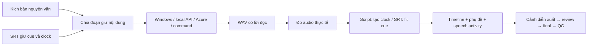

# Ngôn ngữ và TTS bên ngoài

Studio có lựa chọn English / Tiếng Việt / 日本語 / 한국어 cho lời kể và nhận dạng WAV, độc lập với ngôn ngữ giao diện. CLI nhận `en`, `vi`, `ja`, `ko` hoặc locale như `en-US`, `ja-JP`, `ko-KR`. Nội dung không được dịch hoặc viết lại. Một project chọn một ngôn ngữ lời kể; giọng và provider phải hỗ trợ ngôn ngữ đó.

## Pipeline chung



WAV đầu vào giữ giọng của người dùng và không gọi TTS để thay thế. Kịch bản đo thời lượng từng đoạn rồi ghép tuần tự; nghỉ 250 ms giữa đoạn văn. SRT giữ clock, fit tốc độ 0.85–1.20 và báo lỗi nếu không vừa. Provider lỗi, thiếu giọng hoặc cue fit lỗi đều chặn final/DONE. Audio được cache theo text, language, provider, voice, model, endpoint, field mapping và tham số đọc. Resume giữ cache hợp lệ; đổi giọng/model/tham số tạo lại narration và phần phụ thuộc.

## API riêng do bạn phát triển

Trong Studio, mở project → **Nội dung, diễn viên và giọng kể** → chọn ngôn ngữ và dịch vụ TTS → nhập endpoint, model/voice nếu API cần → lưu → **Tạo video**. Có thể lưu cấu hình làm mặc định riêng cho EN/VI/JA/KO. Factory gọi API từ server local; backend TTS có thể chạy cùng máy hoặc trên máy khác trong mạng của bạn. Luồng script và SRT cùng dùng adapter này; WAV giữ audio đầu vào.

Chọn **API TTS riêng (HTTP JSON)**, nhập endpoint đầy đủ như `http://127.0.0.1:8000/tts`. Contract mặc định:

```json
{"text":"The steam moves the piston.","language":"en","voice":"your-voice-id","format":"wav"}
```

Trả HTTP 200 với bytes WAV (RIFF/WAVE), `Content-Type: audio/wav` hoặc `application/octet-stream`. Factory gọi từng đoạn tuần tự, nhận đầy đủ audio rồi chuẩn hóa bằng FFmpeg. Không dùng browser speech synthesis để xuất phim. Không cần API key với server local không xác thực; nếu có, đặt key trong biến môi trường và nhập tên biến ở Studio. Client gửi `Authorization: Bearer ...` từ server của Factory, không đưa key vào trình duyệt.

Nếu API dùng tên trường khác, điền **Tên trường API riêng**:

```json
{"text":"input_text","language":"lang","voice":"speaker_id","model":"model_name","format":"audio_format"}
```

Tên trường phải khác nhau. Trường tùy chọn bị bỏ qua nếu không khai báo hoặc đặt `null`; trường `text` bắt buộc. **Tham số thêm** là JSON cho tham số provider, ví dụ `{"temperature":0.7}`. Chúng không được ghi đè các trường narration/language/voice/model/format. Dữ liệu JSON được gửi như dữ liệu, không thực thi template hoặc mã.

API trả job ID, URL file hoặc MP3 cần một adapter của bạn chuyển sang contract trả WAV trực tiếp, hoặc command adapter. Client hiện không đoán endpoint polling/đường dẫn file từ phản hồi. Lỗi HTTP, timeout, JSON thay vì audio, WAV hỏng hoặc audio không có speech activity phải được model test kiểm tra riêng.

Có thể cấu hình project qua `PATCH /api/projects/:name/settings`, cùng contract với Studio. Ví dụ cho API local tự phát triển:

```json
{
  "language": "en",
  "input": {"mode": "script"},
  "voice": {
    "source": "auto",
    "tts_provider": "http",
    "base_url": "http://127.0.0.1:8000/tts",
    "voice_id": "your-english-voice",
    "timeout_ms": 600000,
    "http_fields": {"text": "input_text", "language": "lang", "voice": "speaker_id", "format": "audio_format"},
    "http_extra_body": {"temperature": 0.7}
  }
}
```

Tên giọng và tham số thêm trong ví dụ phải thay bằng giá trị backend của bạn hỗ trợ. Có thể gửi thêm `revision` lấy từ project detail để tránh ghi đè cấu hình vừa thay đổi. Endpoint và giọng được lưu trong project; đổi chúng làm tạo lại narration ở lần chạy tiếp theo. Backend không cần trả timestamp: Factory đo WAV và tự tạo clock cho script, hoặc fit vào cue SRT đã có.

## OmniVoice Studio / VoiceStudio local

Adapter `omnivoice-studio` nhắm đến phiên bản có API `/v1/audio/speech`, được đối chiếu với [router chính thức](https://github.com/debpalash/VoiceStudio/blob/main/backend/api/routers/openai_compat.py) ngày 02/10/2026. Tên upstream hiện là VoiceStudio. Phiên bản cũ hoặc fork dùng API khác cần chọn HTTP/command adapter tương ứng.

Bạn cài và chạy dịch vụ local, chọn model đã cài trong dịch vụ, rồi cấu hình:

```yaml
project:
  language: en
voice:
  source: auto
  tts_provider: omnivoice-studio
  base_url: http://127.0.0.1:3900
  model: omnivoice
  voice_id: default
  api_key_env: OMNIVOICE_API_KEY
  timeout_ms: 600000
  http_extra_body:
    num_step: 32
```

Port 3900 là ví dụ theo upstream, thay bằng endpoint thực tế của máy. Có thể nhập root, `/v1` hoặc endpoint `/v1/audio/speech`; client tạo URL speech tương ứng. Request chứa `input` nguyên văn, `model`, `voice`, `language` mã chính, `response_format: wav`, `speed: 1`. Voice profile là ID do dịch vụ cung cấp. Factory không cài/download model, tạo voice clone hoặc thay model đang chạy trong VoiceStudio. Cấu hình được giữ riêng cho từng ngôn ngữ nếu bấm lưu mặc định ở Studio.

Chọn `openai-compatible` cho server local khác có cùng speech endpoint. Model là bắt buộc; provider này không tự thêm trường language ngoài protocol chuẩn. Dịch vụ cần nhận diện đúng ngôn ngữ văn bản. Dùng `omnivoice-studio` khi cần trường language theo extension của VoiceStudio.

```powershell
npm.cmd run cli -- configure projects/my-english-video --language en --input script --tts omnivoice-studio --tts-url http://127.0.0.1:3900 --tts-model omnivoice --voice default --tts-timeout 600
npm.cmd run cli -- make projects/my-english-video
```

## Windows và Azure Speech

`npm.cmd run cli -- voices --language en` liệt kê giọng cài trên máy. Windows chọn giọng đúng ngôn ngữ; locale cụ thể yêu cầu culture đúng (ví dụ `en-GB` không tự dùng `en-US`). Thiếu giọng Nhật/Hàn cần cài giọng phù hợp hoặc cấu hình provider khác. Caption Nhật dùng fallback Yu Gothic/MS Gothic; Hàn dùng Malgun Gothic. Các font cần có trên máy render; không tự tải font.

Adapter `azure-speech` dùng endpoint HTTPS theo vùng (ví dụ `https://southeastasia.tts.speech.microsoft.com`) và key từ environment. TTS sử dụng SSML chỉ để đóng gói text đã escape, không đọc input như markup. Mặc định gợi ý Jenny/Guy (EN), HoaiMy/NamMinh (VI), Nanami/Keita (JA), SunHi/InJoon (KO). Giọng khác có thể nhập ID. Locale/voice sai chặn tạo giọng. [Contract REST](https://learn.microsoft.com/en-us/azure/ai-services/speech-service/rest-text-to-speech), [danh sách ngôn ngữ/giọng](https://learn.microsoft.com/en-us/azure/ai-services/speech-service/language-support).

## Preset và phạm vi nghiệm thu

`config/voice.yaml` có `voice` mặc định và `voice_profiles` theo ngôn ngữ. Thứ tự: mặc định → preset khớp locale (hoặc mã chính) → series → project. Giọng ghi rõ trong project được ưu tiên. `PUT /api/settings/voice?language=en` lưu preset EN, giữ nguyên mặc định VI và preset khác. `GET /api/voices` chỉ công bố catalog Windows/preset đã bỏ executable và arguments; không công bố API key. HTTP/command tùy chỉnh phải tự xác nhận hỗ trợ ngôn ngữ; catalog không phải kiểm tra âm thanh của provider.

Code hỗ trợ EN/VI/JA/KO, Japanese segmentation không cần khoảng trắng và giữ nguyên chuỗi ký tự. Tiếng Hàn giữ từ Hangul. Ngôn ngữ ASR dùng mã chính; đổi ngôn ngữ trong Studio/CLI cũng cập nhật ASR. Phân tích nội dung, diễn xuất và chất lượng phát âm cần nghiệm thu riêng với nội dung thật; contract TTS không chứng minh chất lượng đạo diễn đa ngôn ngữ. Live OmniVoice/JA/KO/Azure đang chờ backend/credentials và nghiệm thu, không được gọi là đã PASS chỉ vì build hoặc stub API chạy.

Audit độc lập đầu tiên: 437/442 test qua, 5 lỗi cấu hình được giữ trong báo cáo. Sau sửa, cùng assertions và một ca bổ sung chặn executable qua API project: 40/40 ca TTS mới và 33/33 regression liên quan qua, test:typecheck0. English Windows thật dùng Microsoft David Desktop (en-US), tạo WAV có speech activity 5323 ms và phụ đề theo thời lượng thực; giữ nguyên script. Máy hiện liệt kê hai giọng EN, chưa có giọng JA/KO trong Windows engine. HTTP local trong audit là stub PCM, không phải OmniVoice thật hoặc bằng chứng phát âm đa ngôn ngữ. [Phạm vi kiểm tra](validation/2026-10-02-multilingual-tts.md).

Lượt độc lập sau đó đã chạy cùng English script từ archive có dependencies sạch đến actors MP4/DONE. [Báo cáo runtime](validation/2026-10-03-clean-english-runtime.md) phân biệt pipeline thành công, raw audit30/31 và creative offline; không dùng kết quả Windows Speech để tuyên bố API riêng/OmniVoice đã chạy thật.

Probe renderer migration thật03/10 giữ audio/cache bytes và HTTP TTS count3→3 khi chỉ cập nhật phần hình. Lần đầu FAIL do scene identity, follow-up d882 FAIL do rig hash/host approval; raw evidence vẫn giữ. Probe độc lập mới trên pristine baseline đã qua17/17 checks, nhánh chưa khóa rebuilt SCENES_READY, host đã duyệt/audio/cache giữ bytes và TTS3→3; nhánh khóa conflict rõ. [Phạm vi hiện tại](validation/2026-10-03-current-runtime.md), [lịch sử migration](validation/2026-10-03-renderer-language.md). Đây là HTTP stub PCM, không chứng nhận giọng API local hoặc live OmniVoice.
