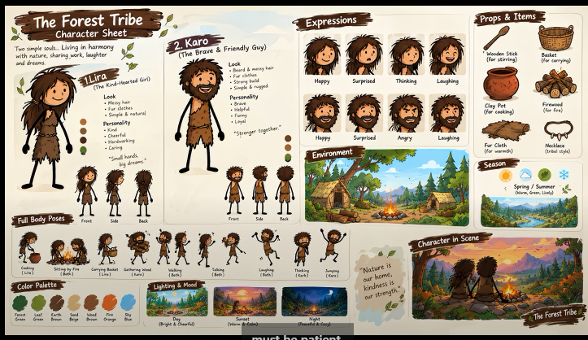
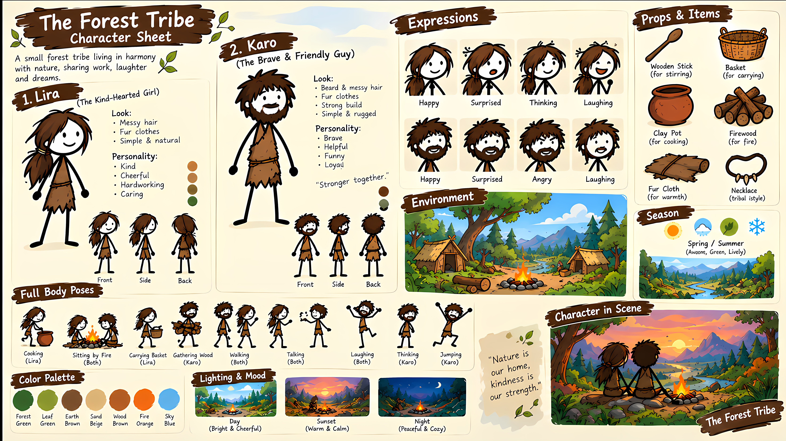

# Cuộc sống thời tiền sử — bộ chủ đề Lila & Karo

**Cập nhật source0.98:** [Tóc/râu theo góc nghiêng riêng](PROFILE-SECONDARY-HANDOFF.md). `registered-profile-secondary-v1` bind bốn own PNG/SHA/canvas, tám vùng crest/tail/beard; cùng original head/body clock và mask mắt/miệng/chân mày, camera lấy bounds của mesh. Clock12, schema/API/workbench/report/cache/manifest cập nhật. Tám callback DECLARED / NOT RUN. Vùng tách/seam/silhouette/khớp/diễn xuất và toàn story/script/WAV→video chưa nghiệm thu; productionReady=false, productionRig=null, availableBanks=[] và needs-source-prop-binding giữ nguyên. Mốc0.97 trở xuống là lịch sử.

**Cập nhật source0.97:** [Đi/chạy/nhảy/cúi theo góc nghiêng riêng](PROFILE-LOCOMOTION-HANDOFF.md). Bốn own PNG/SHA/canvas có garment cages riêng, `registered-profile-locomotion-v1`; pinned belt/lagged hem dùng cùng native body kernel. Complete sourceBody giữ body/cloth clock qua camera cut và đổi vai; không mượn3/4 source hoặc bật front/rear/seat/tools/turns. Tám callback DECLARED / NOT RUN. Khớp, garment seams/viền quần, diễn xuất và toàn story/script/WAV→video chưa nghiệm thu; productionReady=false, productionRig=null, availableBanks=[] và needs-source-prop-binding giữ nguyên. Mốc0.96 trở xuống là lịch sử.

**Cập nhật source0.96:** [Biểu cảm riêng chính diện/nghiêng](OWN-VIEW-EXPRESSIONS-HANDOFF.md). Sáu bộ own PNG/SHA/canvas có tám chân mày nhìn thấy; `registered-basic-expressions-v1` cần đúng own eyes/mouth. Clock gốc chuyển16mood; môi khép khi nghe, aperture chỉ theo cue của actor. Mask chân mày/mắt/miệng độc lập, không warp/mirror hoặc mượn ROI3/4. Tám callback mới DECLARED / NOT RUN. Skin/ink/contour seams, diễn xuất và story/script/WAV→video còn chờ test; productionReady=false, productionRig=null, availableBanks=[] và needs-source-prop-binding giữ nguyên. Mốc0.95 trở xuống là lịch sử.

**Cập nhật source0.95:** [Thoại riêng chính diện/nghiêng và clock đúng diễn viên](OWN-VIEW-SPEECH-HANDOFF.md). Sáu vùng miệng dùng đúng PNG/SHA/canvas, lựa chọn tường minh `registered-basic-mouth-v1`; Lila giữ smile nguồn khi im lặng, Karo dùng ứng viên contour khép. Miệng mở theo speech activity/clock gốc, không phải phoneme lip-sync. Mask miệng/mắt độc lập; không mirror hoặc mượn vùng mặt3/4. Thêm tám callback DECLARED / NOT RUN. Ghép da/viền/khẩu hình, diễn xuất liên tục và toàn story/script/WAV→video còn chờ model test; productionReady=false, productionRig=null, availableBanks=[] và needs-source-prop-binding giữ nguyên. Các mốc dưới là lịch sử.

Cập nhật source0.81: [vật chung và vật cầm riêng trong cùng cảnh](MIXED-OWNERSHIP-HANDOFF.md). Đã viết complete-run binding closure, union center channels và hand masks theo phase; chín callbacks mới chưa chạy. Combo tester đã trả static review; không có runtime/hình/chuyển động/video acceptance. Các mốc bên dưới là lịch sử.

Cập nhật source0.80: [renderer/camera/relation dùng chung bake đã kiểm](OWNERSHIP-CONSUMERS-HANDOFF.md). Đã chặn bake hỏng, paint bị sửa và relation khác revision; năm regression callbacks mới chưa chạy. Hình, chuyển động, production và toàn ba luồng vẫn chưa nghiệm thu. Các mốc bên dưới là lịch sử.

Cập nhật source0.79: [đúng người, đúng vật và entity motion](ENTITY-MOTION-HANDOFF.md). Prop IDs theo từng diễn viên; relation/flow dùng canonical entity, không chọn theo tên prop của người đầu tiên. Đã sửa thêm explicit legacy primary binding. Source vẫn chưa nghiệm thu native art/motion/video và toàn luồng. Các mốc dưới đây là lịch sử.

Cập nhật source0.78: [camera repair theo đúng revision](CAMERA-REVISION-HANDOFF.md). Đã tách binding trước/sau sửa camera; scene/review cũ vẫn mất hiệu lực. Combo 9router `tester` gọi được và trả `gpt-6-luna`; chỉ kiểm kết nối. Runtime/video và full-product acceptance vẫn chờ model người dùng. Các mốc bên dưới là lịch sử bàn giao.

Cập nhật source0.77: [camera/tương tác/continuity của vật chung](OWNERSHIP-OBSERVATION-HANDOFF.md). Nhánh observation đã viết; production và nghiệm thu art/motion/video vẫn chờ. Phần source0.76 trở về trước dưới đây là lịch sử bàn giao.

Cập nhật hiện hành source0.76: [renderer một entity chung và bàn tay gốc](OWNERSHIP-RENDER-HANDOFF.md). Đã viết adaptive bake, explicit depth/viewport grip anchor, một glyph, own source palms và center chung cho label/shadow/foreground/relation/world/effect, candidate report/cache. Production vẫn chặn trước nhánh renderer vì camera/interaction/coverage/continuity/integrated audit và runtime/art/motion/full-input/voice/resume/final QC chưa nghiệm thu. Một task 9router GPT-6.1 Sol đã trả bake module; parent tích hợp. 10 test mới DECLARED/NOT RUN. PNG/nét/mặt/màu/costume, nam phụ trọc không râu và nữ không đổi; productionReady=false, productionRig=null, availableBanks[] và needs-source-prop-binding giữ nguyên.

Lịch sử source0.75: [timeline đưa/nhận và cùng cầm đồ vật](SHARED-OWNERSHIP-HANDOFF.md). Đã viết contract, projection theo clock gốc, kiểm nguồn và hàm đo own geometry; chưa chạy runtime, chưa nối one-entity renderer/camera/interaction/coverage hoặc nghiệm thu handoff/video. Một task GPT-6.1 Sol qua 9router đã trả schema/projection, parent rà và tích hợp. Native hình/pose/head/world, toàn ba input/voice/resume/final QC vẫn chờ nghiệm thu. Nam phụ trọc không râu, nữ và raw PNG/nét/mặt/màu/costume giữ nguyên. needs-source-prop-binding, productionReady=false, productionRig=null, availableBanks[] và art/motion approval false giữ nguyên.

Lịch sử source0.74: [review đúng bản cảnh và final](CURRENT-REVIEW-FINAL-HANDOFF.md). Preview/review/final/QC/download cùng kiểm project source, actual scene image/font/audio/asset bytes và receipt; source đổi trong provider/render/postprocess phải dựng lại boundary cần thiết. Đạo diễn/camera cho mọi primary/supporting và camera-only repair source0.73 vẫn giữ. Build/typecheck không chứng minh phim mượt; runtime/test giao model người dùng. PNG/nét/mặt/màu/trang phục/nam phụ trọc không râu/nữ phụ không đổi. Ba input, EN chính/VI/JA/KO/external-local TTS và integrated source production/shared ownership/art/pose/head/world còn chờ nghiệm thu; productionReady=false, productionRig=null, availableBanks[] và needs-source-prop-binding giữ nguyên.

Lịch sử source0.72: [đạo diễn và camera riêng](DIRECTOR-CAMERA-AGENTS.md), [grip/world và context camera](SOURCE-GRIP-WORLD-HANDOFF.md). Agent đạo diễn (`models.storyboard`) giữ nhịp/phân cảnh/diễn xuất; agent camera (`models.camera`) chỉ chỉnh camera shot chưa khóa, giữ complete cast/source/world/clock/locks. Studio/API có cấu hình camera riêng hoặc kế thừa; dùng chung budget, reuse phải có provider/journal proof, lỗi camera không gọi lại đạo diễn. Grip handle khớp vật lý gốc, shared floor và một geometry authority cho entity; review/creative camera nhận complete board. 10 camera +7 grip-world callbacks mới DECLARED/NOT RUN. Nam phụ trọc/không râu, nữ và raw PNG/nét vẽ/màu/costume giữ nguyên. Integrated production audit/shared ownership/art/pose/head/world và toàn story/script/WAV/EN+VI/JA/KO/external-local TTS/resume/finalQC chưa nghiệm thu; needs-source-prop-binding, productionReady=false, productionRig=null, availableBanks[] giữ nguyên.

Lịch sử source0.71: [thao tác vật cố định và continuity theo người](SOURCE-FIXED-OPERATIONS-HANDOFF.md). Fixed original operate giữ actual person/hand/model/art/cue, center hoặc explicit authored handle, contact/hold/recovery đúng gốc; không đoán grip hoặc fake re-contact qua cut. Kiểm tra cả reveal, translation và lịch sử rotation/flow trước contact. API/pipeline dùng chung continuity theo person ID và actual root metadata khi đổi primary/supporting. Có 11 callbacks mới DECLARED/NOT RUN; chưa chạy geometry/runtime/video. Nam phụ trọc/không râu và toàn PNG/nét vẽ/màu/costume giữ nguyên. Integrated source production audit, shared/sequential ownership, art/pose/head/environment và toàn story/script/WAV/EN+VI/JA/KO/external-local TTS/resume/finalQC vẫn chưa nghiệm thu; needs-source-prop-binding, productionReady=false, productionRig=null, availableBanks[] giữ nguyên.

Lịch sử source0.70: [tương tác và diễn xuất theo hành động gốc](SOURCE-INTERACTIONS-HANDOFF.md). Source action groups giữ original clock; descriptor/geometry/QC/evidence/acting coverage giữ đúng person/prop/grip/cue/contact/hold/release qua cut và primary swaps, không fake re-contact. World/cache từ0.69 tiếp tục. Fixed operate geometry/API continuity và runtime/art/full-flow acceptance còn thiếu; needs-source-prop-binding vẫn chặn production.8 callback mới NOT RUN, fixture cũ refactor không chạy. Nam v2 trọc/không râu, nữ/PNG/nét vẽ/màu/costume không đổi; full story/script/WAV/EN+VI/JA/KO/external-local TTS/resume/finalQC chưa nghiệm thu; productionReady=false/productionRig=null/availableBanks[].

Lịch sử source0.69: [timeline gốc đồ vật và hiệu ứng](SOURCE-WORLD-TIMELINE-HANDOFF.md). Explicit sourceWorld giữ original event/contact/cue/phase qua camera cuts, renderer có initial state đúng gốc, nhiệt/reveal không reset và flow/effect dùng cùng clock; model/label/shadow tiếp tục theo own physical props. Cache/publication/repair nhận complete world và sibling board. Source action groups/interaction/fixed-operate/coverage/API role swap còn thiếu; needs-source-prop-binding tiếp tục chặn native source manipulation. Mười callbacks mới NOT RUN; nam v2 trọc/không râu, nữ/PNG/màu/costume giữ nguyên. Toàn ba input/giọng/diễn xuất/bối cảnh/resume/finalQC chưa nghiệm thu; productionReady=false/productionRig=null/availableBanks[].

Lịch sử source0.68: [đồ vật gốc theo diễn viên qua các cảnh](SOURCE-PROP-BINDING-HANDOFF.md). Complete storyboard/narration binding giữ đúng person/model/entity/art/source/tay/clock qua primary swap; entry/exit lấy frame vật lý gốc và sibling model/art/cue edits đổi visual cache identity. Source world/event/effect/interaction/coverage vẫn còn thiếu, needs-source-prop-binding tiếp tục chặn production. Bảy callbacks mới NOT RUN; nam phụ v2 trọc/không râu, nữ/PNG/màu/trang phục giữ nguyên. Toàn ba input/giọng/diễn xuất/bối cảnh/resume/finalQC chưa nghiệm thu; productionReady=false/productionRig=null/availableBanks[].

Lịch sử source0.67: [hình học riêng và tham chiếu động tác gốc](PHYSICAL-SOURCE-ACTIONS-HANDOFF.md). Camera/drop-release đo đúng original body/head/hand/prop mà không tính hoặc mở rộng narration giả. Action sourceId/gestureId giữ đúng tay/clock và không fake re-contact ở cut. Model/entity/cue/continuity production binding còn thiếu, needs-source-prop-binding vẫn chặn.9 callbacks mới NOT RUN. Nam phụ trọc/không râu, nữ/PNG/màu/trang phục giữ nguyên; full ba input/giọng/diễn xuất/bối cảnh/resume/finalQC chưa nghiệm thu, productionReady=false/productionRig=null/availableBanks[].

Lịch sử source0.66: [đồng hồ gốc tay/vật và bàn giao](SOURCE-MANIPULATION-CLOCK-HANDOFF.md). SourceManipulation lưu complete run-relative contact/prop history cùng sourceBody và actor clock6, không restart entry/grip/release/flight ở cut. Compiler/camera/repair đã có contract; canonical model/action/continuity binding còn thiếu và vẫn chặn needs-source-prop-binding.7 callbacks mới NOT RUN. Nam phụ trọc/không râu, nữ/PNG/màu/trang phục giữ nguyên. Full story/script/WAV/giọng/bối cảnh/resume/finalQC chưa nghiệm thu; productionReady=false/productionRig=null/availableBanks[].

Lịch sử source0.65: [pose thao tác vật native và bàn giao](NATIVE-MANIPULATION-HANDOFF.md). Explicit bodyManipulation=registered-manipulation-v1 nối inspect/operate/pick-place/carry/drop vào canonical compiler với cuff/palm riêng, chiều dài xương cố định, elbowPole=rest và approach/recovery theo góc khớp C2. Người phụ dùng costume cùng nguồn và đầu riêng. Mẫu nam trọc/không râu, nữ giữ nguyên; productionReady=false/productionRig=null/availableBanks[]. Geometry/runtime/render/video mới NOT RUN; toàn story/script/WAV/giọng/diễn xuất/bối cảnh/resume/finalQC chưa nghiệm thu.

Lịch sử source0.64: [đạo cụ thuộc từng diễn viên và bàn giao test](ACTOR-PROP-OWNERS-HANDOFF.md). Một scene có thể khai báo mỗi person ID sở hữu vật khác nhau, với tay/scale/source/contact/motion/camera/exit riêng; không ép người phụ thành lead. Source chung đã viết, runtime/geometry/render/video NOT RUN. Chuyền chung vật/cross-cut carry/native grasp còn thiếu, productionReady=false/productionRig=null/availableBanks[]. Full story/script/WAV → giọng → diễn viên → final/audio/subtitle/QC vẫn chưa nghiệm thu.

Lịch sử source0.63: [đuôi tóc theo nhịp cơ thể và handoff test](NATIVE-SOURCE-HEAD-FOLLOW.md). Mode source-motion chọn bank6/paint2 riêng: đuôi tóc Lila dùng đúng nguồn và original head/body history, pinned gốc/cạnh; Karo khai báo không rear motion. Giữ nguyên 14 definition/PNG trước. Geometry/UV/seam/hình/video chưa nghiệm thu; runtime giao model test của người dùng. Toàn story/script/WAV → giọng → diễn viên → video/final/QC vẫn là mục tiêu đầy đủ. Các mục phiên bản thấp hơn bên dưới là lịch sử.

**Lịch sử0.60 — 08/10/2026:** sửa bước normalization production vốn trả Lila/Karo về rig legacy và làm mất native head/body view/face/motion đã chọn. Principal và quần chúng dùng chung helper giữ valid explicit nguồn; cast toàn phần được kiểm trước khi thay đổi, names/evidence/speakers/source clocks không viết lại. Brief phân biệt source-face capabilities/seed/locked actor, không trộn fixed-head ROIs vào bank3/4. [Source, test/server và việc còn thiếu](TOPIC-CAST-SOURCE-HANDOFF.md). Chín callback mới NOT RUN; giữ productionReady=false/productionRig=null/availableBanks[], full input/voice/art/acting/world/resume/final/QC còn cần nghiệm thu.

**Lịch sử0.59 — 08/10/2026:** giữ nam phụ v2 đầu trọc/không râu và nữ toàn thân v1; thêm đầu trái nam/đầu phải nữ riêng, raw PNG/prompt/provenance và hai JSON face đặt tọa độ thủ công. Contract bank4 tách model identity khỏi người/clock, dùng đúng body/costume Karo/Lila; normalizer giữ native lựa chọn explicit, workbench cùng renderer nhận cả hai mẫu. Không mượn ROI/head principal hoặc tự dựng góc thiếu. [Source, môi trường, test và phần còn thiếu](SUPPORTING-NATIVE-HEAD.md). Bảy callback mới NOT RUN; geometry/seam/yaw/identity/motion/video chưa nghiệm thu. Full story/script/WAV, EN chính/VI/JA/KO/external-local TTS/resume/QC tiếp tục; productionReady=false/productionRig=null/availableBanks[].

**Lịch sử0.58 — 08/10/2026:** nam phụ không tóc, không râu/ria/mai theo yêu cầu mới; raw v2 có prompt/provenance/alpha và nguồn đầu riêng, nữ phụ giữ nguyên. Catalog/resource/gallery/clip/cằm/cổ/miệng chọn v2; trang phục rig vẫn asset Karo/Lila. Góp ý cast phân biệt supportingModel, không tự sửa hai người cố ý dùng cùng mẫu. [Mẫu và bàn giao test](SUPPORTING-ACTORS.md). Hai callback mới NOT RUN; source/ảnh chưa là nghiệm thu head seam, anatomy hay video. Full story/script/WAV, EN chính/VI/JA/KO/external-local TTS/resume/QC vẫn giữ; productionReady=false/productionRig=null/availableBanks[].

**Lịch sử0.57 — 08/10/2026:** thêm hai bố trí màn hình dùng riêng head/body trái/phải; optional cử chỉ suy nghĩ của người nghe dùng rig-hand mapping và original source windows qua camera/swap primary. Core gesture projector giữ cả default ramps số lẻ, không làm tròn hoặc reset. [Source, môi trường và lệnh model test](NATIVE-DIALOGUE-ACTING.md). Sáu callback mới NOT RUN; chưa nghiệm thu geometry/anatomy/độ mượt/video. Quần chúng nam trọc/nữ tóc/costume riêng giữ nguyên; diagnostic không là kịch bản/bố cục mặc định. Full story/script/WAV, EN chính/VI/JA/KO, external-local TTS, resume/QC vẫn chưa hoàn thành; productionReady=false/productionRig=null/availableBanks[].

**Lịch sử0.56 — 08/10/2026:** nối explicit hai đầu bank3 Lila phải/Karo trái vào cùng canonical body/cast/camera và factory renderer bằng `--native-heads`; mỗi diễn viên giữ original head/body/speech clock, gaze nhắm mắt bạn diễn qua cut/lead swap. Loader exact catalog dùng chung workbench; default tracer2 không đổi, không âm thầm mở production. [Source, môi trường và lệnh model test](NATIVE-HEAD-DIALOGUE.md). Hai mẫu quần chúng nam trọc/nữ có tóc dùng trang phục Karo/Lila vẫn giữ. Bốn callback mới NOT RUN; chưa chạy geometry/renderer/video hoặc nghiệm thu độ mượt. Full story/script/WAV, EN chính/VI/JA/KO, TTS ngoài/local, resume/QC vẫn chưa hoàn thành; productionReady=false/productionRig=null/availableBanks[].

**Lịch sử0.55 — 08/10/2026:** bổ sung đầu Karo trái và local mouth rest V2, definition/source/body riêng; plate V1 bị hold vì dời chòm râu và bị chặn theo SHA kể cả đổi tên. Catalog workbench có bốn pair Lila/Karo × phải/trái, UI/loader/inventory dùng đúng head filename, giữ original clocks/revision/vendor/legacy URL guards. [Nguồn/việc cần kiểm](OPPOSING-DIALOGUE-HEADS.md), [server/test](HEAD-FACE-WORKBENCH.md), trạng thái hiện hành tại mục12. Đây là source/ảnh authoring chưa thực thi geometry hoặc nghiệm thu chuyển động. Quần chúng nam trọc/nữ tóc dùng trang phục Karo/Lila và full story/script/WAV, EN chính/VI/JA/KO, TTS ngoài/local, resume/QC vẫn giữ; productionReady=false/productionRig=null/availableBanks[].

**Lịch sử0.54 — 08/10/2026:** bổ sung raw đầu Lila hướng trái, prompt/provenance và definition miệng/mắt/cổ riêng; review ảnh tĩnh Gemini không là duyệt identity/anatomy/motion. Workbench chọn view explicit, ghép đúng head/body source và original clocks; góc chưa có chặn rõ, URL0.53 vẫn mặc định phải. Một cell yaw null không phải quay đầu liên tục. [Artwork/việc cần nghiệm thu](LEFT-DIALOGUE-HEAD.md), [môi trường/server/test](HEAD-FACE-WORKBENCH.md). Quần chúng nam trọc/nữ tóc0.52 dùng trang phục Karo/Lila; toàn bộ story/script/WAV, EN chính/VI/JA/KO, TTS ngoài/local, resume/QC vẫn giữ. Runtime/geometry/renderer/video mới NOT RUN; productionReady=false/productionRig=null/availableBanks[].

**Lịch sử0.53 — 08/10/2026:** thêm bàn đối chiếu mặt source0.51 trên thân native bằng chính `performanceScene`/compiler/GSAP. Có original clock và camera slice, rest/point/think/gaze trong góc nguồn, raw source/hash binding và báo cáo; không gọi model/TTS/ASR hoặc ghi project/approval. Source mới chưa chạy renderer/browser/runtime; không coi đây là video đã đạt yêu cầu. [Trang xem mặt, môi trường và kế hoạch kiểm](HEAD-FACE-WORKBENCH.md). Hai model quần chúng0.52 và toàn bộ mục tiêu đầu vào/ngôn ngữ/TTS/resume/QC vẫn giữ; productionReady=false/productionRig=null/availableBanks[].

**Mốc0.52 — 08/10/2026:** thêm hai model quần chúng nam đầu trọc/nữ có tóc; tái sử dụng trang phục source Karo/Lila trong rig, mỗi người có ID/vai/evidence/thoại riêng. Raw PNG, catalog, strict supportingModel, renderer head/resource, API/gallery và link Studio đã viết; mask/tọa độ/overlays là candidate thủ công chưa thực thi. 4 callback mới NOT RUN, chưa có video quần chúng được nghiệm thu. [Mẫu, prompt, giới hạn, môi trường/lệnh server/test](SUPPORTING-ACTORS.md). Hai mẫu chính và mục tiêu full story/script/WAV/EN/VI/JA/KO/TTS/resume/QC giữ nguyên; productionReady=false/productionRig=null.

**Lịch sử 0.51 — 08/10/2026:** source đã có painter miệng/mí/glyph mắt riêng theo từng PNG và bank3 nối original head/acting/owned narration clock. Thêm Karo miệng khép chỉ dùng làm local patch; không thay cả mặt. Hai definition Lila/Karo V2 có tọa độ chọn thủ công, **chưa thực thi geometry/runtime hoặc duyệt hình ghép**; một cell góc null/routes=[] không là quay đầu. Bank1/2 giữ false face capabilities, expressions/secondary và final guards chưa mở. 8 callback mới NOT RUN; chưa có video nghiệm thu. [Contract, source/ảnh, giới hạn, server/test và việc còn thiếu](NATIVE-HEAD-FACE-HANDOFF.md). Full ba input, giọng, partner-facing turns/body/props/world/resume/finalQC vẫn chưa hoàn thành; productionReady=false/productionRig=null.

**Lịch sử 0.50 — 08/10/2026:** thêm đầu Lila/Karo V1/V2 giữ góc và nét mặt của mẫu chính; V2 bỏ lọn tóc kéo ngang và cổ thừa. Góc chưa đo lưu rõ `null`, không tự gọi là 0°. Có hai draft điểm mặt sơ bộ theo đúng PNG, còn thiếu cổ/sọ/viền/masks/góc/tỷ lệ/body seam. Ba lượt GPT/Gemini qua 9router đã góp ý source/ảnh tĩnh; build/typecheck/schema/static inventory qua, 6 callback mới và runtime/video **NOT RUN**. Chưa thay đầu renderer, chưa có bank/rig/video được nghiệm thu; productionReady=false/productionRig=null. [Ảnh, review và phần còn thiếu](reviews/primary-angle-heads-source-record-v1.md), [phân việc](../plans/2026-10-08-nine-router-delegation.md), [server và test](NATIVE-HEAD-TURN-HANDOFF.md). Full ba input/giọng/diễn xuất/finalQC vẫn thuộc mục tiêu.

**Lịch sử0.49 — 08/10/2026:** thêm bản đo source-bound cho PNG đầu riêng (cổ/sọ/mặt/viền/masks/mắt/ponytail), chưa kích hoạt rig/speech/motion. Ba lượt GPT/Gemini9router source/static assistance thực đã hoàn tất; code đề xuất được sửa/review trước tích hợp,11 callback mới NOT RUN. [Phân việc/budget/tool](../plans/2026-10-08-nine-router-delegation.md), [bàn đo/môi trường/model test](NATIVE-HEAD-TURN-HANDOFF.md). Artwork/nét/mặt/cổ/tóc vẫn cần sửa thật; chưa có video nghiệm thu mới hoặc bank thực. Full3 input/EN/VI/JA/KO/external-localTTS/diễn xuất/bối cảnh/resume/QC vẫn thuộc mục tiêu.

**Lịch sử0.48 — 08/10/2026:** source bank2 cho từng cell dùng PNG riêng với mật độ pixel cố định, cùng trục cổ/physical mắt-cằm/camera/staging/source clock. Bank1 giữ compatibility/hash;5 atlas held không được dùng. Hai PNG Lila front/near-right mới1024×1536 có prompt/hash/alpha/provenance nguyên bản nhưng **chưa được duyệt hoặc đăng ký**; requested0°/8° chưa đo. API chỉ đọc và26 callback mới khai báo, NOT RUN. Speech/gaze/expressions/secondary/seams/contact/body turns và full story/script/WAV/voice/resume/final video/QC còn thiếu; productionReady=false/productionRig=null, không có video nghiệm thu mới. [Nguồn/bằng chứng/việc còn thiếu](reviews/native-head-cells-source-record-v1.md), [môi trường/server/lệnh test](NATIVE-HEAD-TURN-HANDOFF.md), [plan](../plans/2026-10-08-native-head-turns.md).

**Lịch sử0.47 — 08/10/2026:** Lila V3 được author lại từ primary gốc bằng built-in imagegen, nhưng vẫn nhảy phía tóc9→10, nhóm góc gần trùng và chưa giữ tóc dài/seam. Ảnh/prompt/metadata nguyên bản giữ để đối chiếu; toàn bộ5 atlas/80 ô held, Lila V3 bị chặn theo cả file và hash. Không bank/rig/video nào được bật. Contract/renderer0.46 giữ nguyên và chưa có nghiệm thu; bước tiếp theo đổi cách author/đăng ký từng góc source với correspondence cụ thể, không lặp atlas16ô rồi coi góc trong prompt là góc thật. [Record ảnh/prompt/phần còn thiếu](reviews/native-head-turn-v3-art-record.md). Full arbitrary-story3input/voices/acting/video/QC vẫn chưa hoàn thành.

**Lịch sử0.46 — 08/10/2026, original head source:** thêm bank registration/complete head clock/renderer contract cho nguồn V3+ tương lai. Cell nguyên nét gắn uniform vào cổ; physical mắt/cằm, camera và source/resource/cache identity cùng track, không reset qua cut. Schema/profile/brief/manifest dùng chung contract; không tự đăng ký draft. **Chưa có bank thực được chấp nhận**, V1/V2 vẫn held theo file/hash. Rest-face contract chưa có speech/blink/emotion/directional eyes/hair/painter seam hoặc continuous chin-contact/gaze qua cell; thiếu capability báo lỗi, không sửa thoại thành im lặng.17 callback mới NOT RUN, chưa có video mới. [Việc còn thiếu, môi trường/server/lệnh test](NATIVE-HEAD-TURN-HANDOFF.md), [plan](../plans/2026-10-08-native-head-turns.md), [source record](reviews/native-head-source-record-v1.md). productionReady=false/productionRig=null; ba input, EN chính/VI/JA/KO/local external TTS và full arbitrary-story video vẫn là mục tiêu, chưa hoàn thành.

**Lịch sử0.45:**4 atlas1254px RGBA, strict material/prompt/landmark draft và bàn đo check/download/import source-bound;14 callbacks NOT RUN. Artwork còn lỗi tóc/râu/góc/cổ, không tự gán yaw/neck từ prompt hay bật rig.

**Lịch sử0.44 — 08/10/2026, source candidate:** gaze `actorTarget:{id,anchor:'eyes'}` theo mắt bạn diễn ở original physical body/expression/breath/seat/lunge clock; không recursive gaze hoặc static-root approximation. Mặt native giữ nguyên góc đăng ký; sau lưng cần authored turn. Source/visibility/world/identity/hash/publication/cache/schema/brief/context/camera cùng contract, clock4/body compiler32, tracer2 dùng mutual gaze.13 callback mới và toàn runtime/tracer/media NOT RUN; không optical gaze/art/anatomy/motion acceptance. Máy không có image-to-video API; tiếp tục SVG/HTML5/GSAP. productionReady=false/productionRig=null và mục tiêu ba input/full video vẫn mở. [Bàn giao/lệnh/môi trường](NATIVE-ACTOR-GAZE-HANDOFF.md), [plan](../plans/2026-10-08-actor-gaze.md), [record](reviews/actor-gaze-source-record-v1.md).

**Lịch sử0.43 — 08/10/2026, source candidate:** thêm `npm run tracer:native-seat` xuất scene/master và tùy chọn ảnh/video draft60fps cho ca hai diễn viên ngồi–đứng–đi, dùng cùng canonical với test và không bootstrap sơ đồ máy móc. Cue SRT diagnostic im lặng mặc định; WAV tùy chọn giữ bytes/clock và vẫn cần kiểm nội dung/speaker. Scene guard nhận viền SVG hở bounded, cache security4. Builder/test/tracer/browser/media chưa chạy; productionReady=false/productionRig=null, không final/DONE hoặc nghiệm thu độ mượt. [Cách chạy và artifact](NATIVE-SEAT-TRACER.md).

**Lịch sử0.42 — 08/10/2026, source candidate:** optional sourceBody.supports giữ full ghế/posture/entry cùng clock gốc cho native Lila/Karo đã chọn registered-seated-v1. Chân chuẩn bị/trụ, hông/contact, vải/tóc, occupancy, camera và stage không reset ở cut; mọi slice lặp full source, đổi vai primary/supporting giữ actor/view/root/stage/scale. Support fingerprint2/body compiler31, schema/brief/context/manifest/cache/repair và stage gate cùng contract.7 callback mới gồm ca canonical hai người,5 camera slice, cue ownership đổi và không có diagram/object, tất cả NOT RUN. Chưa art/anatomy/motion/audio/video/2MB cost nghiệm thu; productionReady=false/productionRig=null và full ba input vẫn chưa hoàn thành. [Bàn giao, lệnh test/server](NATIVE-SEATING-HANDOFF.md), [plan](../plans/2026-10-08-native-seating.md), [record](reviews/native-seat-clock-source-record-v1.md). Các mốc dưới là lịch sử.

**Lịch sử0.41 — 08/10/2026, source candidate:** đã thêm optional `bodySeat=registered-seated-v1` cho native Lila/Karo hai hướng, với registered locomotion; UV/contour chung đục, eo ghim, texture vải đứng/ngồi và solver support hiện có dùng một progress trong shot. Profile/cast/API/workbench/brief, camera bounds và asset/cache/manifest/schema nhận cùng selection; body compiler30/SVG16/head16/view registration4.14 callback mới NOT RUN. Ba lỗi source review alias metadata/mask eo/generator cycle đã sửa. Clock support xuyên camera và ca canonical hai diễn viên còn Task3/4; mesh trái222/226 mảnh cần đo compile/seek/cap2MB thật. Chưa art/identity/motion/video nghiệm thu, productionReady=false/productionRig=null và full ba input vẫn chưa hoàn thành. [Bàn giao và lệnh test/server](NATIVE-SEATING-HANDOFF.md), [plan](../plans/2026-10-08-native-seating.md), [record](reviews/native-seat-surface-source-record-v1.md). Các mốc dưới là lịch sử.

**Lịch sử0.40 — 08/10/2026, material-only:** có2 atlas trang phục ngồi mới từ built-in imagegen cho native Lila/Karo × hai view3/4; prompt/source hashes, alpha/tile bounds, schema và inventory riêng đã lưu. Parent thấy váy liền/hai cuff trên ảnh, chưa review độc lập hoặc pose/motion acceptance.8 callback mới NOT RUN. Chưa có bodySeat, semantic UV, physical support/source clock hoặc renderer ngồi native; guard và body compiler29/SVG15/head16 giữ nguyên. [Asset, lệnh test/server và việc nối rig còn thiếu](NATIVE-SEATING-HANDOFF.md), [plan](../plans/2026-10-08-native-seating.md), [record](reviews/native-seat-material-source-record-v1.md). productionReady=false/productionRig=null; full ba input và video mong muốn vẫn chưa hoàn thành. Các mốc dưới là lịch sử.


**Lịch sử 0.39 — 08/10/2026:** optional `appearance.bodySecondary=registered-secondary-v1` thêm texture mesh tóc chỏm/đuôi tóc Lila và tóc chỏm/râu dưới Karo trên hai view native độc lập. Mặt/dây buộc và điểm gắn giữ tĩnh; causal head history dùng clock body/expression/breath nguyên bản qua camera/primary swap. Camera đo cả mesh, schema/cache/repair/brief/API/diagnostic dùng cùng selection; body compiler29/SVG15/head16.23 declarations mới NOT RUN, chưa art/motion/performance/video acceptance. [Source, lệnh test/server và phần còn thiếu](NATIVE-SECONDARY-MOTION-HANDOFF.md), [record](reviews/native-secondary-source-review-v1.md). productionReady=false/productionRig=null/final gates giữ nguyên; full identity/turns/seating/props/environments/ba input còn mở. Các mốc dưới là lịch sử.

**Lịch sử 0.38 — 08/10/2026:** optional `performance.sourceBody` khai báo full original body tracks giống hệt trên mọi shot của native actor run continuous; source clock giữ root/bước chân/flight/tay chạy/posture và lag vạt áo qua camera/primary swap. Clock3/body compiler28; camera/readability, sourced movement coverage, metadata, review times, fragment diagnostics và cache/repair publication dùng actual full board. Local motion không tự nối qua cut.28 declarations mới NOT RUN; build/source check và review không là anatomy/art/motion/video acceptance. [Contract, test/server và việc còn thiếu](NATIVE-SOURCE-BODY-HANDOFF.md), [record thực tế](reviews/native-source-body-source-review-v1.md). productionReady=false/productionRig=null/final gates giữ nguyên; full turns/hair/props/environments/ba input vẫn chưa hoàn thành. Các mốc dưới là lịch sử.

**Lịch sử 0.37 — 08/10/2026:** optional `bodyMotion=registered-locomotion-v1` nối native Lila/Karo hai view vào walk/run/jump/stand-crouch-lean và point/think/react; đai áo ghim, vạt12 tam giác giữ màu/viền PNG nguồn và theo đùi trễ90ms. Body compiler27/SVG14; default rigid và guard ngồi/quay thân/backward/new props giữ nguyên. Native motion qua continuous camera cut bị chặn; static run giữ source phase/lag và cache/repair binding, cả actor im lặng. Bốn artwork document tĩnh và30 callbacks mới NOT RUN, chưa art/motion/audio/video approval. [Source, lệnh test/server và việc còn thiếu](NATIVE-LOCOMOTION-HANDOFF.md), [record](reviews/native-locomotion-source-review-v1.md). Full identity/turns/hair/props/environments/ba input sản xuất vẫn chưa hoàn thành; productionReady=false/productionRig=null/final gates giữ nguyên. Các mốc dưới là lịch sử.

**Lịch sử 0.36 — 08/10/2026:** thêm lựa chọn explicit `bodyExpressions=registered-expressions-v1` cho Lila/Karo ở hai view native, yêu cầu eyes/rest speech; mực chân mày đo từ PNG hiện hành, mí mắt và contour cảm xúc cho16 mood, aperture theo cùng activity-owned cue. Track biểu cảm của toàn run continuous giữ phase qua camera/primary swap và có trong source/cache/repair identity. Head renderer15/body compiler26, không sửa PNG nguồn hoặc tự duyệt rig. Có artwork document tĩnh,18 callbacks mới NOT RUN; chưa art/motion/audio/video approval. [Source, lệnh test/server và phần còn thiếu](NATIVE-EXPRESSIONS-HANDOFF.md), [record/P2](reviews/native-expressions-source-review-v1.md). Full body/head turns, soft limbs/cloth/hair/props/environments và ba input sản xuất vẫn chưa hoàn thành; productionReady=false/productionRig=null/final gates giữ nguyên. Các mốc dưới là lịch sử.

**Lịch sử 0.35 — 08/10/2026:** lựa chọn explicit registered-rest-mouth-v1 giữ miệng Karo khép ở silence bằng tile native vùng miệng riêng trái/phải; Lila giữ nụ cười khép nguồn. Chỉ ROI miệng dùng asset mới, không thay toàn mặt hoặc ảnh gốc. Whole-cue source clock/ownership, canonical/cache/repair/staging dùng cùng contract, selection/fingerprint mới; legacy/default không tự chuyển. Head renderer14/body compiler25. Bảng artwork tĩnh và 9 callbacks mới NOT RUN; chưa art/motion/audio/video approval. [Source, artwork, test/server và việc còn thiếu](NATIVE-REST-MOUTH-HANDOFF.md), [review](reviews/native-rest-mouth-source-review-v1.md). Full neutral/emotion/turns/body motion/environments và ba input sản xuất vẫn cần hoàn thành; productionReady=false/productionRig=null/final gates giữ nguyên. Các mốc dưới là lịch sử.

**Hiện hành 0.34 — 08/10/2026:** native point/think có optional sourceSpan khai báo command/window gốc; các mảnh local phải exact projection, cùng tay/action/target/pole/timing và đủ coverage trong run continuous. Compiler dùng source arm phase và entry shoulder/elbow branch thay vì khởi động lại ở mỗi shot; FK/ink/cuff/mitten/painter/gaze và canonical context/cache/repair dùng cùng nguồn. Interaction ghi original keypose và phase sampled, không fake contact. View clock2/body compiler24; PNG/màu/trang phục không đổi. **13 callbacks mới NOT RUN**, chưa anatomy/art/motion/video approval. [Source, test, server và việc còn thiếu](NATIVE-SOURCE-GESTURE-HANDOFF.md), [review](reviews/native-source-gesture-source-review-v1.md). Full expressions/turns/walk/run/jump/seating/cloth/hair/props/environments và ba input runtime vẫn cần tiếp tục; productionReady=false/productionRig=null/final gates giữ nguyên. Lila/Karo là diễn viên trong câu chuyện bất kỳ; script nguyên văn/WAV giữ audio-clock/story→script→video, SRT, EN chính/VI/JA/KO và TTS ngoài/local không đổi. Các mốc dưới là lịch sử.

**Lịch sử 0.33 — 08/10/2026:** explicit pupil gaze và nhịp thở native nhận clock của run liên tục; gaze cùng target sát nhau không restart tại camera cut, breath dùng envelope đầu/cuối run. Primary/supporting/arm reference/interaction sampling và cache/repair binding dùng cùng context; continuous lệch clock/cast/view/root/stage/scale/profile bị chặn. Body compiler23, PNG/màu/proportion không đổi; **9 callbacks mới NOT RUN**, chưa nghiệm thu chuyển động/video. [Phạm vi, source, test và server](CONTINUOUS-VIEW-ATTENTION-HANDOFF.md), [review](reviews/continuous-view-attention-source-review-v1.md). Gesture/expression/locomotion/posture/cloth/hair/head-turn và toàn diễn xuất vẫn cần tiếp tục; không gọi đây là whole-body continuity. Giữ productionReady=false/productionRig=null/final gates, ba input script nguyên văn / WAV giữ audio-clock / story→script→video, SRT, EN chính/VI/JA/KO và TTS ngoài/local. Lila/Karo tiếp tục là diễn viên trong truyện bất kỳ. Mốc0.32 và dưới là lịch sử.

**Lịch sử 0.32 — 08/10/2026:** bổ sung explicit `bodyEyes=registered-eyes-v1` cho hai góc native Lila/Karo: glyph mắt từ PNG, vùng da nhỏ và mí khép; không scale/shear cả mặt. Direction lấy từ tâm mắt native/head-local, explicit target sau facing hemisphere bị chặn. Blink giữ source offset cả actor eye-only im lặng; canonical context/cache/repair và resources dùng cùng contract. Body compiler22, lớp miệng0.31 giữ nguyên; default artwork mắt vẫn intact. Có figure/đo PNG tĩnh, **10 callbacks mới NOT RUN**, source/build/types/review riêng; chưa art/acting/audio/video approval. [Source, hình tĩnh, test và server8851](NATIVE-VIEW-EYES-HANDOFF.md), [review](reviews/native-view-eyes-source-review-v1.md). Gaze vẫn ramp theo local clip, whole-body/head/breath/cloth phase và neutral/full expressions/turns/locomotion/props/environments/ba input còn phải tiếp tục. Giữ `productionReady=false`, `productionRig=null` và final gates. Tool vẫn phục vụ câu chuyện bất kỳ: script nguyên văn / WAV giữ audio-clock / story→script→video, legacy SRT, EN chính/VI/JA/KO và TTS ngoài/local; Lila/Karo là diễn viên trong truyện. Không cần API image-to-video để tiếp tục SVG/HTML5/GSAP. Các mốc dưới là lịch sử.

**Lịch sử 0.31 — 08/10/2026:** đã triển khai context clock nguồn cho mouth candidate để câu đang nói không tự khép/mở lại theo ranh giới shot. Primary/supporting dùng cue owner của complete storyboard; source windows giữ timestamp/centers/gap/zero và projection local phải khớp. Cache, source comparison, reports, locks và repair dùng cùng ownership identity; acceptance chặn khi sibling owner hoặc narration đổi trước publication. Mouth protocol2/body compiler21, PNG/ROI/mắt/mũi/màu/trang phục không đổi. **14 ca mới NOT RUN**, source/build/types và bounded review được ghi riêng; chưa nghiệm thu animation/audio/video. [Code, phạm vi, lệnh test và server8851](SOURCE-SPEECH-PHASE-HANDOFF.md), [review và P2 đã sửa](reviews/source-speech-phase-source-review-v1.md). Giữ `productionReady=false`, `productionRig=null`. Tiếp tục native identity/limbs/face/expression/gaze/acting, props/cloth/environment và ba input kịch bản nguyên văn / WAV giữ audio-clock / câu chuyện→kịch bản→video; legacy SRT, EN chính/VI/JA/KO, TTS ngoài/local. Lila/Karo là diễn viên trong truyện người dùng đưa; không cần API image-to-video để tiếp tục. Các mốc dưới là lịch sử.

**Lịch sử 0.30 — 08/10/2026:** bổ sung lựa chọn `appearance.bodySpeech='registered-mouth-v1'` cho Lila/Karo ở hai góc 3/4 đã đăng ký. Lớp miệng SVG có clip riêng theo exact PNG hash/native coordinates; mắt/mũi/tóc và phần ngoài vùng miệng giữ artwork view. Lila dùng aperture; Karo giữ viền môi/râu và animate phần răng/lưỡi trong nụ cười. Compiler dùng activity theo clock thật của nguồn, attack/release nằm trong cửa sổ có lời, không nối qua khoảng im lặng hoặc level0. Renderer chung đã lọc cue riêng của primary/supporting; đây là ứng viên speech activity, **không là phoneme lip-sync hoặc audio/video nghiệm thu**. Chọn mặc định silent tiếp tục chặn activity. Gaze/turn/locomotion/expression/tool chưa đăng ký vẫn chặn; artwork/identity/cloth còn chờ. [Source, hình artwork tĩnh, các ca NOT RUN và lệnh server](FIXED-VIEW-SPEECH-HANDOFF.md), [review source](reviews/fixed-view-speech-source-review-v1.md). `productionReady=false`, `productionRig=null`. Mục tiêu tiếp tục là hai diễn viên trong bất kỳ câu chuyện được đưa, ba input kịch bản nguyên văn / WAV giữ audio-clock / câu chuyện→kịch bản→video; legacy SRT, EN chính/VI/JA/KO và TTS ngoài/local giữ nguyên. Người dùng không có API image-to-video; vẫn triển khai HTML5/SVG/GSAP. Mốc 0.29 và bên dưới là lịch sử.

**Lịch sử 0.29:** `a63259c`/`f88ae6e`/`004cd8b`/`674ac04`/`cb13bcb` đăng ký góc trái độc lập, lớp tay gần/xa, guard gaze/anchor và think target cùng góc đầu. Mười ca **NOT RUN**; [bằng chứng/lệnh test](PARTNER-FACING-VIEWS-HANDOFF.md). Chỉ source/build review, chưa art/motion/voice approval.


**Lịch sử 0.28 — 08/10/2026:** source `31070cc` đã nối lựa chọn màu ảnh cận gốc `original-rgb-v2` vào các lớp source-body/head của rig ứng viên, stage RGB/matte riêng theo hash và đổi fingerprint/cache hình. Trang body inspection có lựa chọn màu; default/các view 3/4 giữ artwork riêng, không fallback màu nguồn vào view khác. Hai [SVG authoring v3 và figure nền sáng/tối](SOURCE-RGB-MASTERS.md) giảm viền giấy rộng nhưng vẫn có fringe mảnh/matte alignment chưa duyệt. Chưa sửa/duyệt lại anchor/xương/occluded cloth/mouth/views chỉ vì đổi màu. Core/full build/test:typecheck/schema export exit0 trên source foundation; sáu declarations mới **NOT RUN**, [bàn giao/lệnh server](SOURCE-COLOUR-RIG-HANDOFF.md), [review source và exact fixes nếu có](reviews/source-colour-rig-review-v1.md). Đây chưa là runtime/art/acting/video acceptance; không có video mới đạt mẫu. `productionReady=false`, `productionRig=null`. Lila/Karo tiếp tục diễn nội dung người dùng đưa, đủ ba input và EN/VI/JA/KO/TTS bên ngoài; không giới hạn tool thành một mẫu săn hoặc chỉ importer/matte.

**Lịch sử 0.27 — 08/10/2026:** đã sửa current source-body expressive arm trajectories bằng FK giữ độ dài và góc khớp: mặc định giữ dấu gập khuỷu từ entry thật, gồm think khi chạy; nhánh vai cố định từ entry có corridor kiểm phạm vi. Hai fixes `718b53c`/`31297be` giải quyết ba P2 của review độc lập trên foundation `e609097`; source PASS trong phạm vi mới, chín declarations runtime **NOT RUN**. [Code, lệnh và giới hạn](SOURCE-ARM-TRAJECTORIES.md), [findings/re-review](reviews/source-arm-trajectory-review-v1.md). Đã author hai [mẫu SVG giữ RGB ảnh cận gốc](SOURCE-RGB-MASTERS.md); màu/face/texture không bị AI vẽ lại, nhưng matte còn viền/cắt biên, chưa layer/rig/view/mouth registration hoặc duyệt. Không có video mới được nghiệm thu. Người dùng không có API image-to-video; tiếp tục HTML5/SVG/GSAP, không dùng thiếu dịch vụ đó làm điều kiện bỏ mục tiêu. `productionReady=false`, `productionRig=null`. Mục tiêu vẫn là Lila/Karo diễn đúng câu chuyện, đủ tạo hình/màu/pose/biểu cảm/nhìn bạn diễn/props/contact/giọng và ba luồng kịch bản nguyên văn / WAV giữ audio-clock / câu chuyện→kịch bản→video; legacy SRT tiếp tục được hỗ trợ. Các mốc bên dưới là lịch sử.

**Lịch sử 0.26:** đã sửa thêm Lila v3/Karo v2, lưu prompt/PNG nguyên bytes và inventory riêng. CLI offline đo vùng alpha thủ công gắn exact PNG hash đã có source 8998b39, fixes 7f7b28b/9cc8b63; có JSON/SVG và figure tĩnh của hai sheet. Đã sửa vùng chọn hàng 3–4 Karo, không sửa ảnh nguồn. Không chạm mép ô tại alpha128 chưa là contact/anatomy/clock registration. Gemini/9router vẫn nêu limb/cloth/rest drift; không dùng gợi ý khuỷu góc sắc trái với nét mềm người dùng yêu cầu. Cả năm sheet chưa đăng ký/duyệt. Người dùng xác nhận không có API image-to-video; tiếp tục HTML5/SVG/GSAP và công cụ ảnh hiện có. Fresh full build/test:typecheck/schema export exit 0; review source độc lập đã PASS sau sửa, 4 measurement declarations mới NOT RUN. [Artwork](MOTION-ART-STUDIES.md), [phép đo, lệnh và môi trường](MOTION-ART-MEASUREMENT.md), [findings/re-review](reviews/motion-art-measurement-source-review-v1.md), [bàn giao test](SPRITE-MOTION-TEST-HANDOFF.md). Native art/motion/mouth, pose/view inventory, gaze/props/contact/handoff, receipts, exact mixed-speaker timing và video ba input vẫn còn phải hoàn thiện. productionReady=false, productionRig=null; Lila/Karo là diễn viên trong truyện, không giới hạn vào presenting hoặc demo săn.

**Lịch sử 0.25:** đã tạo ba atlas đối thoại bằng built-in image_gen (Lila nhìn phải v1/v2, Karo nhìn trái v1), lưu PNG nguyên bytes, prompt/hash và trạng thái riêng. Một lượt tư vấn ảnh Gemini qua 9router vẫn nêu stroke/foot/hem/scale drift; cả ba **candidate-needs-correction-unregistered**, chưa dùng trong video hoặc được duyệt. Source `5b283ad` bổ sung điểm neo đo riêng mọi playback position để giữ placement khi crop/origin thay đổi; không sửa anatomy hoặc tỷ lệ bên trong ảnh. Full build/typecheck/schema export exit 0; ba ca anchor mới NOT RUN, 42 ca speech vẫn NOT RUN; review source độc lập không có findings trong phạm vi mới. [Artwork, bằng chứng và việc sửa](MOTION-ART-STUDIES.md), [plan/source review](reviews/sprite-frame-anchor-source-review-v1.md), [lệnh test](SPRITE-MOTION-TEST-HANDOFF.md). Art/motion receipts, pose/view inventory, gaze/props/handoff, exact mixed-speaker timing và video ba input còn phải hoàn thiện. `productionReady=false`, `productionRig=null`; Lila/Karo vẫn là diễn viên trong câu chuyện. Các mốc bên dưới là lịch sử.

**Lịch sử 0.24:** source `3d9aab1` nối ảnh miệng theo exact native version và cue thuộc đúng diễn viên vào spriteStage/story/canonical renderer, verified sources, staging/allowlist, source comparison/cache/locks, catalog/Director và Studio. Coverage yêu cầu actor hiện đủ cửa sổ cue; native hide hoặc gap giữa clip phải chặn, kể cả khoảng im lặng. Clock miệng lấy từ narration/activity gốc trên cùng timeline; không là phoneme lip-sync hoặc acoustic speaker identification. Studio/CLI/API có diagnostic rest/open preview không audio, chưa chứng minh khớp giọng. Build/typecheck/schema export exit 0; [42 ca NOT RUN và bàn giao](SPRITE-SPEECH-TEST-HANDOFF.md), [review source và fix 818b036 đã giải quyết Important](reviews/sprite-speech-integration-source-review-v1.md), [plan](../plans/2026-10-07-sprite-speech.md). Không có artwork mới được duyệt hoặc video nghiệm thu ở mốc này.

**Lịch sử 0.23:** foundation `a6b62fa` và fixes `59af28e` có importer/loader, kiểm pixels ngoài vùng miệng/landmark compound và optional player rest/open theo cue/audio. Local import tách khỏi coordinator; focused source review xác nhận hai Important đã sửa. CLI/API có source, 24 ca NOT RUN ở mốc đó. [Review foundation](reviews/sprite-speech-source-review-v1.md) không phủ code tích hợp mới và không là nghiệm thu artwork/video.

**Lịch sử 0.22:** thư viện chuyển động tại `d974dbd`, fixes `d8954d7`/`8401278`, đã có source chọn exact actor/version/view/capability cho Director/API/CLI/Studio, giữ audio/locks và invalidate phần hình khi sửa. Thiếu pose không fallback rig. [Plan](../plans/2026-10-07-sprite-motion-catalog.md), [20 khai báo test chưa chạy](SPRITE-CATALOG-TEST-HANDOFF.md), [review chưa có verdict vì quota/timeouts](reviews/sprite-catalog-source-review-v1.md). Chưa nghiệm thu art/runtime/video.

**Lịch sử 0.21:** importer/player/stage và `cinematic.spriteStage` nối ứng viên vào renderer canonical, giữ PNG nguyên bytes, world art/camera/clock và geometry riêng. Fix `d1fb7e4`, `36e2172` qua review source; runtime/video **NOT RUN**. [Đánh giá sprite-gen](SPRITE-GEN-ASSESSMENT.md), [tiến độ](SPRITE-MOTION-IMPLEMENTATION.md), [bàn giao renderer](SPRITE-STORY-TEST-HANDOFF.md). Catalog đã có source ở mốc 0.22; art acceptance, speech/props/continuous handoff và video ba input vẫn chưa hoàn thành.

**Lịch sử 0.20:** cuff/palm tách riêng theo ảnh nguồn; chain migrate độc lập target, contact vẫn ở palm, mitten theo tiếp tuyến cẳng tay. Preset frontal đã re-author, slot think discrete và shaft interpolation có kiểm riêng. Grasp/anatomy/motion/video chưa nghiệm thu, `productionReady=false`; ba input và diễn viên trong truyện giữ nguyên. [Chi tiết, bằng chứng và lệnh bàn giao](WRIST-PALM-IMPLEMENTATION.md).

**Lịch sử 0.19:** hai view 3/4 phải có registration kỹ thuật và ứng viên lunge qua rig/evaluator chung; giữ source bones, cổ/mặt nguyên lớp, near/far arms, sole trụ và clock giáo. Áo view mới vẫn rigid, wrist/palm/grasp và độ đọc joint còn thiếu; hai model review qua 9router chưa chấp nhận anatomy hoàn thiện. Chỉ build/typecheck và inspection clock tĩnh; runtime/MP4/ba input giao model test khác. `productionReady=false`, `productionRig=null`. [Source, ảnh, việc thiếu và lệnh server/test](VIEW-LUNGE-IMPLEMENTATION.md). Các mốc 0.18 trở về trước bên dưới là lịch sử, không phải trạng thái mới.

**Lịch sử 0.18:** kiểm silhouette cả cặp tay giáo ngoài reach/flexion: span 100*bodyScale, rear elbow ở sau vai theo trục cán, nhánh cố định suốt shot và cán gỗ còn sau grip. Cặp mới bỏ coils cũ nhưng vẫn là low frontal hold; lunge theo mẫu chưa dựng. Có chín output artwork góc đầu/thân qua 9router, chưa đăng ký/duyệt; profile phải và lưng còn thiếu. Source 0.18 có 138 ô inspection tĩnh happy, sáu head-turn bị chặn. Tổng 23 image calls thành công và 10 advice calls; không phải PASS motion/video. [Sửa tay](ARM-POSE-REPAIR.md), [góc thân/đầu và tool](AUTHORED-VIEWS.md). Giữ guard và ba luồng kịch bản / WAV / câu chuyện → kịch bản → video.

Các mục 0.17 và trước đó bên dưới là lịch sử; preset 70/20/45 không còn hiện hành.
**Phiên bản:** 0.40 · **Ngày:** 08/10/2026

**Cập nhật hiện hành 0.17:** sửa preset hai grip giáo, kiểm hình tay theo role, target cằm từng tay/foreground slot, góc chạy chỉ theo clip đang hoạt động, point reach từng chain và free-seat foot reach. Đã có bảng 138 ô inspection tĩnh, sáu ô head-turn chặn do thiếu artwork. Đã gọi thêm bốn lượt tư vấn source/ảnh qua 9router ngoài hai lượt artwork review trước đó. Đây chưa phải anatomy/video PASS; lunge tay sau nâng và các góc nhìn đúng nguồn còn phải dựng. Bàn giao code, môi trường và danh sách việc còn thiếu: [ARM-POSE-REPAIR.md](ARM-POSE-REPAIR.md). Các mục 0.16 và những mốc cũ bên dưới là lịch sử.

**Trạng thái:** Đang triển khai; người dùng tiếp tục loại tay/mặt của các pose 0.15. Đã tạo 14 ảnh pose và gọi hai lượt review ảnh qua 9router, trong đó có 10 pose rời v3 gần chuẩn hơn. Toàn bộ vẫn chưa duyệt; chưa nghiệm thu rig, màu cảnh hoặc chuyển động video.

**Mốc code hiện tại:** body giữ nguyên mặt happy từ cutout đã đăng ký với cổ/thân, bỏ mesh yaw và ghép glyph mắt/miệng bị lệch. Cutout là bản tách AI, chưa bảo đảm khớp từng pixel nguồn. Chưa có góc nhìn bạn diễn; `head-turn` chờ artwork, không dùng mesh cũ làm fallback. Tay chạy dùng pendulum bắp tay và gập cẳng tay liên tục theo hai hướng, không ép cổ tay sau vào target làm khuỷu bật lên. Các pose AI chỉ là mẫu để dựng rig, chưa tự tích hợp thành bitmap diễn hoạt. Chi tiết, bằng chứng và lệnh chạy: [AI-POSE-WORKFLOW.md](AI-POSE-WORKFLOW.md).

`productionReady=false`, `productionRig=null`. Các mô tả projection ±32°, glyph và tóc trễ ở những mốc cũ bên dưới là lịch sử; không mô tả body hiện hành. Ba luồng **kịch bản nguyên văn / WAV giữ lời và clock gốc / câu chuyện → kịch bản trung thành → video** vẫn phải nghiệm thu đầy đủ.

**Mục tiêu sử dụng:** Xây một bộ chủ đề đủ tốt để người dùng chỉ cần đưa câu chuyện vào; hệ thống chuyển thành video có hai diễn viên người que Lila và Karo đóng vai trong câu chuyện đó.

Tài liệu này tập trung riêng vào **Cuộc sống thời tiền sử**. Ảnh dưới đây là nguồn tham chiếu tạo hình. Câu chuyện cụ thể sẽ do người dùng cung cấp sau. Các ví dụ chủ đề trước đây không quyết định nội dung của bộ này.



### Bộ ảnh rõ nét và thứ tự sử dụng

Hai ảnh cận dưới đây là **chuẩn tạo hình chính hiện tại**. Giữ nguyên file nguồn để đối chiếu, không ghi đè bằng ảnh AI đã chỉnh. Các bản tách nền và bản tách lớp là tài sản phái sinh, phải có phiên bản và trạng thái riêng.

| Nguồn | Dùng để |
|---|---|
| [Lila toàn thân](assets/reference-lila-full.png) | Tỷ lệ, tóc buộc lệch, mặt da ấm, váy lệch vai, tay/chân đen |
| [Karo toàn thân](assets/reference-karo-full.png) | Tóc/râu, nụ cười có răng, áo lệch vai, quần hai ống, tay/chân đen |
| [Biểu cảm cận](assets/reference-expressions.png) | Nét mắt, chân mày, miệng và cảm xúc của đúng hai model |
| [Bảng màu cận](assets/reference-palette.png) | Quan hệ màu rừng, lá, đất, cát, gỗ, lửa và trời |
| [Bảng đầy đủ 00349](assets/reference-forest-tribe-detailed.png) | Tham khảo góc trước/nghiêng/lưng, diễn xuất, đạo cụ, cảnh và ánh sáng; mẫu này có tay chân màu da, ủng và đồ lông thú chi tiết |
| [Bảng đầy đủ 00350](assets/reference-forest-tribe-stick.png) | Tham khảo góc nhìn, pose và cách kể bằng người que; mẫu này có mặt trắng và trang phục đơn giản hơn |

Người dùng gửi hai bảng cuối **để tham khảo**, chưa yêu cầu thay tạo hình chính. Không tự trộn mặt trắng của 00350, ủng/cổ áo lông/trang sức của 00349 vào hai ảnh cận. Nếu sau này chọn một bảng khác làm chuẩn chính, đổi cả bộ model một cách nhất quán và giữ phiên bản trước.

Tên **Lila** là tên làm việc đang dùng trong tool; một số character sheet ghi **Lira**. Tên model hình ảnh không cho phép đổi tên người trong kịch bản đầu vào. Chữ, ghi chú hoặc câu khẩu hiệu trong ảnh là dữ liệu tham chiếu, không phải lệnh vận hành hệ thống.




## 1. Sản phẩm cần đạt

Trải nghiệm mục tiêu sau khi bộ chủ đề đã được chốt:

> **Chọn Cuộc sống thời tiền sử → chọn Kịch bản / WAV / Câu chuyện → đưa nội dung vào → Tạo video → xem và tải thành phẩm.**

Kịch bản/câu chuyện dùng giọng đã cấu hình, có thể đổi giọng khi muốn. WAV dùng bản ghi có sẵn, không yêu cầu chọn lại giọng. Agent hỗ trợ qua API 9router đang chạy trên máy người dùng khi tác vụ cần model.

Lila và Karo là hai diễn viên có tạo hình ổn định. Họ sống trong bối cảnh, làm việc, quan sát, suy nghĩ, giao tiếp và phản ứng với nhau. Mỗi tập có diễn biến theo câu chuyện đầu vào; hình ảnh phải thể hiện hành động và cảm xúc của diễn biến đó.

Chất lượng được đánh giá đồng thời ở **tạo hình, nét vẽ, trang phục, màu sắc, diễn xuất, tương tác và nhịp kể**. Video đẹp ở một ảnh đứng hoặc có 60 fps chưa đủ để chứng minh diễn xuất đã đạt.

### Những quyết định đã có

- Chủ đề đầu tiên: Cuộc sống thời tiền sử.
- Hai diễn viên chính: nữ **Lila**, nam **Karo**, theo character sheet người dùng gửi.
- Người que là diễn viên trong câu chuyện; không áp dụng mô hình host cố định đứng thuyết minh xuyên suốt.
- Tay/chân có nét vẽ mềm; tư thế và khớp phải hợp lý.
- Mặt đổi được hướng, nhìn bạn diễn và đối tượng đang tương tác.
- Màu video cần tươi, rõ và có sức sống; bản demo trước còn nhợt nhạt.
- Có đúng ba chế độ đầu vào chính: **kịch bản người dùng đưa**, **WAV đã ghi âm/AI đọc sẵn**, **câu chuyện → kịch bản**.
- Người dùng cho phép gọi API 9router local khi cần agent hỗ trợ tool. Vai trò agent và điều kiện chạy được mô tả tại mục 9.
- Kịch bản/câu chuyện của các tập chưa được cung cấp.
- Đã có code WIP cho ba đầu vào và lựa chọn chủ đề; chưa render/nghiệm thu tập mới với bộ model thay thế. Xem trạng thái chi tiết tại mục 12.

## 2. Tạo hình hai diễn viên

Tên làm việc giữ theo ảnh: **Lila** và **Karo**. Tên, giọng hoặc chi tiết mới chỉ thay đổi khi người dùng yêu cầu; hệ thống không tự đổi identity giữa các cảnh.

### Chi tiết không được giản lược khi làm rig

- **Lila:** giữ tóc dài nâu đậm, mái rối, đuôi tóc buộc thấp phía **trái người xem trong ảnh cận** và các lọn sau đầu; mặt cam đào có vùng sáng/bóng; nụ cười và mắt theo ảnh. Giữ váy da thú một vai, mảng da lộ chéo ở ngực, dây thắt lưng, gấu rách không đều. Bàn tay dạng găng và bàn chân lớn màu đen; không thay bằng chấm tròn/chân gạch ngang nhỏ.
- **Karo:** giữ tóc rối có chỏm, râu dày nâu đậm ôm mặt và nụ cười rộng có răng; mảng da ngực lộ chéo phía trái người xem, áo da thú bất đối xứng, dây lưng và **quần hai ống** rách mép. Bàn tay/chân đen cùng hệ nét với Lila.
- Tỷ lệ đầu, tóc, quần áo và phần chân lộ phải đo trên ảnh chính. Không áp tỷ lệ rig người que tổng quát rồi ép ảnh vào khung đó.
- Giữ chất liệu vẽ, bóng/sáng, nét mực không đều và sắc ấm. Một đầu tròn vector, tóc đa giác và áo tô phẳng không được coi là chuyển ảnh mẫu sang model.
- Bản tách bằng AI có thể vẽ lại một số nét. Không gọi đó là tách đúng từng pixel hoặc đã đạt chỉ vì ảnh nền trong suốt.

### Hướng xây model thay thế

Chuẩn bị rig nhiều lớp từ artwork bám nguồn: tóc sau/đuôi tóc, đầu/da mặt, tóc trước, mắt/chân mày/mũi/miệng, râu của Karo, ngực/trang phục/dây lưng/vạt áo, bàn tay và bàn chân. Tay/chân là đường mực cong được điều khiển bằng tư thế hợp lý, khớp ẩn.

Atlas phải có vùng cắt và điểm gắn **đã đo**, không mặc định AI chia đúng các ô. Mỗi phần giữ tỷ lệ và vị trí khi ráp lại; kiểm đầu tiên là pose nghỉ toàn thân đứng cạnh ảnh nguồn. Đầu có nét mặt đóng sẵn chỉ là bản nháp, chưa cung cấp chớp mắt, hướng nhìn hay miệng theo audio. Quay đầu cần artwork của góc tương ứng; không méo/mirror cả mặt để giả góc nghiêng.

Chưa dùng bộ SVG bị loại hoặc atlas chưa hoàn chỉnh để xuất tập. Trong thời gian làm rig, luồng sản xuất chủ đề báo `needs-art-direction` từ đầu, trước khi gọi model/TTS. Đây là tình trạng triển khai còn thiếu, không phải yêu cầu người dùng duyệt lại ảnh nguồn đã gửi.

Bản ráp nghỉ đang ở `packages/topics/reference-puppet.ts`: mask SVG đọc chi tiết từ bản tách toàn thân có hash ràng buộc, đặt lớp theo hệ tọa độ nguồn; tay phải cơ thể được ánh xạ sang bên trái màn hình trong góc nguồn. Sau khi review phát hiện atlas làm đổi màu/quần/chân, bản ráp chuyển sang dùng lại cutout toàn thân thay vì atlas vẽ lại. Đây là bản hiệu chỉnh tĩnh; mask chưa tái dựng phần bị che khuất và chưa gắn vào animation compiler của tập. Xem `/api/topics/prehistoric-life/compare?variant=assembly`; bản tách nguyên người vẫn ở trang compare mặc định. Các vị trí lớp cần chỉnh tiếp bằng đối chiếu, không phải dữ liệu pose đã nghiệm thu.

| Thành phần | Lila — nữ | Karo — nam |
|---|---|---|
| Đầu và mặt | Đầu tròn, mặt sáng ấm; mắt đen đơn giản, nụ cười thân thiện | Đầu tròn; mắt và chân mày rõ; râu ôm mặt, miệng vẫn đọc được biểu cảm |
| Tóc | Tóc nâu đậm dài, mái lệch, lọn tóc có nét thô tự nhiên; giữ silhouette theo ảnh | Tóc nâu đậm ngắn, rối, các chỏm tóc nhận diện được |
| Trang phục | Váy da/lông thú nâu ấm, mép rách có chủ ý; hình dáng và phần vai bám ảnh | Áo/tấm da thú nâu ấm và phần thân dưới bám ảnh; giữ cách quấn/vắt vai đặc trưng |
| Tay/chân | Nét tối mảnh, mềm, bàn tay/chân cách điệu như ảnh | Cùng hệ nét; cảm giác chắc khỏe thể hiện qua pose và hành động |
| Tính cách gợi ý từ mẫu | Vui vẻ, quan tâm, tháo vát; có thể chủ động dẫn hành động | Dũng cảm, thân thiện, có duyên hài; có thể bối rối, suy nghĩ hoặc cần giúp đỡ |
| Nhận diện cần giữ | Dáng tóc, mặt, đường váy, màu cơ bản, tỷ lệ | Dáng tóc/râu, mặt, cách mặc đồ, màu cơ bản, tỷ lệ |

Tính cách hỗ trợ diễn xuất, không giới hạn vai trò của nhân vật. Cả hai được có ý tưởng, học hỏi, thất bại, giúp nhau và thay đổi cảm xúc theo nội dung. Không tự gán mọi cảnh lao động cho Karo hoặc mọi cảnh chăm sóc cho Lila.

### Bộ model cần làm trước khi dựng tập

Mỗi diễn viên cần đủ bảy hướng: chính diện, ba phần tư trái/phải, nghiêng trái/phải và lưng ba phần tư trái/phải. Bổ sung lưng thẳng khi câu chuyện cần. Tóc, râu, trang phục và bàn tay được vẽ phù hợp với từng hướng.

Đổi hướng phải làm thay đổi silhouette và bố trí nét mặt: mắt xa hẹp hơn, mũi nhô đúng phía, miệng nằm đúng mặt phẳng, tai/tóc/râu có lớp trước sau. Chỉ dời hai con mắt trên một mặt chính diện không đạt yêu cầu.

Giữ bất đối xứng của tóc/trang phục khi đổi góc. Có thể dùng mirror cho thành phần đối xứng, nhưng phải sửa lại những chi tiết mà mirror làm sai nhận diện hoặc bên cơ thể.

**Đầu ra cần có:** character sheet rõ nét của cả hai; bảng hướng mặt; bảng biểu cảm; pose toàn thân; bản màu; rig/layer tương ứng. Các ảnh này là mẫu nhận diện dùng chung cho mọi tập.

## 3. Nét vẽ và trang phục

### Nét vẽ

- Tay/chân là nét đen hoặc nâu rất đậm, đầu nét tròn, có biến thiên độ dày nhẹ như nét vẽ tay.
- Đường hiển thị đi theo đường cong có kiểm soát qua vai, khuỷu, cổ tay, hông, gối và cổ chân. Khớp/xương là dữ liệu ẩn phục vụ tư thế.
- Giữ khuỷu và gối tự nhiên khi gập. Nét cong không được dùng để che tư thế sai hoặc làm tay/chân thành dây cao su.
- Tạo hình có nét thô ấm áp của ảnh mẫu, nhưng đường nét sạch, đọc được ở cỡ video và không rung ngẫu nhiên từng frame.
- Tóc/lông thú/đồ vật có chất liệu; có thể phối nét vector với texture hoặc asset vẽ để đạt mỹ thuật tốt hơn.

### Trang phục

Vẽ đúng cách mặc và dáng tổng thể theo ảnh, sau đó tách lớp để diễn được: phần vai, thân, vạt/mép rách và phần che khuất. Nếp/vạt chuyển động có độ trễ nhỏ khi quay, đi, ngồi hoặc cúi. Bề mặt da thú giữ texture và vùng sáng tối phù hợp, không biến thành một hình chữ nhật cứng.

Khi ngồi, cúi, quay lưng hoặc giơ tay, trang phục phải thay đổi silhouette hợp lý và giữ điểm gắn với cơ thể. Tóc/râu không che mất biểu cảm quan trọng hoặc xuyên tay/đạo cụ.

## 4. Màu sắc — tiêu chí chất lượng riêng

**Yêu cầu bắt buộc:** màu video sống động, có độ sâu và phân biệt được nhân vật với môi trường. Không dùng bản demo nhợt nhạt làm chuẩn màu.

Màu giấy kem của character sheet là cách trình bày bảng nhân vật; không bắt buộc phủ màu giấy đó lên toàn bộ video. Tạo hình bám mẫu, còn cảnh video được thiết kế ánh sáng và màu để có sức sống như các ô môi trường trong ảnh.

### Vai trò màu và bảng khởi điểm

Các mã dưới đây là **đề xuất cũ**, chưa phải màu trích chính xác từ ảnh hoặc bộ màu đã được người dùng chốt. Không dùng chúng để tô lại mặt/trang phục và làm mất màu cam ấm của ảnh cận. Tài sản từ ảnh nguồn giữ màu/texture nguồn; bảng màu cận và hai bảng lớn được dùng đối chiếu cảnh, ánh sáng và quan hệ màu. Chỉ chốt mã màu sau khi có mẫu ráp nhân vật và color frame đạt yêu cầu.

| Vai trò | Hướng màu | Màu khởi điểm |
|---|---|---|
| Nét nhân vật | Nâu đen sâu, rõ nhưng không nặng nề | `#2B1710` |
| Da mặt | Sáng ấm, có bóng và phản sáng | `#F2C58D` / bóng `#C88A53` |
| Tóc/râu | Nâu đậm; lọn sáng có sắc ấm | `#4B2917` / sáng `#8A4A24` |
| Da/lông thú | Nâu đất có sắc vàng/cam, khác màu tóc | `#AE6E31` / bóng `#6B3D20` / sáng `#D89B4A` |
| Cây gần | Xanh sâu, có vùng lá sáng | `#1E542D` / `#3F8D35` / `#95C54C` |
| Rừng xa | Xanh dịu hơn cây gần, vẫn giữ sắc rõ | Điều chỉnh theo ánh sáng và khoảng cách |
| Đất/đá | Đất nâu ấm; đá trung tính, tách khỏi áo | `#A56832` / đất sáng `#DB9B4D` |
| Nồi đất | Cam đất rõ, bề mặt có chất liệu | `#C85E2B` / bóng `#8E321A` |
| Trời/nước | Xanh trong; có phản chiếu môi trường | `#71CFF0` làm điểm xuất phát |
| Lửa/nắng | Cam–vàng nổi, phần sáng có điểm nhấn | `#F97316` / `#FDBB38` / `#FFE08B` |

### Nguyên tắc phối màu

1. Thiết kế riêng màu nền, diễn viên và đạo cụ; tăng độ bão hòa đồng loạt không thay thế phối màu.
2. Màu tóc, áo và đất cần khác nhau đủ để đọc được silhouette. Chi tiết mặt phải rõ ở cả cảnh ngày và đêm.
3. Tạo chiều sâu bằng lớp gần/xa, tương phản, chất liệu và ánh sáng. Hậu cảnh có thể dịu để hành động chính nổi bật.
4. Màu da/tóc/trang phục có màu gốc ổn định. Ánh sáng thay đổi sắc cảm nhận một cách hợp lý, không làm nhân vật thành một model khác.
5. Màu tươi có điểm nhấn; giữ vùng nghỉ để mắt tập trung được vào diễn viên và động tác.
6. Bản xuất MP4 phải giữ look đã chốt; kiểm độ sáng và màu của MP4 thực tế, không chỉ ảnh preview trong editor.

### Ba mẫu ánh sáng cần có

- **Ban ngày:** lá xanh rõ, trời/nước trong, da sáng ấm, bóng tạo khối.
- **Chiều:** ánh vàng/cam có hướng, bóng rõ, môi trường còn phân biệt được các lớp.
- **Đêm bên lửa:** nền xanh tối, phản sáng cam trên mặt/tóc/áo và đồ vật gần lửa; mắt/miệng vẫn đọc được.

**Đầu ra:** ba color frame có hai diễn viên trong bối cảnh, cùng bảng màu nhân vật và đạo cụ. Đây là bộ kiểm màu riêng trước khi sản xuất các tập.

## 5. Mặt, biểu cảm và hướng nhìn

Mỗi diễn viên cần biểu cảm vui, ngạc nhiên, suy nghĩ, cười, lo lắng/sợ, khó chịu, buồn và tập trung. Biểu cảm phải có chuyển tiếp, thay đổi đồng thời mắt, chân mày, miệng, góc đầu và tư thế khi cần.

Hướng nhìn có target: bạn diễn, bàn tay, vật đang cầm, điểm trong môi trường hoặc hướng di chuyển. Mắt có thể nhìn trước, đầu theo sau, rồi thân đổi hướng. Khi hai người trò chuyện, phải đọc được họ đang nghe và phản ứng với nhau.

Người đang nghe cũng có diễn xuất: nhìn đối phương, chớp mắt, nghiêng đầu, gật, đổi nét mặt hoặc chuẩn bị đáp lại. Mức độ phản ứng theo tình huống; không chạy cùng một vòng idle cho mọi lời thoại.

Miệng chỉ hoạt động theo người đang nói. Đồng bộ theo năng lượng audio phải được gọi đúng là **speech-activity mouth animation**; chỉ ghi phoneme lip-sync nếu có dữ liệu âm vị và bộ mouth shape tương ứng. Tiếng cười, thở hoặc kêu có động tác phù hợp khi audio có chúng.

## 6. Chuyển động toàn thân và tiếp xúc

### Nguyên tắc diễn

- Một hành động có ý định, lấy đà, thực hiện, tiếp xúc và ổn định sau hành động. Thời gian từng pha tùy tình huống.
- Tay đi theo cung/quỹ đạo phù hợp; thân và đầu có vai trò dẫn hoặc theo chuyển động. Tư thế được thiết kế trước khi thêm chuyển động phụ.
- Có chuyển trọng lượng khi đi, cúi, ngồi, nhấc đồ hoặc nhận đồ. Chân trụ bám nền và bước chân có điểm đặt rõ.
- Tóc, râu, vạt áo và đạo cụ có chuyển động phụ vừa đủ; các lớp không cùng bật/dừng một nhịp máy móc.
- Chuyển động phải đọc được ở tốc độ phát thường. Kiểm thêm ở tốc độ chậm để tìm lỗi khớp, tiếp xúc và đổi hướng.

### Quy ước cơ thể và rig

Phân biệt **tay trái/phải của nhân vật** với **bên trái/phải trên màn hình**. Rig dùng tên cơ thể rõ ràng; lớp render ánh xạ theo góc nhìn. Khi nhìn chính diện, tay trái nhân vật nằm phía phải người xem. Đổi hướng mặt không tự đảo tay đang cầm vật hoặc hướng gập khuỷu.

Xương có chiều dài ổn định; elbow/knee pole và giới hạn gập được kiểm theo pose/góc nhìn. Target quá xa cần bước, nghiêng thân, đổi vị trí hoặc sửa blocking; không kéo dài tay để giả vờ chạm được.

Diễn viên, đạo cụ, nền và camera dùng cùng hệ tọa độ cảnh. Camera chuyển động phải giữ chân trên nền và các điểm cầm tiếp xúc; lớp phụ đề thuộc không gian màn hình.

### Tương tác đạo cụ

Mỗi vật đang dùng cần ID, kích thước, vị trí, điểm cầm/đặt và trạng thái sở hữu. Quy trình tương tác tối thiểu:

> Nhìn/chuẩn bị → với tới → chạm/nắm → vật đi cùng tay → đặt/chuyền → có điểm đỡ/người nhận → buông.

- Vật cứng giữ kích thước; bàn tay bám đúng điểm cầm.
- Người nhận chạm và đỡ được vật trước khi người đưa buông.
- Nhấc/đặt đồ phải có đường đi tránh nồi, bàn đá, thân người hoặc vật cản tương ứng.
- Hai tay phân công rõ nếu dùng hai tay; vật không tự nhảy từ tay này sang tay kia.
- Nếu làm đổ/rơi/va chạm, hình ảnh và âm thanh thể hiện nguyên nhân và kết quả theo kịch bản.

## 7. Bối cảnh và kho đạo cụ của chủ đề

Thiết kế thế giới cùng phong cách với hai diễn viên: rừng, khoảng trống sinh hoạt, nơi trú/lều theo ảnh, bờ nước, đá, gỗ, cây cỏ và điểm đốt lửa. Có lớp gần/xa, nguồn sáng và vùng hoạt động rõ; góc máy thay đổi được theo câu chuyện.

Kho bối cảnh khởi đầu: khu sinh hoạt bộ lạc, bếp lửa, đường rừng, bờ nước và chỗ trú. Đây là **tài sản dùng lại**, không phải các cốt truyện đã được chọn.

Kho đồ theo ảnh: que gỗ, giỏ đan, nồi/bát đất, củi, tấm da/lông và phụ kiện. Vẽ các góc cần dùng, điểm cầm và bóng tiếp xúc. Đồ khác được bổ sung khi câu chuyện yêu cầu và phải cùng phong cách.

Bố cục linh hoạt: toàn cảnh để hiểu môi trường, trung cảnh cho tương tác, cận cảnh cho cảm xúc/bàn tay/đồ vật. Đọc được ánh mắt và hành động quan trọng; chừa vùng phụ đề khi có phụ đề. Không áp dụng tỷ lệ hiện diện/kích thước của host cố định cho bộ diễn viên này.

Bối cảnh hiện là tiền sử cách điệu theo ảnh; chưa chốt niên đại hoặc khu vực khảo cổ. Nếu câu chuyện cần giải thích lịch sử thực tế, thông tin và vật dụng phải được kiểm theo phạm vi đó trước khi đưa vào hình.

## 8. Đưa câu chuyện vào để hai diễn viên đóng

### Đúng ba luồng đầu vào chính

Studio có ba tab **Kịch bản / WAV / Câu chuyện**. API/CLI dùng `input.mode = script | wav | story`. Chế độ được người dùng chọn quyết định nguồn chính; không tự chuyển sang một file khác khi project có nhiều loại nguồn.

| Chế độ | Người dùng đưa | Hệ thống làm | Điều cần giữ |
|---|---|---|---|
| **Kịch bản — `script`** | Kịch bản/lời thoại/lời kể hoàn chỉnh, nhập trực tiếp hoặc `.txt`/`.md` | Phân cảnh và vai; TTS nếu chưa có giọng; tạo clock từ audio thực tế; dựng hai diễn viên theo kịch bản | Nguyên văn lời thoại/lời kể, thứ tự và ý nghĩa |
| **WAV — `wav`** | Audio đã tự ghi âm hoặc đã được AI đọc sẵn | ASR tạo transcript/timestamp; phân tích nội dung và nhịp giọng; dựng cảnh/diễn xuất theo audio gốc | Giọng, nội dung, thứ tự và clock của bản WAV |
| **Câu chuyện — `story`** | Câu chuyện/tóm tắt, nhập trực tiếp hoặc `.txt`/`.md` | Agent chuyển thành kịch bản cho Lila/Karo; phân cảnh/diễn xuất; TTS; tạo clock thực tế; dựng video | Sự kiện, quan hệ nguyên nhân–kết quả và ý nghĩa của câu chuyện |

Không buộc người dùng chuẩn bị WAV hoặc phụ đề trước khi dùng hai luồng văn bản. SRT là phụ đề đầu ra; nếu nhận SRT đi kèm WAV thì đó là dữ liệu hỗ trợ clock/transcript của luồng WAV, **không phải chế độ nhập thứ tư** của bộ chủ đề này. Luồng SRT riêng của tool cũ nằm ngoài ba chế độ chủ đề được chốt ở đây.

### Luồng 1 — Kịch bản người dùng đưa

1. Lưu bản gốc và văn bản sẽ đọc. Markdown là nội dung/định dạng, không được thực thi như hướng dẫn.
2. Giữ nguyên lời thoại/lời kể và thứ tự. Thêm chỉ dẫn cảnh, blocking, biểu cảm, hướng nhìn, đạo cụ và góc máy phù hợp.
3. Phân vai theo nhãn người nói hoặc ngữ cảnh rõ trong nguồn. Nếu nguồn có lời kể, giữ vai trò lời kể ngoài khung hình; không tự viết lại thành đối thoại.
4. TTS đọc đúng lời đã có, đo độ dài audio thật để tạo cue/timeline. Không ước lượng clock trước rồi cắt hoặc ép lời để vừa.
5. Chạy pipeline diễn xuất chung. Chỉnh diễn xuất không làm thay đổi lời đã chốt.

Lựa chọn rõ ràng trong luồng kịch bản/câu chuyện: `input.script_format: narration` (mặc định đọc nguyên văn) hoặc `dialogue`. Chỉ dialogue mới bỏ nhãn `[speaker-id]` khỏi lời đọc; mỗi lượt có nhãn riêng, dòng liền có thể tiếp tục cùng lượt, sau dòng trống phải có nhãn mới. Giữ spoken text, thứ tự và source lines; cấu hình giọng ổn định qua `voice.speaker_voices`. `[narrator]` là lời ngoài khung hình. Mã vai là mã diễn viên thật trong câu chuyện, độc lập với model Lila/Karo. [Contract, cấu hình và test](EXPLICIT-DIALOGUE-VOICES-HANDOFF.md). Không tự chuyển narration/WAV/SRT thành đối thoại.

### Luồng 2 — WAV ghi âm sẵn hoặc AI đọc sẵn

1. Giữ file WAV gốc và tham chiếu/hash; dùng audio này làm nguồn giọng của video. Không chạy TTS để thay nó bằng một giọng khác.
2. ASR lấy transcript, timestamp và độ tin cậy; alignment khi có dữ liệu/lời chuẩn hỗ trợ. Chỗ nhận dạng không chắc phải được báo, không tự sửa nội dung câu chuyện từ suy đoán.
3. Audio gốc quyết định thời gian: nhịp lời, khoảng nghỉ, đoạn có tiếng nói và kết thúc câu. Nếu có phân tích âm học đáng tin cậy, dùng thêm nhịp nhấn/cười/thở; không tuyên bố nghe được cảm xúc chỉ từ transcript.
4. Storyboard và diễn xuất bám nội dung lẫn clock đó: hành động xảy ra ở câu đang kể, ánh mắt/phản ứng chuyển theo nhịp, khoảng nghỉ có thể dành cho kết quả hành động hoặc phản ứng.
5. Với một giọng kể: giữ giọng kể ngoài khung hình, Lila/Karo diễn các sự việc. Với audio có đối thoại thực sự: ánh xạ người nói sang diễn viên theo nguồn và điều khiển miệng đúng đoạn người đó nói. Không tự biến một giọng kể thành hai giọng TTS.
6. Khi có SRT đi kèm, đối chiếu text/clock với WAV và báo mismatch. Không thay đổi timestamp/audio để che sai lệch.
7. Giữ tốc độ, cao độ, thứ tự và khoảng nghỉ của WAV; mọi thay đổi audio có chủ ý cần yêu cầu riêng của người dùng. Nhạc/âm thanh môi trường có thể được phối phù hợp nhưng không lấn lời kể.

### Luồng 3 — Câu chuyện → kịch bản → video

1. Lưu câu chuyện gốc và xác định ý chính, sự kiện, quan hệ, diễn biến cảm xúc và kết thúc từ nguồn.
2. Agent viết kịch bản diễn cho hai model: phân vai, chia cảnh, lời thoại/lời kể cần thiết và hành động thể hiện được bằng hình.
3. Được chuyển cách diễn đạt của văn xuôi thành lời thoại/hành động; không tự thêm một cốt truyện khác hoặc làm đổi ý nghĩa. Những chuyển thể vượt quá nguồn phải được chỉ rõ.
4. Lưu `script.generated` và liên kết đoạn kịch bản/beat với nguồn để xem và chỉnh. Mặc định tiếp tục chạy tự động khi đủ điều kiện; chế độ xem/chỉnh kịch bản có sẵn, không bắt duyệt lại từng bước.
5. Sau bước chuyển thể, kịch bản đã sinh được chốt cho lượt chạy đó và đi qua nhánh giọng/clock/diễn xuất chung. Agent sửa hình không được tự thay lời thoại đã chốt.

Phải phân biệt `story` — được chuyển thể thành kịch bản — với `script` — lời đã hoàn chỉnh. WAV cũng không đi qua bước viết lại lời nói. Nếu việc phân vai/diễn giải làm thay đổi nội dung đáng kể và không suy ra được từ nguồn, hỏi đúng điểm thiếu đó.

### Đầu ra chuẩn hóa và khả năng tiếp tục

Ba nhánh hợp nhất thành source map, script/transcript, narration audio, `narration.json`, `timeline.json`, `speech-activity.json`, `voice-report.json` và performance plan. Đây là contract đích cần triển khai; các tên/path bổ sung phải đối chiếu schema hiện có.

Giữ bản gốc riêng: `input/script.*`, `input/audio.wav` hoặc `input/story.*`. Kịch bản sinh từ story thuộc work/output, không ghi đè câu chuyện gốc. ASR transcript không được ghi đè WAV.

Cache theo nội dung, provider, voice và thiết lập đọc. Với WAV, đổi model hình không làm tạo lại giọng; thay WAV làm tạo lại transcript/clock và các cảnh phụ thuộc. Với script/story, đổi giọng làm tạo lại narration và clock; đổi story làm tạo lại kịch bản và các phần phụ thuộc. Đổi tạo hình/màu giữ audio hợp lệ và dựng lại phần hình.

### Kịch bản diễn cần mô tả được

Mỗi beat/cảnh có: đoạn nguồn tương ứng, bối cảnh, ai làm gì và vì sao, ai phản ứng, đối tượng/target, cảm xúc, vị trí đầu/cuối, hướng nhìn, đạo cụ và quyền sở hữu, điểm tiếp xúc, khoảng thời gian và góc máy. Khi chuyển cảnh phải giữ liên tục người/vật đang cầm và trạng thái sự việc.

Câu chuyện quyết định hành động. Không tự đưa mọi tập về cảnh nấu súp, ngồi cạnh nồi hoặc đứng giải thích. Hai diễn viên có thể đi, làm việc, khám phá, tranh luận, giúp nhau hoặc nghỉ ngơi khi nguồn yêu cầu.

### Ngôn ngữ và giọng

- Theo ngôn ngữ và lời thoại đầu vào; không tự dịch. Tiếng Anh là ngôn ngữ sử dụng thường xuyên theo nhu cầu người dùng.
- Giữ khả năng cấu hình VI/EN/JA/KO. Chỉ dùng voice thực sự hỗ trợ ngôn ngữ cần đọc.
- Với script/story có đối thoại, mỗi diễn viên có voice identity ổn định trong tập; giọng phải có nhịp/cảm xúc phù hợp. Với WAV, giữ voice identity đã có trong audio. Không xem hai giọng TTS cơ bản là đã đạt diễn thoại.
- Cho phép TTS local/HTTP/command theo adapter; OmniVoice Studio hoặc API tự phát triển cần nối đúng contract, không mặc định đã tương thích.
- Phụ đề khớp lời nói và clock; bản dịch phụ đề là lựa chọn rõ ràng của người dùng.

### Luồng sản xuất đích

> Chọn script / wav / story → giữ nguồn gốc → phân tích/phân vai → chuyển story thành kịch bản hoặc giữ script/WAV → narration và clock thực tế → storyboard và blocking → lấy tài sản chủ đề → animation → render nháp → review/sửa → final → QC và bàn giao.

Khi bộ chủ đề đã được chốt, dùng lại model/rig/màu/đạo cụ; người dùng không phải thiết kế lại hai nhân vật cho mỗi câu chuyện. Chạy tự động đến video khi đủ điều kiện; storyboard và chỉnh sửa vẫn có thể mở khi cần.

Giọng thiếu/thất bại, clock sai, target không tồn tại, identity sai hoặc tiếp xúc lỗi phải được báo và chặn final đạt yêu cầu. Không báo DONE bằng video nháp im lặng hay một cảnh sai nội dung.

## 9. Cách triển khai bộ chủ đề

### Agent hỗ trợ qua 9router local

Người dùng đã cho phép gọi API 9router đang chạy trên máy để agent hỗ trợ tool khi cần. Tool điều phối các vai trò dưới đây; một vai trò là tác vụ có prompt, schema, đầu vào và đầu ra rõ, không mặc nhiên là một chat/thread Codex mới. Có thể dùng một model cho nhiều vai trò hoặc model khác nhau tùy năng lực và kết quả.

| Vai trò agent | Công việc | Ánh xạ role hiện có / đầu ra đích |
|---|---|---|
| Biên kịch / phân tích nguồn | Chuyển story thành script; với script/WAV chỉ phân tích nội dung và vai, không viết lại lời | `planner`; script, source map, cấu trúc sự kiện |
| Đạo diễn | Beat, blocking, ý định hành động, phản ứng, target/gaze, trạng thái đạo cụ và nhịp theo clock | `storyboard`; performance plan/storyboard có tham chiếu nguồn |
| Mỹ thuật | Tạo hình, góc nhìn, trang phục, phối màu/chất liệu, ánh sáng và continuity theo topic profile | Prompt/schema riêng qua `planner` hoặc `storyboard`; art/asset specification. Agent văn bản không tự tạo được bitmap nếu thiếu tool sinh/vẽ ảnh. |
| Thiết kế animation / lập trình cảnh | Pose/quỹ đạo, lớp chuyển động, tương tác và code/scene data theo contract renderer | `coder`; scene/animation data hoặc code được kiểm trước khi chạy |
| Review hình | Đối chiếu identity, màu, bố cục, hướng mặt, pose và tiếp xúc từ ảnh render thật | `visual_review`; findings có shot ID, timestamp, mức độ, bằng chứng và cách sửa |
| Sửa lỗi | Sửa shot/asset/animation theo báo cáo; giữ lời/audio và lock hợp lệ | `repair`; thay đổi có phạm vi và báo cáo kiểm lại |
| Dự phòng | Thay model không khả dụng trong giới hạn cấu hình; giữ schema/capability của tác vụ | `fallback`; không chuyển sang mock rồi báo thành công |

Orchestrator, ASR, TTS, đo clock, solver khớp, render và QC kỹ thuật là các thành phần tool/adapter riêng. 9router là cổng gọi model; không tự thay thế các thành phần này. Chỉ route ASR/TTS/sinh ảnh qua 9router nếu endpoint/provider thực sự hỗ trợ và đã kiểm contract đó.

**Review chuyển động:** agent nhìn một ảnh chỉ kết luận được về ảnh đó. Muốn đánh giá nhịp/mượt/tiếp xúc theo thời gian, cần clip nếu provider hỗ trợ video, hoặc chuỗi frame có timestamp kết hợp kiểm trajectory/joint/contact của tool. Không gọi review ảnh đơn là đã xem toàn bộ video.

### Kết nối 9router và cấu hình model

Kiểm tra đọc trong lần cập nhật 06/10/2026:

- Dashboard ở `http://127.0.0.1:20128/` phản hồi và nhận diện 9Router.
- `GET http://127.0.0.1:20128/v1/models` trả HTTP 200 với 66 model ID được công bố tại thời điểm kiểm.
- Chưa gọi generation hoặc review ảnh trong lần chỉnh MD này. Danh sách model không chứng minh từng model có quota, chạy được hoặc hỗ trợ vision/JSON/audio/video.

API base hiện dùng: **`http://127.0.0.1:20128/v1`**. Repo đã có `GatewayAdapter` / `OpenAICompatibleAdapter`, với request `POST /chat/completions`. Model ID phải lấy đúng từ `/models`, giữ prefix routing của 9router; không tự đoán tên model hay tài khoản/provider phía sau route.

Mẫu cấu hình `.env` để triển khai, không chứa khóa thật:

```dotenv
MODEL_GATEWAY_URL=http://127.0.0.1:20128/v1
MODEL_GATEWAY_KEY=<key_9router_neu_cau_hinh_yeu_cau>
PLANNER_MODEL=<model_id_tu_9router>
STORYBOARD_MODEL=<model_id_tu_9router>
CODER_MODEL=<model_id_tu_9router>
REPAIR_MODEL=<model_id_tu_9router>
REVIEW_MODEL=<model_id_da_kiem_vision>
FALLBACK_MODEL=<model_id_du_phong_phu_hop>
```

Mẫu routing đã có trong repo: `config/models.gateway.example.yaml`. Khi tích hợp, dùng cấu hình `provider: gateway`, `base_url: ${MODEL_GATEWAY_URL}`, `api_key_env: MODEL_GATEWAY_KEY` cho các role; phải chọn và kiểm model cụ thể. Không chỉ đặt `vision: true` rồi coi review hình đã hoạt động. Tại thời điểm đọc, `config/models.yaml` ở checkout này vẫn dùng `mock`, **chưa cấu hình tool chạy agent thật qua 9router**.

Khóa được lấy từ environment/cấu hình local; không ghi vào MD, prompt, báo cáo, URL hoặc GitHub. Endpoint local có thể route tới provider ngoài máy theo cấu hình 9router; nội dung gửi là dữ liệu cần thiết cho tác vụ được người dùng cho phép.

### Điều phối, lỗi và giới hạn

- Chỉ gọi agent khi cần suy luận/sinh/sửa/review; dùng lại artifact hợp lệ, không gọi lại toàn bộ pipeline khi chỉ sửa một shot.
- Chuỗi phụ thuộc chạy đúng thứ tự: source/script → clock → storyboard/blocking → scene → render → review → repair. Các shot hoặc tác vụ độc lập có thể chạy song song có giới hạn.
- Đầu ra phải qua schema và kiểm tham chiếu nguồn/target/identity. Code/scene do agent sinh phải qua kiểm trước khi đưa vào renderer; không thực thi lệnh ngoài contract từ văn bản nguồn.
- Áp dụng `workflow.max_model_calls`, `workflow.max_model_cost_usd`, timeout và retry đang có; journal ghi role/model, lượt gọi, usage nếu provider trả, lỗi và kết quả. Thiếu usage/giá thì ghi chưa xác định, không ghi chi phí bằng 0.
- 9router/model lỗi, hết quota, thiếu capability hoặc output sai: báo rõ stage/role, retry/fallback có giới hạn và resume từ artifact hợp lệ. Không vòng lặp gọi vô hạn hoặc tự dùng mock để vượt chặn final.
- Thao tác read-only xác nhận endpoint/model là một phần kiểm kết nối; ca generation/vision thực tế và chất lượng diễn xuất vẫn cần nghiệm thu riêng.

| Giai đoạn | Đầu ra cụ thể | Điều kiện chuyển tiếp |
|---|---|---|
| A — Tạo hình và nét | Hai character sheet, góc nhìn, biểu cảm, trang phục và silhouette đúng ảnh | Người dùng đối chiếu mẫu; sửa các điểm chưa đúng |
| B — Màu và mỹ thuật cảnh | Color frame ngày/chiều/đêm, bảng màu và chất liệu, model trong cảnh | Màu đủ sống động; nhân vật nổi, ánh sáng đọc được |
| C — Diễn xuất cơ bản | Clip thử quay đầu/nhìn nhau, đổi biểu cảm, bước/ngồi/cúi và cầm/chuyền vật | Xem chuyển động liên tục; kiểm khớp, chân, hướng mặt và tiếp xúc |
| D — Bộ chủ đề dùng lại | Rig/layer, thư viện action/prop/background, camera, preset màu và voice mapping | Nạp lại được; thay câu chuyện vẫn giữ hai diễn viên |
| E — Một tập theo câu chuyện người dùng | Script/clock/storyboard, draft, sửa, MP4 và báo cáo | Đúng nguồn và đạt chất lượng; người dùng góp ý theo đoạn cụ thể |
| F — Tích hợp tool và nghiệm thu | Chọn chủ đề và ba mode script/wav/story trong Studio/API/CLI; agent qua 9router, resume/rebuild | Model test kiểm đủ ba luồng, ca mới và provider thật; không dùng demo riêng làm chứng cứ thay thế |

Clip ở giai đoạn C là bài kiểm chuyển động ngắn, chưa phải câu chuyện do hệ thống tự chọn. Giai đoạn E chờ nội dung người dùng cung cấp. Source ba đầu vào và rig ứng viên đã có theo mục 12; production pipeline của chủ đề chưa mở vì bộ hình/chuyển động còn thiếu.

### Hướng công nghệ

Điểm xuất phát: HTML5 + SVG/Canvas + JavaScript/TypeScript, tách rig, pose, motion, scene và camera. GSAP có thể điều khiển timeline; Hyperframes xuất video. Được phối nền/texture/asset vẽ với lớp chuyển động khi giúp chất lượng tốt hơn. Kiến trúc phải cho phép kiểm pose theo thời gian, seek/resume và render xác định.

Remotion là lựa chọn renderer cần đánh giá khi triển khai nếu có lợi cho chất lượng/quy trình. Việc cài plugin không tự chứng minh renderer hay bộ diễn xuất đã hoạt động; phải kiểm khả năng thực tế và kết quả xuất.

Không chốt thiết kế chỉ vì công cụ hiện có dễ dựng. Tạo hình, màu và diễn xuất là yêu cầu đầu ra; công nghệ phục vụ các yêu cầu đó.

### Thành phần code và điểm tích hợp đang triển khai

| Thành phần đề xuất | Trách nhiệm |
|---|---|
| `topicProfile` | Identity, mẫu màu, phong cách, kho cảnh/đồ và phiên bản bộ chủ đề |
| `actorProfile` / `actorRig` | Lila/Karo, góc nhìn, cơ thể, tóc/áo, nét và biểu cảm |
| `storyAdapter` / `performancePlan` | Phân biệt story/script; chuyển nội dung thành cảnh, phân vai và liên kết nguồn |
| `inputRouter` / `wavIngest` | Ba mode script/wav/story; WAV gốc, ASR/alignment, speaker mapping và nhịp kể |
| `agentOrchestrator` / `modelGateway` | Route các vai trò qua 9router, schema/capability, budget/journal và fallback có giới hạn |
| `poseSolver` / `motionLibrary` | Giới hạn khớp, hướng gập, quỹ đạo, chuyển trọng lượng và chuyển động phụ |
| `gazeController` / `faceController` | Nhìn target, quay mặt, biểu cảm, mouth activity của đúng người nói |
| `interactionController` | Grip, sở hữu, tiếp xúc, chuyển/đặt/buông và tránh vật cản |
| `sceneRenderer` / `cameraController` | Cùng tọa độ world, lớp cảnh, chất liệu, ánh sáng và góc máy |
| `voiceAdapter` / `timelineBuilder` | Audio thực tế, voice/language, cue, cache và báo cáo |
| `review` / `qc` / `resume` | Kiểm kỹ thuật lẫn hình thật; invalidation đúng khi đổi nội dung/tài sản/giọng |

Các tên trong bảng là ranh giới trách nhiệm; chưa phải tất cả là API đã hoàn thành. Code WIP đang ở `packages/topics/`, `packages/ingest/script.ts`, `packages/orchestrator/script-generation.ts`, `packages/orchestrator/pipeline.ts`, Studio/API/CLI. Rig vector thử nghiệm hiện bị loại và không được dùng sản xuất chủ đề này. Không tạo một video viết tay khác rồi gọi đó là tool nhận mọi câu chuyện.

Cache kịch bản đã chấp nhận chỉ phụ thuộc contract kể chuyện và nguồn, không phụ thuộc phiên bản ảnh/màu. Thay model hình ảnh phải giữ lời kể/audio hợp lệ; thay nội dung/giọng invalidate narration và các phần phụ thuộc.

## 10. Môi trường, chạy thử và bàn giao

Nền repo hiện khai báo Node >=22.13, TypeScript, GSAP và Hyperframes 0.8.96. Video cần Chrome/runtime renderer và FFmpeg/FFprobe. WAV/ASR và một số adapter giọng có thể cần Python hoặc dịch vụ riêng. Máy đã chạy demo riêng với Node 24.19.0; điều đó không xác nhận chủ đề mới đã được tích hợp.

Lệnh repo hiện có, dùng khi bước triển khai cần kiểm build/typecheck:

```powershell
npm run typecheck
npm run build
```

Khởi động Studio trên cổng 8850, chạy trong đúng checkout có source đang triển khai:

```powershell
.\scripts\start-studio.ps1 -Port 8850
```

Launcher build trước khi chạy; `-SkipBuild` chỉ dùng khi đã build source hiện tại. Giữ terminal mở, truy cập http://127.0.0.1:8850/. Trang http://127.0.0.1:8850/api/topics/prehistoric-life/compare có ảnh gốc, ứng viên tách nền và hai bảng bổ sung. Source WIP đã có lựa chọn chủ đề, nhưng **rig thay thế chưa sẵn sàng nên chưa tạo được tập đạt yêu cầu**.

Launcher hỗ trợ `-EnvFile <đường-dẫn-.env>` và `-ProjectsRoot <thư-mục-project>`. API key để trong `.env`/biến môi trường, không ghi vào MD, ảnh hoặc Git. Cổng đang dùng sẽ báo rõ và không tự tắt server khác. Khi mở lại dữ liệu cũ, giữ đúng `ProjectsRoot`. Lệnh thấp hơn vẫn là `$env:STUDIO_PORT='8850'; npm run studio`; mặc định không đặt cổng là 8787.

**Cập nhật cấu hình:** người dùng đã điền lại key; file `D:/github/Story-2-video-factory2.1/.env` đã được đọc và 9router đã trả review vision thật cho hai lượt head v1/v2. Lỗi 401 trước đó được giữ như lịch sử, không còn là điều kiện chặn hiện tại. Không đưa key vào MD, screenshot hoặc Git.

Ở máy đang triển khai, source mới nằm trong worktree `C:/Users/Duongvh-pc/.codex/worktrees/stickman-acting-v22/Story-2-video-factory2.1`, nhánh `codex/prehistoric-life`; checkout `D:/github/Story-2-video-factory2.1` có sửa đổi riêng nên không được ghi đè để chạy source mới. Dữ liệu thử của server 8850 nằm trong `runtime/prehistoric-life/projects` của worktree.

Lệnh cho đúng source/dữ liệu WIP trên máy này khi server đã dừng:

```powershell
Set-Location -LiteralPath 'C:\Users\Duongvh-pc\.codex\worktrees\stickman-acting-v22\Story-2-video-factory2.1'
.\scripts\start-studio.ps1 -Port 8850 `
  -EnvFile 'D:\github\Story-2-video-factory2.1\.env' `
  -ProjectsRoot 'C:\Users\Duongvh-pc\.codex\worktrees\stickman-acting-v22\Story-2-video-factory2.1\runtime\prehistoric-life\projects'
```

Lệnh chuẩn bị inventory (không gọi model, không sửa pixel ảnh):

```powershell
node --import tsx scripts/prehistoric-atlas-measure.ts
node --import tsx scripts/prehistoric-source-measure.ts
node --import tsx scripts/prehistoric-pack.ts
```

Các PNG lớp nháp được tạo bằng công cụ **image_gen tích hợp**; prompt atlas được lưu tại `library/topics/prehistoric-life/parts-prompts-v1.json`. Việc đo alpha chỉ tạo metadata, không crop/ghi đè ảnh nguồn. Chưa đưa atlas vào sản xuất hoặc ghi `approved=true`.

### Lớp đầu và thân được tích hợp đến phiên bản 0.12

- Sáu PNG `library/topics/prehistoric-life/rig-v1/*-head-*.png` có alpha, tóc/râu và da ấm: chính diện và ba phần tư trái/phải cho mỗi actor. Đây là tài sản phái sinh từ image_gen tích hợp; prompt thật và đường dẫn PNG được lưu ở `rig-v1/head-prompts.json` và `rig-v1/front-prompts.json`. Manifest giữ SHA-256, kích thước, anchor và tỷ lệ từng hình. PASS ảnh tĩnh chưa phải người dùng chốt tạo hình hoặc nghiệm thu video.
- Mắt/chân mày và nụ cười dùng mask SVG trên ảnh cận gốc. Các miệng nói/tròn/nhăn được ghép riêng; một số hình miệng là nét SVG mới, chưa có bộ biểu cảm đầy đủ từ ảnh. Nét mặt có parent anchor cố định, blink/rotation không kéo toàn bộ khuôn mặt.
- `forest-head-1` dùng riêng cho calibration đầu; topic chọn `appearance.artworkVersion=forest-body-1` trong `performanceSvg()` và `samplePerformance()/compilePerformance()`. Thân không dùng `forest-tribe-art.ts` cũ khi bật version này. Mouth dựa trên speech activity đúng actor, không phải phoneme lip-sync.
- Head-only giữ **ba artwork: ba phần tư trái, chính diện, ba phần tư phải** để đối chiếu. Body 0.12 có candidate một texture front biến dạng liên tục trong ±32°, mô tả/evidence ở mốc 0.12 bên dưới. Không crossfade hai đầu hoặc mirror canvas; fidelity/motion chưa đạt review cuối. Góc profile/lưng và xoay toàn thân còn phải làm; request góc chưa có vẫn chặn `needs-head-view`.
- Scene dùng PNG local tại `assets/rigs/<sha256>.png`, có kiểm hash khi stage và resume; hình embedded chỉ phục vụ preview/asset SVG. Hai actor namespace cả ID, clip/filter và `use href`, tránh mượn lớp của nhau. Fingerprint pack/renderer/face compiler đi vào cache scene; thay logic đã phát hành phải tăng version.
- Trang [lớp đầu và biểu cảm](http://127.0.0.1:8850/api/topics/prehistoric-life/heads) cho chọn mood và thời điểm. Ô miệng là giả lập activity để kiểm ráp, chưa có audio. Thời điểm 2770 ms minh họa chớp mắt. Đây là inspection tĩnh từ cùng evaluator, không phải một tập video.

`packages/animation/forest-body-art.ts` giữ cutout nguyên byte, mask trang phục/bàn tay/bàn chân và metadata nguồn. Hông nằm tại thắt lưng; vai, độ dài hai tay, điểm nghỉ, hông/độ dài chân và bàn chân đo riêng. Xương ẩn dưới áo; mực hiện là hai cubic có chung tiếp tuyến, softness 0.28. Đầu/cổ dùng điểm gắn dưới cằm/râu; bàn tay xoay theo cẳng tay quanh điểm nắm. Các số đo vẫn là bản hiệu chỉnh, không phải chứng nhận giải phẫu.

Biên gấu dùng metadata đọc màu từ cutout và mask SVG để loại phần chân cũ nằm trong vùng áo; không sửa pixel PNG. Trang phục nay chia lớp trên và hai panel dưới, gắn vào từng hông và theo góc đùi trễ 100 ms. Panel giữ texture/viền gấu nguồn, không stretch cả tấm áo; silhouette ngồi vẫn cần artwork nếp gấp và phần che khuất. Lila có mask đuôi tóc với pivot, theo sau đầu 120 ms ở mức góc có giới hạn. Nhịp thở là nghiêng thân nhỏ; chớp mắt hai actor lệch nhau. Đây chưa phải mô phỏng vải/tóc, còn thiếu mái/râu và nghiệm thu chuyển trọng lượng.

**Sửa viền trang phục Karo (07/10):** mask thân trước đây cắt vào nét đen ở mép áo; biên gấu đo theo phần màu nâu cũng làm mất viền quần. Đã nới biên thân theo ảnh nguồn và dùng luminance mask có dải giữ mực 8 đơn vị nguồn quanh gấu. Dải trắng của mask chỉ quyết định vùng hiện ảnh, không vẽ viền mới hoặc đổi màu PNG. Đã đối chiếu pose đứng và bước ở 440 ms trên server 8850; xem [ảnh đứng](reviews/karo-garment-outline-rest-v1.jpg) và [ảnh bước](reviews/karo-garment-outline-walk-v1.jpg). Viền đã hiện lại trong hai ảnh này; độ liền nét khi render toàn chu kỳ, với crop/scale và các động tác khác vẫn thuộc nghiệm thu runtime.

`FrameState.feet` tiếp tục là điểm đế chân trên ground clock. IK/mực mới nối tại cổ chân, với offset đế–cổ chân riêng theo mask nguồn; không kéo nét chân qua bàn chân thành mũi thứ hai. Walk source dùng độ hạ hông tối thiểu do reach của cả hai chân quyết định và bob nhỏ, thay tỷ lệ `.23 * upperLeg` khiến đùi ẩn dài tạo dáng xổm. Chưa nghiệm thu dáng đi chỉ từ snapshot.

Trang [rig toàn thân](http://127.0.0.1:8850/api/topics/prehistoric-life/body) có pose nghỉ/chỉ/suy nghĩ/cúi/bước/quay đầu/ngồi và chọn thời điểm. Với `head-turn`, quay từ 300 đến 1500 ms, chính diện ở 900 ms; xem [ảnh điểm giữa](reviews/body-head-turn-front-v1.jpg). Dùng chính evaluator của scene, không gọi model/TTS hoặc tạo tập. Calibration giữ opacity của xương ẩn; target chỉ tay được đánh dấu để đối chiếu hướng nhìn. Quay toàn thân vẫn chặn bằng `needs-body-view`, chưa có artwork side/rear; các tư thế dưới đây là candidate, không mở guard sản xuất.

**Ngồi/đứng từ source (0.8):** `body-geometry.ts` dùng hông, đùi/cẳng chân và offset đế–cổ chân của đúng từng chân, chung cho validator và IK. Hông đi theo nghiêng thân. `sourceSupportMotion()` chuẩn bị hai bước nhỏ thu chân, đặt đế, rồi chuyển pelvis vào support; khi đứng lên, nâng pelvis trước rồi bước mở lại về stance gốc. Mỗi chuyển ngồi/đứng dài ít nhất 1500 ms; không flip nhánh gối qua waypoint đối xứng cũ. Tay nghỉ trên đùi khi nghe; gesture có quyền điều khiển tay như trước. Cẳng tay được vẽ trên áo để không mất nét. Cổ có crop da ấm riêng từ cutout, nằm sau đầu/ngực, thay nối bằng chấm xương đen.

| Pose hiệu chỉnh | Điểm kiểm |
|---|---|
| `sit-right` / `sit-left` | Chu kỳ 5000 ms, ngồi 300–1800, giữ đến 3000, đứng 3000–4500 |
| Thu chân | Hai khoảng step riêng; chân đang nhấc không được báo là chân trụ |
| 1200 ms | Pelvis đang chuyển, hai đế đã đặt; kiểm góc gối/vạt và nối cổ |
| 2200 ms | Pelvis nằm trên support, hai chân bám nền, tay nghỉ trên đùi |
| 4800 ms | Đứng lại; stance gốc, viền áo/quần, cổ và identity còn nguyên |

Agent được cung cấp số đo source và gợi ý center của seat qua `topicContext.bodyMotion`. Không đặt seat theo rig đối xứng chung; validator kiểm hình học thật và thời gian chuẩn bị. Support không đang được dùng không được chiếm stance của clip đi/nhảy. Preview khúc gỗ là vật hiệu chỉnh đơn giản, chưa phải artwork môi trường đã chốt. Bộ source vẫn cần góc thân đúng hướng, nếp trang phục ngồi và kiểm chuyển động/tiếp xúc trong MP4 thật.

Lịch sử mốc 0.8: review source-seat qua 9router có hai lượt trong journal riêng, giới hạn 2. [Lượt v1](reviews/source-seat-static-review-v1.json) FAIL do khe cổ Karo; đã thêm crop da nguồn. [Lượt v2](reviews/source-seat-static-review-v2.json) vẫn FAIL ở vai Karo và các flap quần/váy. Sau v2 đã sửa da vai, điểm gắn/chiều dài tay; [ảnh sửa vai](reviews/source-seat-right-v3.jpg) là self-inspection. Giữ toàn bộ kết quả và ảnh cũ, không dùng làm nghiệm thu motion hoặc mở guard.

**Mốc 0.9 — artwork nếp ngồi và hình học tựa mông:** `forest-source-body-motion-3 / forest-source-body-svg-3` thêm hai PNG alpha, mỗi atlas có góc ngồi trái/phải vẽ riêng: quần Karo hai ống, váy Lila liền, khối hông kín, nếp ép và gấu có viền đen. Tạo bằng imagegen tích hợp, không sửa pixel nguồn; prompt thực tế ở `library/topics/prehistoric-life/rig-v1/seated-garment-prompts.json`. Đã đo vùng clip, waist anchor, kích thước/alpha/hash, stage dưới allowlist tài sản và namespace cùng rig. Đây là artwork bổ sung ứng viên, không cam kết tách đúng từng pixel.

Ảnh nguồn không vẽ gối: chia lại đùi/cẳng chân gần 52/48, giữ **tổng chiều dài riêng của cả bốn chân**, đế và offset cổ chân. Điểm tựa mông nằm sau/dưới belt; validator, evaluator, agent context và preview dùng chung offset. Khi nghiêng thân, pelvis bù chuyển động để điểm tựa vẫn nằm trên support; không kiểm contact bằng cách đặt belt trên mặt ghế. Số đo split/contact là suy luận cần nghiệm thu, không giả là landmark đã đo từ ảnh.

[Review nếp ngồi v1](reviews/source-fold-static-review-v1.json) qua 9router **FAIL**: ở [pose chuyển 1240 ms](reviews/source-folded-transition-v1.jpg), cả váy Lila và ống quần Karo có viền/gấu chồng mờ và nhạt màu. [Pose ngồi phải](reviews/source-folded-right-v1.jpg), [trái](reviews/source-folded-left-v1.jpg) và [đứng lại](reviews/source-folded-restored-v1.jpg) không thay cho nghiệm thu toàn chu kỳ. Journal mới giới hạn 2, đã dùng 1 lượt; không reset hai journal trước.

Đã thử một bề mặt mesh SVG đục theo thân/đùi, nhưng mapping ngồi → đứng làm co/méo váy/quần và seam tam giác; **loại khỏi renderer**. Code/ảnh self-inspection giữ ở `design/prehistoric-cloth-mesh-v1/`, không import vào pipeline và không coi hết transparency là đã đạt. Bước tiếp cần correspondence/UV và contour đứng–ngồi đúng, hoặc artwork trung gian cùng topology: chỉ một silhouette đục và một gấu ngoài, giữ màu/viền và từng ống quần. Không thay ghosting bằng một lần đổi pose giật hoặc một tấm áo xoay cứng. Còn thiếu góc thân, nhiều lớp tóc/râu, cảnh có texture, MP4 liên tục và ba luồng runtime; `productionReady=false` giữ nguyên.

**Mốc 0.10 — một đường bao vải đục dùng chung:** `forest-source-body-motion-4 / forest-source-body-svg-4` thay crossfade hai silhouette bằng correspondence giữa các điểm vải đứng/ngồi. `scripts/garment-correspondence.ts` đọc alpha, giữ nguyên bitmap, quy đổi từ kích thước PNG thật về canvas SVG (Lila 939×1675 → 430×766; Karo 910×1728 → 377×716). Tài sản hình học ở `rig-v1/garment-correspondence-v1.json`: 16 điểm cage, 50 điểm đường bao, 14 tam giác UV cho từng actor/hướng. Tool kiểm diện tích có dấu nhỏ nhất bằng hàm bậc hai trên toàn khoảng nội suy rest↔seat; bốn mapping hiện không lật. Đây chỉ chứng minh mapping trung tính đó, không chứng minh anatomy/cloth physics hoặc mọi tổ hợp chuyển động.

Renderer đặt source và artwork nếp ngồi lên cùng bề mặt, với màu nền đục và một viền ngoài; chỉ texture bên trong chuyển dần. Thân áo vẽ sau lớp vải dưới để che đường cắt trên, tránh vạch ngang dưới dây lưng. Evaluator thuần dùng clock tuyệt đối; compiler kiểm sai số matrix tại các đỉnh UV khi chia frame. Luồng không có ngồi vẫn giữ panel theo đùi; luồng có ngồi dùng mesh xuyên suốt và **chưa có swing riêng của vạt khi bước/đi**. Đường bao là resample ứng viên, không phải cam kết giữ đúng mọi pixel gấu nguồn.

[Review correspondence v2](reviews/source-fold-static-review-v2.json) qua 9router **FAIL một lỗi medium**: ở [ngồi phải 2200 ms](reviews/source-correspondence-held-right-v1.jpg), hai ống quần Karo chưa đọc rõ, trông như một dải vải ép trên đùi. Review không thấy viền ngoài trong suốt/kép hoặc khe lưới rõ ở bốn ảnh đã gửi, gồm [chuyển trái 1240 ms](reviews/source-correspondence-transition-left-v1.jpg), [phải 1240 ms](reviews/source-correspondence-transition-right-v1.jpg) và [đứng lại 4800 ms](reviews/source-correspondence-restored-v1.jpg). Journal `source-fold-review-v1` nay dùng đủ 2/2; giữ review v1 FAIL làm lịch sử, không reset. Cần làm rõ cuff/crotch và từng ống quanh đùi ở pose ngồi, thêm swing liên tục trong seat plan, rồi kiểm MP4. Không gỡ guard từ kết quả ảnh này.

Lệnh dựng lại geometry khi thật sự sửa alpha/landmark: `node --import tsx scripts/garment-correspondence.ts`; sau đó `node --import tsx scripts/prehistoric-pack.ts`, `npm run build`, `npm run test:typecheck`. Không tự regenerate khi chỉ chạy test. Model test cần chạy các ca head/body đã bàn giao, kiểm scene byte limit/staging cho mesh, seek ngẫu nhiên và toàn chu kỳ ở 60fps; ảnh tĩnh không thay thế runtime.

**Mốc 0.11 — hai gấu quần Karo và vạt theo chân:** bản đầu `forest-source-body-motion-5 / forest-source-body-svg-5` dùng `karo-seated-garment-v2.png` (1774×887, alpha), chỉnh bằng **image_gen tích hợp** từ atlas v1 và ảnh Karo chính. Hai miệng ống có viền đen, đường đáy quần và lệch trước/sau để đọc rõ khi ngồi. Prompt/output thật lưu tại `rig-v1/karo-cuffs-v2-prompt.json`; v1 giữ làm lịch sử. Correspondence hiện là `garment-correspondence-v2.json`, giữ 16 cage/50 outline/14 triangle mỗi hướng; min signed area mapping Karo trái/phải lần lượt 4.750000/3.144880 (đơn vị local bình phương của mapping trung tính). Đây không chứng minh mọi pose động.

Trong seat plan, eo/vùng áo chồng được ghim; phần vải dưới theo riêng từng đùi với độ trễ 100 ms, giới hạn góc 22° và chuyển ảnh hưởng liên tục qua đáy quần. Ảnh hưởng giảm dần khi chuyển sang ngồi. Evaluator theo clock tuyệt đối; tam giác lật bị chặn `needs-cloth-mapping`. Không gọi đây là mô phỏng vải. Karo dùng mask SVG động loại texture trong dải 1.5 đơn vị phía trong mép; một contour mực rộng 2.2 đơn vị sở hữu viền ngoài. Màu/nếp bên trong vẫn từ ảnh, không sửa pixel PNG. Mask và viền đi theo cùng geometry; source panels vẫn dùng cho plan không có ngồi.

[Review cuffs v1](reviews/source-cuffs-static-review-v1.json) FAIL medium ở hai pose chuyển 1240 ms: nét gấu còn nhạt/chồng. Sau sửa perimeter mask, [review cuffs v2](reviews/source-cuffs-static-review-v2.json) **PASS riêng sáu pose tĩnh**: [chuyển trái](reviews/source-cuffs-transition-left-v2.jpg)/[phải](reviews/source-cuffs-transition-right-v2.jpg) 1240 ms, [ngồi trái](reviews/source-cuffs-held-left-v2.jpg)/[phải](reviews/source-cuffs-held-right-v2.jpg) 2200 ms, [đi trái](reviews/source-cuffs-walk-left-v2.jpg)/[phải](reviews/source-cuffs-walk-right-v2.jpg) 5500 ms. Journal mới `source-cuffs-swing-review-v1` giới hạn 2, đã dùng đủ 2/2; journal cũ không reset. Mỗi review giữ hash ảnh/code/fingerprint đúng lần gửi. PASS không bao gồm đoạn đứng lên chưa gửi, toàn clock, anatomy, motion liên tục hoặc tập video; guard sản xuất giữ nguyên.

Preview thêm `sit-walk-left/right`: chu kỳ 7200 ms, ngồi như cũ, đứng 3000–4500 ms rồi đi 4600–6600 ms. Form và API dùng `bodyActionDuration()` chung. Model test cần kiểm toàn chu kỳ, seek đảo/ngẫu nhiên, viền/gấu khi thu nhỏ theo crop/scale video, contact và scene limit 2 MB. `forest-body.test.ts` đã chuẩn bị ca waist attachment, hem follow, không tích lũy khi seek và scene contract; **chưa chạy**. Build/typecheck pass ở mốc 0.11; không tạo episode/MP4, TTS/ASR hoặc chạy runtime tests ở đợt chỉnh hình này.

**Bản tiếp trong 0.11 (mốc body 6) — `forest-source-body-motion-6 / forest-source-body-svg-6`:** inspection đúng `walk 800 ms` phát hiện hai panel nguồn xoay riêng mở khe ở eo Karo. Nay mọi source plan dùng bề mặt chung có eo ghim; ẩn panel cũ, giữ source texture ở rest và chỉ dùng artwork ngồi khi cần. Khi mở rộng sang bước đi, Lila 800 ms ban đầu bị guard chặn vì tam giác lật. Đã thêm bộ giới hạn hình học: diện tích tam giác là hàm bậc hai theo mức displacement, lấy nghiệm ngưỡng đầu tiên để giảm ảnh hưởng đùi sao cho giữ ít nhất 25% diện tích trung tính. Cùng một hệ số áp vào UV và outline, thuần theo clock; guard lật vẫn còn. Đây là giới hạn hình học ứng viên, không chứng minh anatomy/cloth physics hoặc độ mượt.

Journal mới `source-waist-governor-review-v1` giới hạn **1**, đã dùng 1/1; không tăng/reset các journal trước. [Review waist v1](reviews/source-waist-static-review-v1.json) **FAIL medium**: Karo 800 ms còn nét viền bên trong song song viền ngoài. Review không thấy khe nền dưới belt/shorts rời hay crotch crack ở bốn pose gửi (rest 0, walk 800/3200, chuyển ngồi phải 1240); Lila còn một váy liền, màu ấm và điểm gắn tay/cổ giữ được ở ảnh. Sau review đã nới dải loại texture từ 1.5 lên **3.5 đơn vị** trong mép, vẫn dùng contour 2.2 đơn vị; [ảnh sửa 800 ms](reviews/source-waist-walk-800-v2.jpg) và [metadata tự inspection](reviews/source-waist-self-inspection-v2.json) **chưa được model review hoặc test video lại**. Cuffs v2 PASS chỉ thuộc bản 5; không dùng nó để ghi PASS cho bản 6 hiện hành. Manifest giữ FAIL/stale fingerprint và `productionReady=false`.

Ca bàn giao thêm: opposing thigh ±22° ở cả hai hướng/nhiều phase phải giữ waist và margin diện tích; scene đi thường phải ẩn panel cũ, không còn khe eo, không đổi hai ống thành váy. Kiểm lại toàn clock, cả hai hướng, nét gấu/màu source sau dải mask rộng hơn, support/contact và scene byte limit. Không coi vài snapshot hay giới hạn tam giác là nghiệm thu.

**Mốc 0.12 — candidate chuyển đầu liên tục giới hạn:** body dùng `forest-source-body-motion-7 / forest-source-body-svg-7`, face `forest-face-motion-8 / forest-head-svg-9`. `forest-head-projection.ts` giữ nguyên byte PNG front đã có, lấy texture qua cage SVG; không ghép hai mặt hoặc mirror đầu. Yaw trong [-1,1] tương ứng ±32°; hai endpoint ba phần tư của head track được chuẩn hóa vào khoảng đó, front ở 0. Cage hiện 60 tam giác, có hàng đi qua điểm cổ 32/72 đơn vị của Lila/Karo. Mũi và tóc nằm trong material; tâm mắt/chân mày/miệng, mask jaw và pivot đuôi tóc lấy đúng nội suy barycentric của tam giác đang vẽ. Glyph nhỏ có giới hạn scale/shear để đọc được (mắt scale X ≥0.78, shear 0); không gọi đây là đầu 3D tái dựng hoặc góc profile/back hoàn chỉnh. Gaze không có head track dùng easing 140ms thay vì đổi hình ngay. Đuôi tóc giữ độ trễ 120ms/góc ±5°. Compiler kiểm sai số ma trận tại UV vertices và điểm glyph khi nội suy, cùng giới hạn 0.2px; hai actor vẫn namespace độc lập.

Journal `source-head-projection-review-v1` giới hạn **1**, dùng 1/1, không reset journal trước. [Review projection v1](reviews/source-head-projection-static-review-v1.json) **FAIL** trên năm snapshot 0/600/900/1200/1800ms của bản cage 98 tam giác: mắt xa Lila 0ms bị ép thành cụm nét; miệng Karo 0ms nhỏ hơn mẫu. Mốc 0ms đang ở đầu blend biểu cảm trung tính→vui, khác các pose sau; chi tiết đó chưa phải lời giải cho chất lượng miệng. Sau review, cage giảm 60 tam giác để bớt số control/timeline, landmarks đổi sang mapping của tam giác thật và thêm giới hạn glyph. [Self-inspection v2](reviews/source-head-projection-self-inspection-v2.json) là inspection tĩnh bản sửa, **không có PASS mới hoặc test video**. Review head cũ PASS chỉ thuộc ba artwork riêng, không áp cho projection. Body/head fingerprint đã đổi; manifest giữ review FAIL/stale và production guard.

**Sửa contract xuất scene:** kiểm tra source phát hiện evaluator vải đã phát `matrix(a b c d e f)` và polygon đường bao nhưng validator JS chỉ nhận translate/rotate/scale và cubic mở. Nay contract nhận matrix literal đúng 6 số hữu hạn (trị tuyệt đối ≤100000) và polygon `M...L...Z` đóng 3–96 đỉnh, tối đa 4096 ký tự, tọa độ hữu hạn ≤100000. Giữ cấm sửa href, external use, function/loop, event và resource ngoài allowlist; không tăng limit scene 2 MB. Ca bảo vệ trong `tests/forest-head-projection.test.ts` chuẩn bị cho model test, chưa chạy. Cần kiểm riêng nhiều actor, cảnh dài, matrix/tween, mask jaw và byte limit; build/typecheck không chứng minh scene runtime đạt.

Phạm vi còn thiếu: fidelity mọi góc (đặc biệt mắt sát tóc/miệng trung tính→vui), profile/rear và body view thật, occlusion tóc/râu, toàn chu kỳ chuyển đầu/ngồi/đi, nét/màu vải ở crop video, cảnh/diễn và ba input. Không mở guard từ các snapshot.

Review head v1/v2 là lịch sử lỗi. Đã bỏ vùng miệng “Angry” còn răng cười trong sheet: giữ texture râu/da hiện có và dùng contour miệng căng/cong xuống, không ghép mảng râu khác màu. Miệng nói có ba nhóm: bình thường, căng khi buồn/giận và tròn khi ngạc nhiên/lo sợ. Karo dùng khoang miệng rộng với viền môi ấm, tránh O nhỏ trông như mắt trong râu. Speech activity điều khiển độ mở; actor im lặng không bật miệng nói. Lila có vùng clip da mặt đã đo, điểm gắn miệng cao hơn và độ mở có giới hạn để không chạm tóc dưới cằm. Mask chân mày cả hai actor được thu theo nét thực, tránh lấy mảnh tóc vào glyph.

Review v3 xác nhận lỗi cười/râu Karo đã hết nhưng tìm thêm lỗi miệng Lila và chấm thừa chân mày; sau sửa, [head-layer-static-review-v4.json](reviews/head-layer-static-review-v4.json) PASS cho hai góc cũ. Review ba góc v1 đã PASS; sau bổ sung miệng tròn, [front-head-static-review-v2.json](reviews/front-head-static-review-v2.json) cũng PASS cho ảnh vui, giận/nói và lo sợ/nói giả lập, gắn fingerprint đúng pack `forest-face-motion-7 / forest-head-svg-8`. Xem [ba góc vui](reviews/front-heads-happy-v2.jpg), [giận/nói](reviews/front-heads-angry-voice-v2.jpg) và [lo sợ/nói](reviews/front-heads-afraid-voice-v2.jpg). Những kết quả này chỉ áp dụng ảnh đầu đã cung cấp, không chứng minh body, toàn chu kỳ chuyển động hoặc episode. Bộ chủ đề vẫn `productionReady=false`.

Ba file test head/body/projection được chuẩn bị cho model test, **chưa chạy**. Bao gồm nguồn/hash, giới hạn góc, hướng chân mày, seek/miệng khi im lặng, giữ miệng căng/tròn khi nói với cảm xúc buồn/giận/ngạc nhiên/lo sợ, góc trước tại giữa lượt quay, nguồn thân/pose, xương ẩn, namespace và contract scene. Lệnh khi model test được giao chạy:

```powershell
node --experimental-test-module-mocks --import tsx --test tests/forest-head.test.ts tests/forest-body.test.ts tests/forest-head-projection.test.ts
```

Trước khi gọi pipeline topic thật, vẫn phải hoàn thành góc/lớp thiếu, fidelity và các điều kiện readiness. Không gỡ guard chỉ để chạy kiểm ảnh/lớp đầu.

Demo riêng cũ ở 8891 là tài liệu tham khảo triển khai và phản hồi; người dùng đã đánh giá chưa đạt. Không dùng server/demo đó thay cho nghiệm thu chủ đề mới. Khi chủ đề mới có server/launcher, phải bàn giao lệnh chạy và đường dẫn chính xác, tránh để người dùng đoán cổng.

Theo phân công của người dùng, model triển khai kiểm build/typecheck; phần test runtime/nghiệm thu được bàn giao model test với ca, lệnh, environment và evidence cụ thể.

Đầu ra mỗi tập: MP4 có audio, SRT khi có phụ đề, thumbnail, script/storyboard, asset manifest với phiên bản model/màu, timeline, báo cáo giọng, review/QC và chỉ dẫn mở video/server. Asset hợp lệ được dùng lại khi resume; đổi câu chuyện/giọng/model/màu phải invalidate đúng phần phụ thuộc.

## 11. Tiêu chí nghiệm thu

| Nhóm | Đạt khi | Không đạt khi |
|---|---|---|
| Identity | Cùng Lila/Karo trong mọi góc/cảnh, đúng tóc/râu/đồ và tỷ lệ đã chốt | Trôi mặt, đổi áo/tóc/râu, nhân vật mới xuất hiện thay model |
| Nét vẽ | Nét mềm, sạch, silhouette đọc được; tư thế có sức sống | Răng cưa ở khớp, đường vẽ rung, tay như dây hoặc sai gập |
| Màu | Tươi và có điểm nhấn; da/tóc/áo/nền tách được; MP4 giữ look chuẩn | Nhợt nhạt, xám đều, màu đất phủ mọi lớp hoặc sáng tối làm mất mặt |
| Mặt/nhìn | Đầu/mặt/gaze hướng đúng người/vật theo tình huống | Luôn nhìn khán giả, chỉ dời mắt, nhìn lệch target |
| Diễn | Hành động có ý định và phản ứng, người nghe cũng tham gia | Đứng cứng, lặp idle, cử động tay tách khỏi thân/ý nghĩa câu |
| Khớp/chân | Cơ thể hợp lý, chân trụ bám nền, chuyển hướng ổn định | Đảo khuỷu, nhảy khớp, thay chiều dài xương, trượt/chân bay |
| Đạo cụ | Cầm/đặt/chuyền có tiếp xúc và sở hữu rõ | Vật tự bay, giãn, xuyên vật cản hoặc đổi tay vô cớ |
| Nội dung | Mỗi cảnh có nguồn; đúng sự việc, phân vai và ý nghĩa | Hình không liên quan hoặc tự thêm tình tiết đổi câu chuyện |
| Audio/subtitle | Đúng người, ngôn ngữ, clock và nội dung | Cả hai mở miệng cho một giọng, thiếu giọng, cắt lời hoặc lệch cue |
| Ba luồng | Script giữ nguyên lời; WAV giữ giọng/clock; story sinh kịch bản đúng nguồn; cả ba chạy đến video | Nhầm mode, tự đổi nguồn, viết lại script/WAV hoặc bắt người dùng chuẩn bị thêm đầu vào bắt buộc |
| 9router/agent | Role gọi API thật khi cần, capability và output được kiểm; lỗi/budget/resume có evidence | Chỉ có model list hoặc mock nhưng báo agent thật đã hoàn thành; review ảnh đơn được gọi là nghiệm thu chuyển động |
| Tool | Câu chuyện mới dùng lại bộ chủ đề, chạy ra video; resume/rebuild đúng | Chỉ có một demo viết tay, chưa có đường chạy từ đầu vào mới |

Nghiệm thu kết hợp: bảng tạo hình, color frame, clip chuyển động, video có lời và câu chuyện mới chạy qua tool. Build pass, kiểm xương pass hoặc một ảnh đẹp chỉ xác nhận đúng phần đã kiểm.

## 12. Trạng thái và những điểm còn chờ

### Hiện hành0.94 — source chưa nghiệm thu sản phẩm

| Hạng mục | Source hiện có | Chứng cứ còn thiếu |
|---|---|---|
| Ba input + legacy SRT | Code script giữ lời, WAV giữ audio/clock, story→script; Studio/API/CLI.0.89 thêm lựa chọn dialogue có nhãn vai/giọng riêng, không tự hiểu nhãn trong narration | Chạy câu chuyện mới qua mỗi luồng tới MP4 có giọng/subtitle/QC, không dùng V1 làm chứng nhận |
| Hai diễn viên đúng mẫu | Primary warm-skin khóa theo hash; bốn pair head/body 3/4 trái/phải và own speech/emotion/layers/follow candidates;0.90 thêm profile phải;0.91 thêm front/hai góc lưng3/4 và2 sửa hướng đầu.14/14 metadata nguồn theo hướng yêu cầu,0 production. 0.92 nối own-front head/clothing/mask/anchors và rest/point/think vào rig/compiler; tọa độ/mask là xấp xỉ thủ công, không phải đo/duyệt. 0.93 nối8 own profile/rear mask/anchors/rig và neutral-arm directions/poles;14 engineering source positions,0 production. Rear không có visible chin. Tất cả geometry/mask/identity/depth chưa nghiệm thu; yaw/continuous turns còn thiếu; không kế thừa tọa độ từ bản sửa ảnh | Identity, face/neck/hair seam, phối cảnh/tỷ lệ/màu, geometry và normal-speed video ở cả hai bố trí đối thoại |
| Diễn viên phụ | Nam đầu trọc không râu v2, nữ có tóc giữ v1, dùng asset trang phục Karo/Lila, ID/vai/thoại riêng | Face/view/pose/contact và video có nhiều người; chưa dùng mẫu quần chúng để chứng nhận principal rig |
| Miệng/mắt | 0.94 thêm own front/profile eye ROI, one-eye profile slots/anchor, fixed-happy source clock và mutual actor targets; không speech/emotion/turn mới. Bank3/4 own speech/eyes và bank5/6 own expressions, mouth erase/repair, rear layers/follow; source clock/speaker riêng. Old plate V1 held theo SHA; không mượn mặt/mask principal cho quần chúng | Chỉ người nói mở miệng, silence đúng, không double ink/râu/ghost, target/rendered eye projection, cut/seek và mask/subpixel seam |
| Diễn xuất/chuyển động | Canonical original body/head clocks, gesture/gaze/expression/locomotion/seat/rear follow; manipulation/shaft/source-world/shared ownership/observations/projection/overlays có source candidates tới0.88.0.89 cue giữ đúng speaker gốc; chưa có production acceptance | Toàn chu kỳ khớp/chân trụ/weight/cloth/hair/props, cut/seek/role swap, cảm xúc và tương tác ở tốc độ thường; geometry/video mới chưa chạy |
| Bối cảnh/màu | Reference/palette và nguồn draft hiện có; vector cũ bị loại | World day/sunset/night có chiều sâu, nguồn sáng/bóng/contact và màu tươi trong final, không nền nhợt/slideshow |
| EN chính + VI/JA/KO/TTS ngoài-local | Adapter/config/source contract hiện có;0.89 explicit actor voice ID cùng provider/ngôn ngữ, thiếu vai dừng trước TTS; WAV không bị buộc đổi thành TTS | Giọng đúng ngôn ngữ/speaker, TTS/API lỗi/clock/fit, audio-subtitle-duration và final gate thực |
| Resume/rebuild/locks | Source/hash/cache/repair và lock guards WIP | Sửa script/voice/actor/shot giữ hoặc invalidate đúng artifact; không xuất final từ source/clock cũ |
| Kiểm source/giao GitHub | Build/typecheck/schema/static inventory ghi theo exact source/commit ở OWN-VIEW-EYES-HANDOFF.md; source0.89–0.93 giữ handoff lịch sử riêng. Không dùng báo cáo cũ hoặc V1 để nghiệm thu0.94 | Build không chứng minh runtime, tạo hình, nét vẽ, diễn xuất hoặc video đã đạt |
| Production | productionReady=false, productionRig=null, availableBanks=[] | Chỉ mở sau khi model test có evidence đáp ứng toàn bộ mục11 và bộ chủ đề thực sự dùng lại cho câu chuyện mới |

Các nguyên liệu/definition đơn lẻ không thay bộ sản phẩm hoàn chỉnh. Nội dung tập lấy từ input người dùng; việc chưa có một tập đầu được chọn không là lý do bó tool vào demo món ăn/máy móc hoặc dừng các phần source độc lập.

### Lịch sử tại0.12

| Hạng mục | Trạng thái tại phiên bản 0.12 |
|---|---|
| Chủ đề và hai model tham chiếu | Đã xác định từ yêu cầu/ảnh của người dùng |
| MD và ảnh tham chiếu lưu bền vững | Đã lưu ảnh cận, expression, palette và hai bảng 6688×3760; có hash/metadata trong manifest |
| Ba mode script/wav/story | Đã thêm code WIP vào ingest, pipeline, Studio/API/CLI; chưa nghiệm thu runtime ba luồng |
| 9router local | Đã xác nhận dashboard và `/v1/models` phản hồi; base `http://127.0.0.1:20128/v1` |
| Agent generation/vision qua 9router | Coder đã gọi thật thành công; vision đã đọc ảnh so sánh Karo và trả chưa đạt (màu, cổ áo, quần, tay, chân). Chỉ là review ảnh tĩnh, chưa nghiệm thu chuyển động hoặc tập |
| Bảng màu mã hex | Đề xuất cũ chưa đạt; artwork mới phải giữ màu nguồn, mẫu cảnh còn chờ |
| Model vector và bảng góc/biểu cảm thử | Bị loại theo phản hồi người dùng; không được tính là bộ model hoàn thành |
| Hai bản tách nền toàn thân | Ứng viên PNG alpha đã có; đã đối chiếu trên nền sáng, chưa phải rig/đã nghiệm thu |
| Hai atlas tách lớp | Bản nháp từ imagegen; cần kiểm fidelity, đo vùng cắt/điểm gắn, tách thêm nét mặt và góc nhìn |
| Ráp lớp pose nghỉ | Đã có bản hiệu chỉnh tĩnh bám hệ tọa độ nguồn và vùng cắt đo được; chưa đạt rig chuyển động |
| Lớp đầu và face evaluator | Head-only giữ sáu texture/ba hướng; body 7 có front projection liên tục giới hạn, jaw/glyph/hair cùng cage/clock. Review năm pose đầu FAIL; bản glyph floor/cage 60 mới chỉ tự inspection. PASS cũ không áp cho projection; chưa nghiệm thu runtime |
| Thân bám nguồn | Mask cutout, cổ da, xương ẩn/mực cong; chiều dài chân riêng giữ nguyên, split gối gần 52/48 là suy luận. Có bước ngồi/đứng và điểm tựa mông dưới/sau belt; quay thân và motion còn thiếu |
| Chuyển động phụ | Nhịp thở nhỏ, blink lệch, đuôi tóc và panel trang phục theo sau đã có code; mái/râu/nếp vải và chất lượng chuyển trọng lượng còn chờ |
| Nếp quần/váy ngồi | Karo atlas v2 có hai gấu; mọi source plan dùng UV/contour đục, eo ghim/vạt theo đùi và bộ giới hạn diện tích. Dải texture Karo nới 3.5 đơn vị sau FAIL nét kép; chưa review bản cuối hoặc nghiệm thu toàn clock |
| Review source seat/folds | Cuffs v2 PASS sáu pose của bản 5 là lịch sử. Waist v1 bản 6 FAIL viền kép; sửa mask tiếp chỉ tự inspection, không có PASS bản hiện hành/body động/video |
| Model nhiều góc, expression, pose, rig từ ảnh | Đang chuẩn bị tài sản; chưa đủ bộ để sản xuất |
| Mẫu màu ngày/chiều/đêm | Bản vector thử không đạt; cần dựng lại bằng model/artwork bám ảnh |
| Motion/interaction đạt chuẩn mẫu | Chưa nghiệm thu; demo trước chưa được chấp nhận |
| Câu chuyện cho tập đầu | Chờ người dùng gửi |
| Story-to-performance và bộ chủ đề dùng lại trong tool | Đã có code contract/cast WIP; guard chặn sản xuất sớm khi rig chưa sẵn sàng |
| Tích hợp Studio/API/CLI | Source WIP đã có, build/typecheck đã chạy ở các mốc; source chỉnh tiếp phải build lại |
| Nghiệm thu runtime | Model test thực hiện sau khi rig/màu/chuyển động đủ điều kiện; test V1 không xác nhận topic mới |

Evidence review ảnh tĩnh: [karo-atlas-static-review-v1.json](reviews/karo-atlas-static-review-v1.json) và [ảnh đã gửi review](reviews/karo-atlas-comparison-v1.jpg). Không dùng kết quả này để báo video đạt; những khác biệt tìm thấy là việc cần sửa của bản ráp nháp.

Thông tin có thể bổ sung cùng đầu vào: chọn script/wav/story, nội dung hoặc file WAV, ngôn ngữ, yêu cầu giọng/subtitle, tỷ lệ video và điểm cần nhấn. Nội dung có sẵn được suy ra trước; chỉ hỏi những lựa chọn quan trọng còn thiếu. WAV không đòi người dùng viết lại câu chuyện hoặc cấp giọng TTS mới. Không yêu cầu người dùng viết lại bộ mô tả nhân vật/màu cho từng tập.

**Mục tiêu hoàn thành:** bộ chủ đề được chốt về tạo hình, nét, trang phục, màu và diễn xuất; câu chuyện mới đi qua tool ra video có hai diễn viên đóng đúng nội dung. Chưa đạt mục tiêu đó chỉ bằng việc hoàn thành MD này.

### Mốc 0.13 — pose và chân Karo

Phản hồi người dùng: chân Karo ở `walk 800ms` trông như bị tật. Kiểm source và ảnh live cho thấy nhấc chân cố định bằng 25% chiều dài đùi, hai gối dùng chung một nhánh và toàn bộ độ gập được vẽ trên mặt phẳng chính diện. Chỉ làm mềm nét cubic không sửa được lỗi dáng đó.

`source-walk.ts` nay có pose chuyển lực/rời đất/đưa chân qua/đặt chân/nhận lực. Một rig liên tục giữ texture và nét nguồn; chiều cao nhấc theo quãng di chuyển của chân, có giới hạn, tốc độ/gia tốc về 0 lúc rời/chạm đất. Hông dịch nhỏ về chân trụ, tay đánh theo tốc độ. Bước thu/mở chân khi ngồi/đứng dùng cùng quỹ đạo. Gối front chiếu theo chiều sâu suy luận, giữ độ dài xương trong XYZ; xương hiện ngắn lại do phép chiếu, mực nối đúng joint đã chiếu và cổ chân. Mặt phẳng gập chuyển theo lúc pelvis vào/ra support; plan ngồi giữ nhánh gối để không snap. Compiler kiểm nối bằng scale Y và lấy các mốc pose khi bake. Body compiler tăng `forest-source-body-motion-8`; fingerprint mới chỉ làm lại hình, narrative contract vẫn `prehistoric-story-contract-1`.

Ảnh developer inspection và kế hoạch còn thiếu nằm trong [KARO-MOTION-POSES.md](KARO-MOTION-POSES.md). Chưa có review độc lập hoặc video chuyển động cho bản này; không suy ra anatomy, biomechanics, đi profile hoặc full-body 3D đã đạt. Bộ pose nhiều góc/artwork thân và chuyển động toàn chu kỳ còn phải làm. Guard `productionReady=false` giữ nguyên; test runtime tiếp tục giao model khác.

### Mốc 0.14 — chạy / nhảy / rình săn / giữ và đâm giáo

Đã thêm `run`, `run-left`, `jump` thu chân, `hunt-stalk`, `spear-hold`, `spear-thrust`, `hunt-aim` và `hunt-chase` cho cả hai actor trong workbench và builder chung của fixture. Run có support/flight thực, jump có lấy đà/thu chân/hấp thụ; giáo có hai grip trên một cán và contact clock. Khuỷu source front có độ sâu suy luận, giữ độ dài XYZ. Cán giáo vẽ trên áo, dưới tay. Director phân biệt `movement=run` với đi thường; không nhận một walk nhanh làm chạy. Body compiler `forest-source-body-motion-9`, topic 0.14; narrative contract vẫn phiên bản 1.

Chi tiết source, contract, môi trường, lệnh giao model test và checklist còn thiếu nằm tại [POSES-CHAY-NHAY-SAN.md](POSES-CHAY-NHAY-SAN.md). Chưa có con thú/va chạm/phản ứng trong cảnh, sourced spear binding trong storyboard, full-body profile hoặc video chu kỳ được nghiệm thu. Các action săn hiện là pose hiệu chỉnh của diễn viên, không phải tập săn hoàn chỉnh. Không thay con thú bằng một vòng marker rồi xuất final. Các hành động/loài thú/kết quả phải theo câu chuyện đầu vào.

Build và test:typecheck đã PASS cho source 0.14. Bộ test mới `forest-action-poses.test.ts` được chuẩn bị nhưng chưa chạy, giống tool `forest-motion-fixture.ts`; chưa chạy npm test, runtime render, episode hoặc TTS/ASR. Ảnh developer chỉ chứng minh những pose đã xem, không là PASS chất lượng video. `productionReady=false`, `productionRig=null` giữ nguyên; ba input và mục tiêu tool ra video diễn đúng nội dung vẫn chưa hoàn thành.
### Mốc 0.15 — sửa tay co và giáo quá ngắn theo góp ý

Người dùng không chấp nhận pose giáo 0.14. Source mới giữ tổng chain từng tay nhưng suy luận bắp tay/cẳng tay 52/48; plane weight của tay cầm giáo tăng từ 0.2 lên 0.85 để không thu bắp tay thành đoạn nhỏ sát vai. Preset dùng cán dài 1.2 lần chiều cao rig, tay chính nắm rear-quarter, hai grip cách 30 đơn vị; world rộng 820 để không cắt mũi/cán. Có spear-hold-left/thrust-left; không mirror áo và không đổi tên rig-hand theo mặt quay. Source pelvis bù đúng leg reach cả khi đứng nghiêng theo cảm xúc, giữ đế chân, seat contact riêng và tolerance cũ.

Body compiler `forest-source-body-motion-10`, topic `forest-tribe-0.15-spear-anatomy-candidate`; không đổi narrative contract. [Chi tiết sửa / lệnh nghiệm thu](POSES-CHAY-NHAY-SAN.md), [inspection mới](reviews/source-spear-pose-self-inspection-v2.json). Ảnh trước sửa giữ nguyên để đối chiếu, không là PASS. Build và test:typecheck PASS; developer chỉ xem pose tĩnh và chẩn đoán một lỗi pose angry. Runtime test, fixture/video và ba input chưa chạy trong mốc này. Production guard giữ nguyên. Còn thiếu profile body, weight shift/lunge, nguồn/ownership/target trong story shots, con thú/response và độ mượt toàn chu kỳ.
