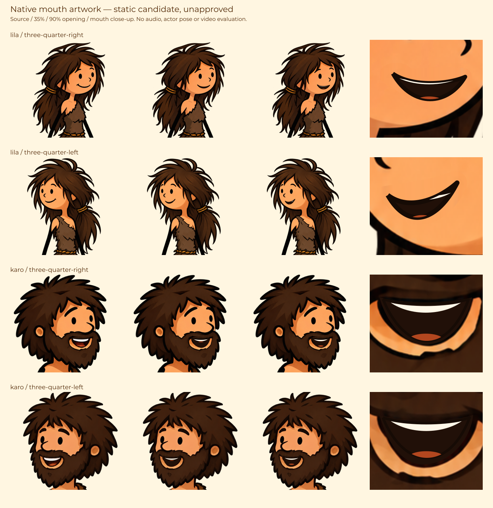

# Lila/Karo — lớp miệng ở góc nhìn bạn diễn

Mốc 0.30, 08/10/2026; foundation `6b3cf00179878c45e137af7ba300b6ba4c78708b`, fixture fixes `6433243`/`d6bc260c9b104cdcaad0999695166db70cbfa599` đã push/đối chiếu remote trên `codex/prehistoric-life`, tiếp nối `cb13bcb`. Đây là một phần tiếp tục của tool ba input, chưa là bản hoàn thành hay nghiệm thu video. Không cần dịch vụ image-to-video để triển khai.

## Source và lựa chọn

- `packages/animation/body-view-mouth.ts`: bốn mouth ROI gắn SHA256 và canvas native, SVG bounded clip, đường aperture/răng/lưỡi hai cubic, clock/envelope pure không dùng frame trước. Lila phục hồi nét cười cũ bằng strip da trong ROI; Karo giữ viền môi/râu ngoài vùng trong miệng, nền trong tối và răng/lưỡi. Không khép được môi của artwork grin Karo thành neutral thật; đó còn là việc author expression, không phóng/kéo cả mặt.
- `packages/host/schemas.ts`: optional `bodySpeech='registered-mouth-v1'`, chỉ hợp lệ cùng `artworkVersion='forest-body-view-1'`, actor và bodyView đã đăng ký. ActorDefinition dùng chung appearance schema. Mặc định thiếu bodySpeech giữ nguyên hình happy im lặng và lỗi khi có activity. Compiler13/14/15 mới nhận lựa chọn miệng; compiler cũ, source colour hoặc artwork khác không được âm thầm thay thế.
- `body-view-art.ts`: toàn bộ PNG đầu và mouth SVG trong cùng native scale/neck translation/head clip. Mouth candidate fingerprint đi vào bodyView→cutoutHead→head/body/caches; body compiler20 và body/head renderer13. Không đổi rig-label của tay, narrator words, provider/voice hoặc clock.
- `compiler.ts`: mouth paths qua cơ chế interpolation/refinement/GSAP literal hiện có, mouth-layer opacity liên tục trong attack/release. Activity schema và thứ tự/overlap được kiểm khi compile; sampler cũng giữ guard raw clock. Attack45ms/release70ms không mở rộng cửa sổ có lời. Interpolate level giữa sample centers liền nhau có level>0, không bắc qua gap hoặc interval0. Không thêm phoneme/word timing.
- `library/shots/cinematic.ts:42,60` đã lọc primary/supporting theo speakingSegmentIds qua `actorSpeech`, rồi trừ startMs của shot. Không cần fork renderer. Report mới ghi version/fingerprint, actor/view, activityMethod, input hash nếu có, `audioVerified=false` và `phonemeLipSync=false`. Có hash không chứng minh audio hợp lệ hoặc speaker assignment đúng.
- Workbench/server body có query/form `mouth=silent|registered-mouth-v1`. Preview dùng signal giả lập có nhãn **segment-draft**, không phát TTS/audio/video. Clip/data attributes được giữ khi ghi frame. Các link clock giữ mouth/view/colour; profile hash thay theo lựa chọn.

Một cue chỉ được giao cho một diễn viên theo contract upstream. Bản miệng này không chia câu hai người nói chung cue, không suy ra speaker/phoneme hay sửa lời kể. Ba input vẫn dùng chung tool: script nguyên văn→TTS/clock thật; WAV giữ audio/clock→ASR; story→kịch bản bám nội dung→voice/video. Legacy SRT, EN chính/VI/JA/KO và HTTP/command/local TTS tiếp tục giữ nguyên.

## Artwork tĩnh và bằng chứng



[SVG tài liệu](reviews/fixed-view-mouth-native-art-v1.svg), [số đo nativePNG/ROI/hash](../../library/topics/prehistoric-life/body-views/mouth-registration-v1.json).

`scripts/prehistoric-view-mouth-art.mjs` chỉ đọc native PNG, đo màu theo từng hàng và author figure SVG/PNG bằng Sharp; không gọi activity sampler/body evaluator/GSAP/browser/audio/scene/video. Bốn canvas/hash không đổi: Lila right1173×1341, left1024×1536; Karo hai phía910×1729. Dark bounding rows có thể chứa rìa face/hair/beard, không là suy luận anatomy. Figure gồm nguồn, opening35%,90% và ROI phóng to, không phải bốn frame trong clip thực tế.

Quan sát artwork tĩnh: không dịch mắt/mũi, màu mặt và tóc vẫn ấm; Lila mouth patch và corner/stroke cần review khi đổi activity; Karo grin/rim còn fixed, vùng răng/lưỡi mới phải kiểm seam/mask ở kích thước video. Native views vốn vẫn khác source về identity/proportion/costume và lớp tóc/cổ. Không dùng figure này để tuyên bố diễn xuất mượt hoặc giống ảnh gốc.

## Kiểm source và test còn thiếu

`npm run build`, `npm run test:typecheck`, `npm run schemas` và `git diff --check` được chạy ở lượt triển khai; kết quả cụ thể/commit trong [review record](reviews/fixed-view-speech-source-review-v1.md). Typecheck đầu tiên phát hiện literal widening trong test compiler; đã gắn PerformancePlan rồi typecheck lại. Source review độc lập đọc bounded subset, không chạy runtime.

**11 callbacks mới đều NOT RUN** trong `tests/fixed-view-speech.test.ts`: schema/default/old compiler; exact PNG/hash/dimension/ROI/URL; gap/zero/boundary; pure seek/head invariants; malformed clock; fixed-view guard; compiler/security/resources/report; namespace/workbench clip; actorSpeech cue/time ownership; canonical paired primary/supporting; cache/topic gate. Mười ca partner-view cũ và các ca foundation còn trạng thái trong handoff riêng.

Cho model test chạy trên đúng nhánh:

```powershell
Set-Location -LiteralPath 'C:/Users/Duongvh-pc/.codex/worktrees/stickman-acting-v22/Story-2-video-factory2.1'
git rev-parse HEAD
node --experimental-test-module-mocks --import tsx --test --test-concurrency=1 tests/fixed-view-speech.test.ts tests/partner-facing-views.test.ts
```

Ghi exact SHA, PASS/FAIL/NOT RUN và file evidence. Sau đó kiểm GSAP seek/playback tại attack/release/cue đổi người, zero/gap, tốc độ fps và peak code-size/time; kiểm clip không tràn miệng, duplicate ID, supporting im lặng khi primary nói. Dùng audio thực và hai cue riêng trước khi báo khớp tiếng. Kiểm riêng câu nói chạy qua hai shot: renderer hiện clip activity ở ranh giới shot trước khi áp envelope; attack/release sẽ khởi động/kết thúc theo cửa sổ local đó. Cần giữ phase nguồn qua shot để tránh miệng khép/mở lại giữa lời liên tục; chưa có source-context cho envelope của bản này. Audio/cue gốc không bị đổi, nhưng đây vẫn là hạn chế animation đồng bộ cần xử lý. Controller chưa chạy callback/browser/API/audio/video ở checkpoint này.

## Khởi động server test

Node≥22.13, npm/dependencies theo package-lock (TypeScript/Vite/Sharp/GSAP). Controller chưa restart8850 hay start8851. Trong PowerShell:

```powershell
Set-Location -LiteralPath 'C:/Users/Duongvh-pc/.codex/worktrees/stickman-acting-v22/Story-2-video-factory2.1'
powershell -ExecutionPolicy Bypass -File scripts/start-studio.ps1 -Port 8851 -ProjectsRoot 'projects-fixed-view-speech-test'
```

Giữ terminal; Ctrl+C dừng server này. Trang pose không cần model/TTS/API. Khi test pipeline có model, thêm `-EnvFile 'D:/github/Story-2-video-factory2.1/.env'` nếu key thực sự nằm đó; chỉ tham chiếu file riêng, không in/gửi/commit key. Không dùng file env không tồn tại hoặc khởi động lại project người dùng đang chạy.

URL dự kiến để model test mở sau khi start:

```text
http://127.0.0.1:8851/api/topics/prehistoric-life/body?action=rest&timeMs=1100&mood=happy&view=three-quarter-left&mouth=registered-mouth-v1
http://127.0.0.1:8851/api/topics/prehistoric-life/body?action=point&timeMs=2200&mood=happy&view=three-quarter-right&mouth=registered-mouth-v1
```

Đổi timeMs1600..1899 hoặc2650..2799 xem interval im lặng/zero giả lập; đổi về mouth=silent để đối chiếu native happy. Một page hiển thị hai mẫu calibration, không là scene thoại hai người được phân cue hoặc preview video liên tục.

## Điều kiện còn thiếu của toàn mục tiêu

Giữ `productionReady=false`, `productionRig=null`, identity/voice/source/target/sync final gates. Fixed-view candidate chỉ happy/rest/point/think, cùng các tool bên phải đã đăng ký; vẫn chặn gaze/turn/locomotion/seat/expression khác và tool bên trái.

Cần tiếp tục: identity/tỷ lệ/màu/nét source qua mọi view; mask neck/hair/costume và phần bị che; neutral/talking/blink/expression/gaze native; continuous turning, bước/chạy/nhảy/seating/cloth/hair follow; props/grip/contact/handoff và môi trường giàu màu/texture; source-envelope phase qua shot, audio/speaker ownership thật, exact timing nếu mixed-speaker cần contract mới; nghiệm thu seek/resume/cache/sửa script/đổi voice/host và ba input tạo video thật. Không dùng testV1 hoặc source review làm nghiệm thu sản phẩm mới.
