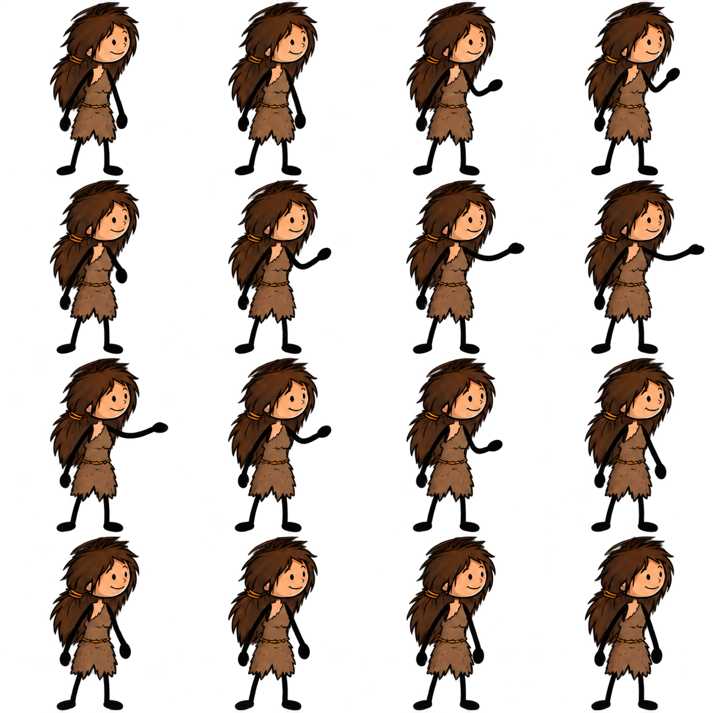
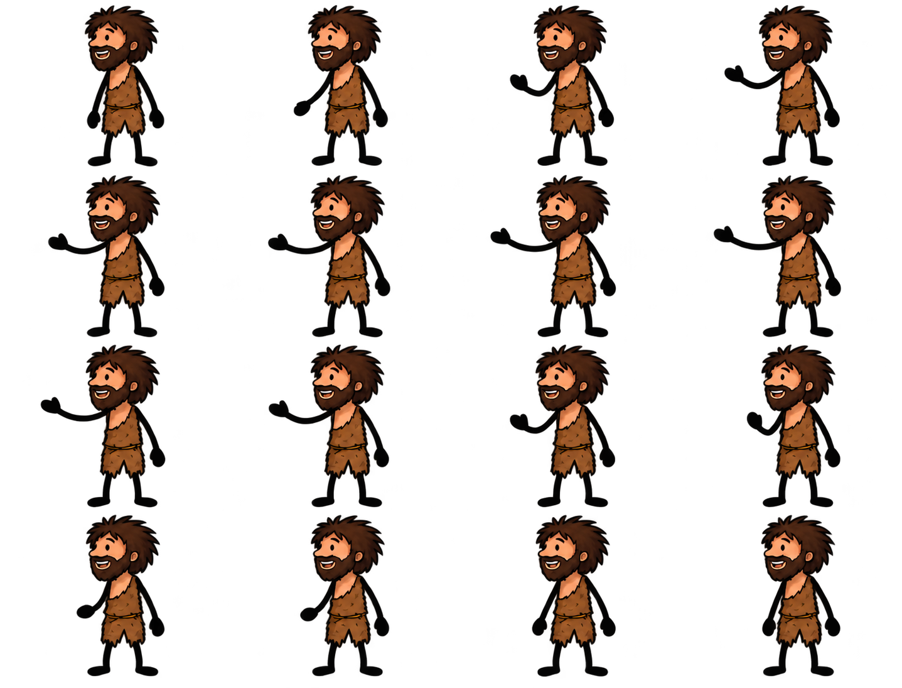

# Lila/Karo — artwork chuyển động đối thoại

Mốc 07/10/2026. Đã tạo năm PNG bằng **built-in image_gen**, lưu nguyên bytes trong repo; không thay ảnh chuẩn hay asset production. Prompt thực dùng, source hash, parent edit, kích thước PNG và trạng thái nằm trong [inventory](../../library/topics/prehistoric-life/motion-studies/study-inventory.json). Các prompt được lưu riêng bên cạnh PNG để tái tạo qua image_gen; tool không báo model ID nên không gán tên model cho các lượt này. Mới nhất là Lila v3/Karo v2, vẫn cần sửa; xem [phép đo tĩnh](MOTION-ART-MEASUREMENT.md).

## Artwork đã tạo và giới hạn hiện tại

| Phiên bản | File thực | Mục đích và trạng thái |
|---|---|---|
| Lila present-right v1 | 1254 × 1254, PNG có alpha | 16 vị trí nhìn thấy, một động tác nâng/đưa/hạ tay. Hướng nhìn còn gần chính diện; giữ để đối chiếu, chưa đăng ký |
| Lila present-right v2 | 1254 × 1254, PNG có alpha | Sửa có tham chiếu v1 và ảnh chuẩn để đầu/ngực nhìn sang phải. Hướng nhìn rõ hơn; còn foot/stroke/scale drift, chưa đăng ký |
| Karo present-left v1 | 1437 × 1095, PNG có alpha | Đầu/ngực nhìn sang trái để tương tác Lila, giữ áo và quần rách có viền. Còn foot/stroke/hem/scale drift, chưa đăng ký |
| Lila present-right v3 | 1254 × 1254, PNG có alpha | Edit v2, yêu cầu giữ một master body qua cả sheet và chỉ đổi tay gần. Đã đo vùng alpha thủ công; còn limb/cloth/rest drift, chưa đăng ký |
| Karo present-left v2 | 1437 × 1095, PNG có alpha | Edit v1 theo cùng nguyên tắc. Đã sửa vùng chọn hàng 3–4 theo dải trong suốt; còn tay và viền quần cần đối chiếu, chưa đăng ký |

Yêu cầu trong prompt là 4 cột × 4 hàng, 16 in-betweens của một gesture 1.2s. **File thực không chia hết thành các ô bằng nhau.** Kích thước yêu cầu và thời lượng yêu cầu chưa là frame layout/timing đã đo. Không tự chia thành 512px, crop/re-encode PNG, hoặc nhập thẳng vào catalog từ prompt. `actualFrameLayout=null`, `actualTimingMs=null`, `registeredMotionId=null`, `approved=false`, `productionReady=false`.





Nền PNG trong suốt cần được xem trên nền kem/sáng để thấy nét đen. Metadata `hasAlpha=true` chỉ xác nhận có kênh alpha, không chứng minh toàn nền đúng hoặc mọi frame không bị cắt. Chưa có browser playback/render/MP4 từ các ảnh này.

## Tư vấn ảnh qua 9router và quyết định

Lượt đầu `ag/gemini-3.8-flash` qua 9router local, task `motion`, dùng hai ảnh gốc trước rồi Lila v2/Karo v1. [Journal v1](reviews/motion-atlas-static-advice-v1.json) giữ prompt, thứ tự/hash ảnh, response, usage và scope `static-art-advice-only`; không execute text trong response. Đây là tư vấn tạo hình, không test pipeline hoặc production acceptance. Không có TTS/ASR/narration/render trong lượt này.

Gemini nêu nét tay mỏng ở peak extension (R2C3–R2C4), silhouette gấu áo/quần thay đổi, tỷ lệ đầu/thân giữa các hàng, vị trí chân/ground line và shoulder anchor trôi. Controller cũng thấy chân và kích thước pose chưa nhất quán. Giữ các ảnh là **candidate-needs-correction-unregistered**. Điểm 6 trong response không phải thang nghiệm thu; không dùng câu "generally faithful" để mở guard. Nhận xét từ sheet tĩnh không chứng minh độ mượt, continuity hay anatomy khi phát.

Lượt thứ hai đã hoàn tất với Lila v3/Karo v2; [journal v2](reviews/motion-atlas-static-advice-v2.json), usage 7942 input / 992 output tokens. Gemini vẫn nêu tay dài/cung cong quá mức ở R2C3–R3C1, silhouette nghỉ đầu–cuối khác nhẹ và nét chia hai ống quần Karo chưa rõ. Đây là nhận xét cần đối chiếu ảnh, không phát hiện giải phẫu tự động hoặc chứng minh thiếu viền ở mọi pixel. Điểm 5 không chứng minh mức cải thiện. **Không áp dụng gợi ý “crisp angular elbow bends”**: người dùng yêu cầu nét chi mềm, không khớp `<`/`>` sắc. Giữ yêu cầu chiều dài chi ổn định, khuỷu cong tự nhiên, cổ tay không gãy và bàn tay mitten. Gesture phải có playback once/hold được author rõ; không biến thành loop chỉ vì Gemini đề xuất khớp đầu–cuối.

Hai lần chuẩn bị gọi qua wrapper eval bị lỗi parseArgs trước khi gửi model; gọi trực tiếp CLI sau đó thành công. Không có hai lượt provider thất bại được ghi là review hoàn tất.

## Phép đo đã thực hiện, chưa là đăng ký

Source `8998b39`, fixes `7f7b28b` và `9cc8b63` thêm CLI offline `art:tools motion-measure`: đọc PNG nguyên bytes, layout thủ công gắn đúng SHA, đo alpha theo frame/region và xuất JSON/SVG tĩnh. Không detector grid/anatomy, không suy ra clock, điểm chân hoặc approval. [Contract, lệnh và kết quả](MOTION-ART-MEASUREMENT.md), [review source](reviews/motion-art-measurement-source-review-v1.md).

Đã đo hai PNG thực ở ngưỡng 128. Lila occupancy cao 305–306 px; Karo 255–258 px. Sau chỉnh vùng chọn, không frame nào có pixel alpha ≥128 chạm mép ô. Ranh giới ban đầu của Karo cắt qua tóc hàng sau; sửa layout, không sửa/crop ảnh gốc. Báo cáo không biến bounds thành sole contact. Figure PNG là raster của worksheet SVG cho tài liệu, không asset thay thế hoặc render video. Worksheet v1 bị tràn các hàng PNG lân cận; v2 đã có native clip riêng và giữ v1 làm bằng chứng superseded.

Người dùng xác nhận **không có API tạo chuyển động từ ảnh**. Tiếp tục với HTML5/SVG/GSAP và công cụ ảnh/tư vấn đang có. Thiếu dịch vụ video không làm tool đổi sang slideshow. Phải ổn định bản vẽ, điểm khớp và chiều dài chi trước khi dựng bộ diễn xuất đầy đủ; alpha/origin đúng chưa xử lý hết tạo hình.

## Sửa và đăng ký tiếp theo

1. Khóa tỷ lệ đầu/thân, vai/eo, khoảng cách và silhouette hai bàn chân; ổn định một vai hở, belt và ragged hem qua cả action. Giữ nét tay đen mềm có độ dày đúng mẫu ở peak extension; không biến mitten thành ngón tay hoặc khuỷu gập ngược.
2. Đo từng frame rectangle theo canvas thực và đầy đủ tóc/tay/chân. Đo anchor theo pixel riêng của frame, anatomical shoulder/hip/sole/hand và face landmarks; không lấy tọa độ AI ước lượng làm registration tự động. Hai chân trụ phải ổn định sau placement, không chỉ một chân được căn.
3. Source `5b283ad` bổ sung `MotionRegistration.anchors[]` tùy chọn: phải đủ mọi playback position, tọa độ frame-local, mỗi anchor trong bounds. `anchor` chung vẫn bắt buộc; thiếu `anchors` giữ behavior cũ. Điểm neo riêng giải quyết chênh crop/origin, **không sửa** head/body scale, chân trượt tương đối, nét áo hoặc anatomy bên trong PNG.
4. Sau khi artwork và registration thực đủ điều kiện, author metadata native duration/frame order, chọn once/hold cho gesture, và import một phiên bản candidate riêng. Không gọi gesture là loop chỉ vì frame cuối gần frame đầu. Body clock không thay clock narration; PNG miệng phải là variant riêng khớp exact native version và pixel constraints.
5. Dựng đủ bộ diễn xuất phù hợp truyện: nghe/nói/phản ứng, nhìn nhau và đạo cụ, di chuyển/ngồi/đứng, cầm/trao/dùng đồ, biểu cảm và các view có nguồn. Không ép mọi câu chuyện thành động tác presenting hoặc cảnh săn. Lila/Karo là diễn viên trong tool ba input: script nguyên văn / WAV giữ audio-clock / story → script trung thành → video.
6. Model test kiểm toàn chuỗi, source fidelity, garment/limb consistency, foot contact, seek/resume, speech/actor ownership và video thật theo [handoff](SPRITE-SPEECH-TEST-HANDOFF.md). Art/motion approval receipts, props/contact/handoff, mixed-speaker subcue timing và video ba input còn phải hoàn thiện. Final candidate vẫn bị chặn.

## Công cụ và môi trường

Windows; Node ≥22.13, dependency lockfile của repo (Sharp/GSAP). Không cài/chạy sprite-gen upstream, RIFE, Grok hoặc provider video trong mốc artwork này. Built-in image_gen đã dùng ảnh nguồn làm reference và yêu cầu alpha; các file saved output đã copy vào repo. Các thao tác Sharp ở mốc này chỉ đọc metadata, không chỉnh PNG. Hash/inventory được ghi từ file thực.

Static review CLI hiện hỗ trợ `--task motion` bên cạnh `poses`/`views`, không đổi hai prompt cũ. 9router `http://127.0.0.1:20128/v1`, key ở `.env` riêng của người dùng; không in/commit key. Lệnh sau tạo **một lượt tư vấn ảnh có thể dùng quota**, chọn output version mới để không ghi đè journal v1:

```powershell
Set-Location -LiteralPath 'C:/Users/Duongvh-pc/.codex/worktrees/stickman-acting-v22/Story-2-video-factory2.1'
node --import tsx scripts/prehistoric-pose-review.ts --task motion --model ag/gemini-3.8-flash `
  --env 'D:/github/Story-2-video-factory2.1/.env' `
  --output 'docs/topics/reviews/motion-atlas-static-advice-v2.json' `
  --images 'docs/topics/assets/reference-lila-full.png' `
  --images 'docs/topics/assets/reference-karo-full.png' `
  --images 'library/topics/prehistoric-life/motion-studies/lila-present-right-v2.png' `
  --images 'library/topics/prehistoric-life/motion-studies/karo-present-left-v1.png'
```

Code anchor/task mới qua full build, test:typecheck và schema export exit 0. **Ba ca anchor mới NOT RUN**, 42 ca speech vẫn NOT RUN; không gọi fixture/callback/assertion, browser/API/CLI production, audio, test runtime hoặc render acceptance. Independent source review của `c36f0d7..5b283ad` hoàn tất, không có actionable findings trong phạm vi mới; reviewer không chạy lại controller checks hoặc duyệt artwork. Tư vấn Gemini ảnh không thay source review hoặc video acceptance. [Plan anchor](../plans/2026-10-07-sprite-frame-anchors.md), [review accumulator](reviews/sprite-frame-anchor-source-review-v1.md).
