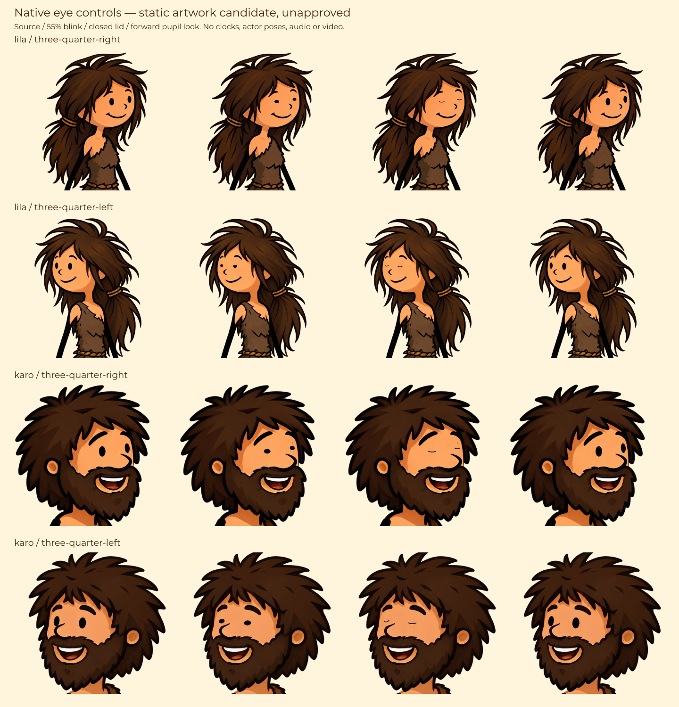

# Lila/Karo — mắt native, chớp mắt và nhìn bạn diễn

Mốc source0.32, 08/10/2026, tiếp nối `7add5d39002ada7d81300bc88c4b08cb0495f4c7` trên `codex/prehistoric-life`. Đây là lớp diễn xuất tiếp theo của tool; chưa là bộ biểu cảm đầy đủ, video đạt mẫu hoặc bản sản xuất được duyệt.

## Artwork và màu



Figure là SVG tài liệu với **giá trị shape đặt bằng tay**, không phải frame lấy từ body evaluator hoặc clip render. [SVG artwork](reviews/native-view-eyes-art-v1.svg), [crop/ink study](reviews/native-view-eyes-registration-study-v1.png), [đo native và skin strips](../../library/topics/prehistoric-life/body-views/eyes-registration-v1.json).

Mỗi actor × view dùng canvas/hash và tọa độ riêng. Giữ PNG nguyên bytes; mắt dùng glyph raster của chính PNG, không vẽ lại mắt hoặc scale/shear cả khuôn mặt. Overlay chỉ phục hồi footprint mắt cũ bằng skin strip từ PNG, dịch glyph trong ROI nhỏ và thêm đường mí mềm khi khép. Hai slot **screen-left/screen-right** chỉ là vị trí trên canvas, không đổi nhãn tay trái/phải trong rig.

Điểm đáng chú ý: mắt phía trái trên canvas Karo-left chạm nét mũi trong artwork native. Region sửa có cạnh chéo để giữ nét mũi; không dùng dark connected component lan sang mũi/tóc để suy mắt. Body/head clip, nose, brow, hair, mouth, màu mặt/tóc/trang phục ở ngoài ROI giữ nguyên. Karo mouth vẫn là grin native với overlay inner-mouth riêng, chưa có môi neutral khép thật.

Quan sát tài liệu tĩnh: blink/closed lid có hình mềm, mặt vẫn màu cam ấm, nét tóc/râu và khuôn mặt giữ nguyên; dịch pupil nhỏ theo hướng view. Tám skin strip đo darkPixels0/transparentPixels0 theo threshold đã ghi, **không chứng minh patch không có seam**. Cần review rìa ROI, skin gradient, mắt-mũi Karo-left và sự phù hợp với ảnh cận gốc ở kích thước video. Các view native vốn vẫn chưa được duyệt identity/tỷ lệ/masks. Figure không là art approval, optical gaze hay motion acceptance.

## Source và contract

- `appearance.bodyEyes='registered-eyes-v1'` là lựa chọn rõ trong shared Host/Actor appearance schema. Chỉ đi cùng actor + `forest-body-view-1` + registered bodyView. Default thiếu bodyEyes giữ intact native eye; source orientation không tự chọn mắt 3/4. Miệng speaking vẫn phải chọn bodySpeech; eye-only actor không được nhận activity có lời nếu chưa có mouth candidate.
- `packages/animation/body-view-eyes.ts`: exact native SHA/dimension/URL binding, clips, native glyph/skin/lid, pure bounded look/blink transforms và corner error của matrix interpolation. Default layer opacity0 giữ ảnh nguồn. ROI/skin/glyph khác nhau theo từng PNG; không mirror một view làm view kia.
- `body-view-art.ts`: eye/mouth layers trong cùng uniform native head attachment/clip. Eyes fingerprint đi vào head/body/rig/scene identity; body compiler22. Không đổi chiều dài xương, cuff/grip/sole hoặc narrator words/voice.
- `compiler.ts`: target direction lấy từ **tâm mắt native đã chiếu ra world**, rồi inverse head rotation; không lấy góc từ cổ hoặc dùng world-X cho đầu nghiêng. Explicit target sau facing hemisphere bị chặn, cần view/turn đúng. Pupil chỉ dịch có giới hạn; không mô phỏng eyeball3D, head turning hay khẳng định nhìn chính xác quang học. Happy/fixed head/body/locomotion/unsupported expression guards giữ nguyên.
- Blink deterministic period3500ms/duration140ms, actor phase khác nhau; khi có source context dùng `shotLocalTime+sourceOffset`. Grid chứa source blink start/quarter/peak/end, gaze ramps và refinement. Native matrix error đo tại corners rồi quy ra pixel để bound nội suy, ngoài opacity checks hiện có. Test runtime vẫn phải xác minh GSAP interpolation thực, không chỉ pure evaluator.
- `actors/speech-clock.ts`/canonical cinematic renderer: eye-only silent actor cũng nhận clock nguồn, exact owner/span/projection validation, ownership input identity và repair binding. Primary/supporting dùng cùng path. Source/actor ownership contract, cache/locked conflict/source comparison/transaction vẫn giữ. Không suy speaker từ gaze hoặc blink.
- Workbench/API body thêm `eyes=native|registered-eyes-v1`, `look=rest|ahead|up|down`, giữ lựa chọn trong form/clock links. Native source/default incompatible choices báo needs-view-eyes/gaze. Đây chỉ là pose inspection. Mouth signal nếu chọn vẫn **segment-draft giả lập**, không audio/video.

Report có candidate version/fingerprint, actor/view, blinkClock/sourcePhase và `opticalGazeVerified=false`, `approved=false`. Clock/binding không xác minh waveform/identity. Blink giữ source phase; **gaze tracks vẫn có ramp theo local clip**. Nếu hai shot liên tục cùng target, cần thiết kế/handoff gaze phase để tránh rest/reset; whole-body/head/breath/cloth continuity cũng còn phải làm. Không dùng mốc này tuyên bố mọi thành phần qua cut đều liên tục.

## Kiểm source và ca runtime bàn giao

Chi tiết actual checks/review trong [review record](reviews/native-view-eyes-source-review-v1.md). Controller chỉ đọc source, build/typecheck/schema export và author SVG tài liệu/đo PNG; không chạy callback, body evaluator, GSAP, browser/API, audio, pipeline hoặc MP4.

**10 callbacks mới NOT RUN**, `tests/native-view-eyes.test.ts`:

1. Native bytes/size/schema/default selection và profile identity.
2. Passive SVG/resource/independent views/screen slots/protected nose region.
3. Bounded pure shapes, native centers, closed lids, random access, invalid input, matrix corner bound.
4. Opt-in/front-hemisphere gaze và expression/motion/voice guards.
5. Native eye origin/head-local direction và actor+target translation invariant.
6. Eye-only silent actor blink phase tại source cut/seek, owner/span guard.
7. Compiler source events/refinement/namespace/resource/report/duration.
8. Canonical primary speaking+eyes/supporting eye-only/listening, ownership binding and unique IDs/resources.
9. Workbench/API selections, link state, validation422/source error.
10. Production/candidate gate không thay đổi.

Canonical fixture mượn stage kỹ thuật để kiểm renderer/contract, không phải nội dung sản phẩm hoặc giới hạn chủ đề. Bộ0.31 phase14 ca, mouth0.30/partner0.29 và legacy giữ trạng thái nghiệm thu riêng. Cho model test chạy trên đúng SHA:

```powershell
Set-Location -LiteralPath 'C:/Users/Duongvh-pc/.codex/worktrees/stickman-acting-v22/Story-2-video-factory2.1'
git rev-parse HEAD
node --experimental-test-module-mocks --import tsx --test --test-concurrency=1 tests/native-view-eyes.test.ts tests/source-speech-phase.test.ts tests/fixed-view-speech.test.ts tests/partner-facing-views.test.ts tests/artwork-repair.test.ts
```

Ghi SHA/PASS/FAIL/NOT RUN/output/evidence. Kiểm thêm actual GSAP seek/playback, mặt tại source/local blink peaks, gaze ramps/target phía sau, độ ổn định ROI/skin patch và nose contact. Đo code-size/compile time/fps với audio-RMS thật, hai actor cùng visible, nhiều cuts; test cache/resume/locked changes/repair stale ownership và voice/script edits. Không dùng source review, figure hoặc test V1 làm nghiệm thu diễn xuất mới.

## Server và môi trường

Node≥22.13; npm/package-lock, TypeScript/Vite/Sharp/GSAP hiện có. Chưa start8851/restart8850 ở mốc này. Dùng PowerShell:

```powershell
Set-Location -LiteralPath 'C:/Users/Duongvh-pc/.codex/worktrees/stickman-acting-v22/Story-2-video-factory2.1'
powershell -ExecutionPolicy Bypass -File scripts/start-studio.ps1 -Port 8851 -ProjectsRoot 'projects-native-view-eyes-test'
```

Giữ terminal; Ctrl+C dừng server đó. URL để model test mở sau khi start:

```text
http://127.0.0.1:8851/api/topics/prehistoric-life/body?action=rest&timeMs=2250&mood=happy&view=three-quarter-left&eyes=registered-eyes-v1&look=ahead
http://127.0.0.1:8851/api/topics/prehistoric-life/body?action=rest&timeMs=2770&mood=happy&view=three-quarter-right&eyes=registered-eyes-v1&look=rest&mouth=registered-mouth-v1
```

2250ms là peak blink local Karo,2770ms là Lila; page cả hai actor có phase khác nhau, chưa là episode hai người đã chia lời thoại. `eyes=native&look=rest` đối chiếu ảnh native. Eye/pose page không cần TTS/model. Pipeline 9router/TTS dùng config/env riêng đã có; không gửi/in/commit key, không ghi đè project ở8850. Endpoint/key/server runtime chưa được kiểm ở checkpoint này.

## Toàn mục tiêu còn tiếp tục

`productionReady=false`, `productionRig=null`; final identity/voice/source/target/sync gates giữ nguyên. Còn identity/tỷ lệ/source RGB và seams qua mọi view; native neutral/talking/full expressions/brows/mouth; continuous turns/whole-body/head/gaze/breath phase, walk/run/jump/seating và cloth/hair; props/contact/handoff; môi trường giàu màu/texture; test runtime/visual và ba input tạo video thật.

Tool vẫn là kịch bản nguyên văn→TTS/clock thật; WAV giữ audio/clock→ASR; câu chuyện→kịch bản bám nội dung→voice/video, legacy SRT. EN chính/VI/JA/KO và HTTP/command/local TTS giữ nguyên. Lila/Karo đóng vai bên trong bất kỳ câu chuyện người dùng đưa; không trở lại người dẫn cố định, máy móc hoặc demo săn. Không có API image-to-video không làm dừng phần SVG/HTML5/GSAP. Mục tiêu đầy đủ vẫn active.
