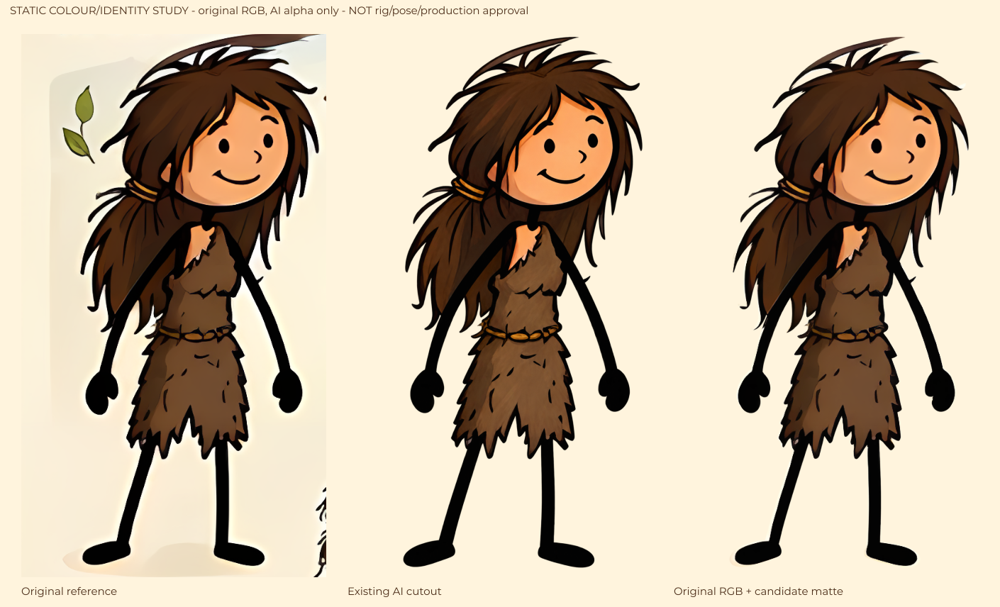
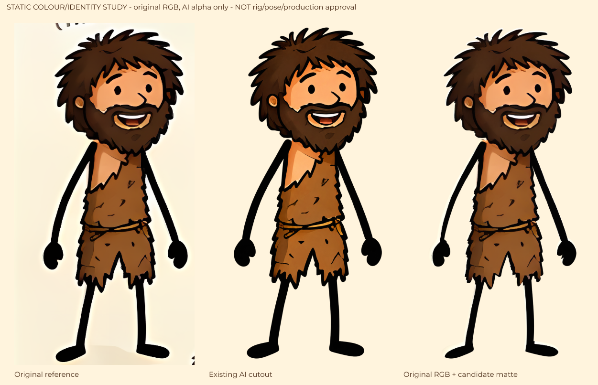

# Giữ màu và nét vẽ gốc của Lila/Karo

Ngày 08/10/2026. Đây là mẫu authoring SVG tĩnh để giữ phần màu của đúng hai ảnh cận người dùng gửi. Chưa phải model đã đăng ký, animation hoặc video đã duyệt. Yêu cầu vẫn là Lila/Karo đóng vai trong câu chuyện, với màu da ấm, tóc/râu nâu, áo lông một vai và tay chân nét đen mềm.

## Đã làm

Hai SVG nhúng nguyên bytes PNG tham chiếu cho lớp RGB. Alpha của bản tách AI hiện có chỉ được dùng làm matte, ánh xạ về canvas nguồn. Không dùng RGB đã được AI vẽ lại để thay mặt/mắt/mũi/miệng, texture áo hoặc màu nguồn. Filter làm trắng RGB của matte nhưng giữ alpha trước khi dùng luminance mask; không dựa vào thuộc tính SVG alpha-mask có mức hỗ trợ khác nhau giữa các renderer.

| Diễn viên | RGB nguồn và kích thước thật | Matte hiện có và kích thước thật | Mẫu SVG |
|---|---|---|---|
| Lila | [reference-lila-full.png](assets/reference-lila-full.png), 430×766, không alpha | [lila-cutout-v1.png](../../library/topics/prehistoric-life/lila-cutout-v1.png), 939×1675, có alpha | [lila-source-rgb-master-v1.svg](../../library/topics/prehistoric-life/source-rgb-masters/lila-source-rgb-master-v1.svg) |
| Karo | [reference-karo-full.png](assets/reference-karo-full.png), 377×716, không alpha | [karo-cutout-v1.png](../../library/topics/prehistoric-life/karo-cutout-v1.png), 910×1728, có alpha | [karo-source-rgb-master-v1.svg](../../library/topics/prehistoric-life/source-rgb-masters/karo-source-rgb-master-v1.svg) |

[Inventory](../../library/topics/prehistoric-life/source-rgb-masters/inventory-v1.json) ghi exact SHA-256 của từng nguồn/matte/master/figure, kích thước, phương pháp ánh xạ và giới hạn. `approved=false`, `productionReady=false`, `registeredRigId=null`. Kích thước PNG matte độ phân giải cao khác tọa độ source-unit của rig; không thay giá trị 430×766 hoặc 377×716 trong rig bằng kích thước pixel của matte.

Đã raster hai tài liệu so sánh bằng Sharp từ SVG tĩnh và xem ảnh. Ba cột lần lượt là ảnh gốc, cutout AI hiện có và RGB gốc dưới matte ứng viên:

Mặt, màu da, nét cười và texture gốc được giữ trong vùng matte cho phép. Quan sát cũng thấy viền nền sáng, phần tóc/áo bị cắt và chỗ biên tay/chân chưa trùng. Karo thấy rõ viền ở tóc, vai và bàn chân; Lila còn chênh ở tóc và chân. Hai cột bên phải không được coi là pixel-identical cutout hoặc artwork đã đạt.

## Phần cần hoàn thiện trước khi nối rig

1. Căn silhouette/matte riêng từng model theo ảnh gốc; xử lý viền nền và các khe tóc/tay/chân, giữ viền áo đen. Không co dài thân hoặc đổi mặt để vừa matte AI.
2. Tách lớp đầu, tóc trước/sau, cổ, thân áo, hai phần vạt áo, tay/cuff/palm và chân/sole trong tọa độ nguồn. Vùng bị che cần authoring có provenance riêng; crop từ ảnh đứng không tự có phần che khuất.
3. Đo và đăng ký anchor/neck/shoulder/hip/cuff/palm/sole theo từng lớp; giữ ảnh màu gốc của các phần thấy được. Mẫu whole-body SVG này không cung cấp các registration đó.
4. Làm các góc nhìn bạn diễn, biểu cảm và miệng phù hợp từng góc. Không kéo glyph trên mặt gốc hoặc lật whole-body để giả near/far limbs.
5. Nối candidate rig theo version/hash mới để cache hình hết hiệu lực; giữ narration/audio hợp lệ. Preview phải cho thấy tạo hình, viền áo và màu trên nền rừng/ngày/hoàng hôn/đêm trước khi có art receipt.
6. Model test kiểm các pose/chuyển tiếp, môi trường dựng và ba luồng script/WAV/story. Chỉ có receipt đúng artifact/version và đủ kiểm tra mới xét điều kiện final.

## Phạm vi và môi trường

Mẫu này dùng SVG `<image>`/filter/mask và Sharp trong dependency dự án; không cần API tạo video từ ảnh, Grok/Veo/Kling hoặc RIFE. Khi authoring lại, lưu version mới, giữ cả ảnh nguồn/matte cũ và ghi hash mới. Không chạy bộ import/production chỉ để kiểm màu một tài liệu tĩnh.

Controller không gọi body evaluator, test callback/fixture/assertion, GSAP, browser, API/CLI sản xuất, model/TTS/ASR/audio hoặc render MP4 trong bước này. Đây là authoring và xem tài liệu tĩnh, không phải test runtime hoặc xác nhận đã mượt như video tham chiếu. Studio/model production vẫn dùng rig ứng viên hiện có; hai master mới chưa được chọn tự động.

Các thay đổi góc khớp là công việc khác, xem [SOURCE-ARM-TRAJECTORIES.md](SOURCE-ARM-TRAJECTORIES.md). Matte sạch không chứng minh motion đúng; FK giữ chiều dài cũng không sửa artwork. Cần hoàn thiện cả hai trước khi giao tool ba input để sử dụng.
