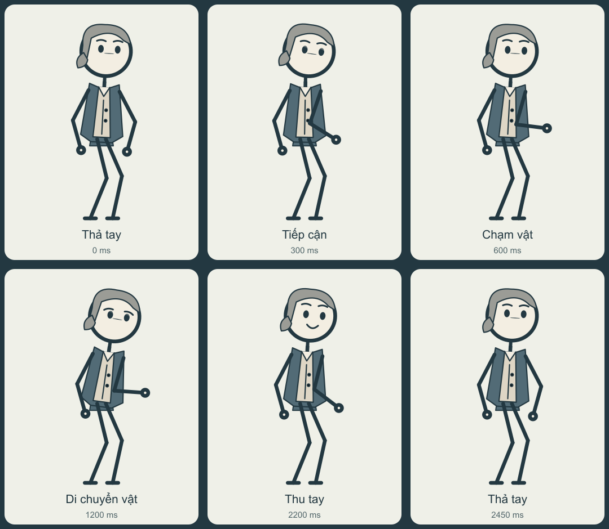

# Sửa khuỷu tay theo hình người dùng — performance2.2.7

Người dùng chỉ ra khuỷu nghỉ gập vào thân ở bản cũ và vẽ hướng mở ra ngoài. Compiler đổi pole IK cho tư thế nghỉ, chuyển hướng qua duỗi để tránh bật khuỷu. Động tác suy nghĩ dùng cung trong tọa độ vai, giữ điểm đầu/cuối và tránh đi gần tâm vai.

Auditor độc lập Nash chạy trên worktree `codex/stickman-acting-v22`, base22953fa; snapshot thực tế là director21/performance7/artwork4. Báo cáo hoàn tất08:51:01UTC ngày02/10/2026. Source và TypeScript không đổi giữa08:45:24 và08:48:35UTC.

| Command | UTC | Exit | Result |
|---|---|---:|---|
| `node --import tsx --test --test-concurrency=1 tests/animation.test.ts tests/story-actors.test.ts tests/actor-studio.test.ts` | 08:45:34–08:46:36 | 0 | 145/145;0 skipped |
| `npm.cmd run test:typecheck` | 08:45:36–08:45:46 | 0 | Test TypeScript |
| `npm.cmd run build` — người triển khai | Bản performance7 | 0 | Core/server/CLI, Studio TypeScript, Vite |

16 regression mới kiểm tra hai rig và hai profile story-actor thật: khuỷu nghỉ ngoài vai, fixed lengths/joins; idle→point/think/pick-place→idle; raw frame và GSAP/AttrPlugin đã bake; reverse seek; contact, attached prop và release destination. 40 animation tests cũ,43 story-actor và46 Actor Studio vẫn được giữ. Assertions và ngưỡng không đổi từ bản6 sang bản7.

Raw length/join <.002px; contact <1px; compiler interpolation ≤.2px; baked joins <.21px. Guards tốc độ dùng 1ms/2.5ms và epsilon ±.001ms. Đây là regression hình học, không phải chuẩn tốc độ giải phẫu hoặc chứng nhận cảm giác chuyển động tự nhiên.

Compiler SHA256: `9c0b7ee1eafe12c957de0c6b483537aa0046ad4de1d0a1fced23043473699def`. 121 module nạp runtime được ghi hash; runtime manifest `952bdfbe79fb29c505f9c877245a70b1971906a84ce6a451aa9269a90f00889e`. Các process test đã terminal; PID tái sử dụng cho conhost khác được xác minh qua thời điểm tạo, không bị kill.

Lịch sử: performance6 **143/145 FAIL2**, robot think recovery xoay nhanh gần vai. Giữ report/log đỏ; bản7 sửa production, không giảm ngưỡng. Full suite khác **378/386 FAIL8** trước thay đổi này vẫn là lịch sử đỏ, cần report execution mới.

**NOT CERTIFIED:** ánh xạ tay trái/phải giải phẫu (`left/right` hiện là tọa độ rig), thẩm mỹ/video toàn bài, native model/TTS, matrix đầu vào actors, editor browser và nghiệm thu sản phẩm. Runtime resume mock HyperFrames; GSAP và Sharp ở các ca được nêu là thật. Authored film của người triển khai là proof thiết kế riêng, không thuộc chứng nhận auditor này.

Ảnh do compiler7 tạo từ vai Watt trong storyboard authored. Không phải chứng cứ lịch sử. Full logs/source inventories/media giữ tại task-state của người triển khai; V1 TEST-RESULTS.md giữ nguyên.
