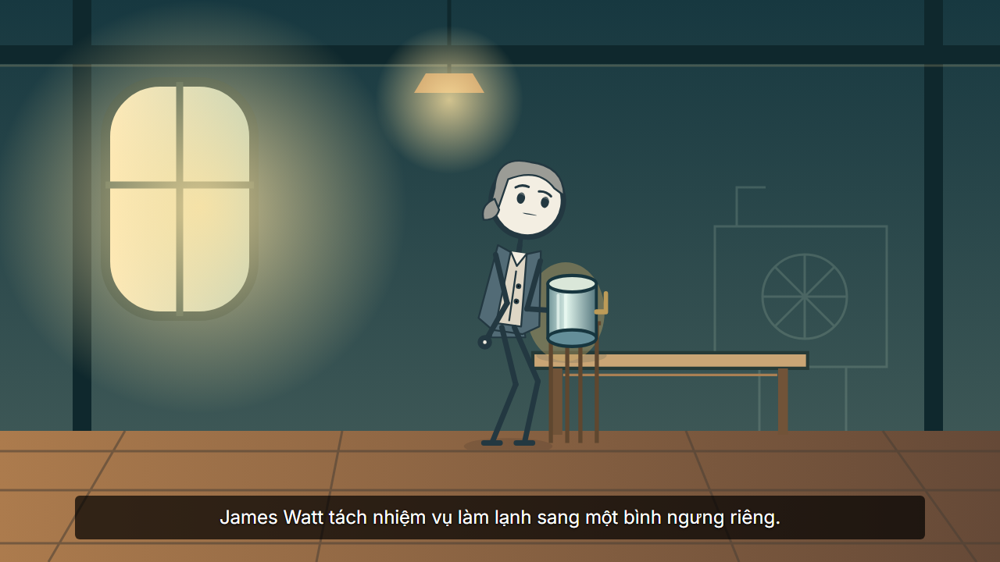

# Independent actor regression — source2.2.21

Auditor: Nash, model độc lập với người triển khai. Ngày02/10/2026, receipt07:00:09UTC, hoàn tất báo cáo07:10:34UTC, trước giới hạn15phút. Source tại nhánh `codex/stickman-acting-v22`, base22953fa; chưa commit tại thời điểm audit. Source fingerprint thực tế được ghi, không dùng base SHA để thay cho bytes đã kiểm tra. Auditor không sửa repo, không đổi assertion hoặc cấu hình provider.

| Command | Thời gianUTC | Exit | Kết quả |
|---|---|---:|---|
| `node --import tsx --test --test-concurrency=1 tests/actor-studio.test.ts tests/story-actors.test.ts` | 07:03:57–07:04:34 | 0 | 89/89;46 Studio,43 actor;0 skipped |
| `npm.cmd run test:typecheck` | 07:03:59–07:04:05 | 0 | Test TypeScript qua |

Hai tiến trình đã kết thúc; các PID không còn tồn tại khi kiểm tra lúc07:06:47UTC. Toàn bộ119 module runtime/test nạp trong lượt chạy có SHA256 trước/sau giống nhau. CSS responsive và tài liệu được chỉnh tiếp ngoài phạm vi module runtime này; không dùng audit này để chứng nhận UI.

## Đã kiểm tra

- Cast SVG, preview PNG, poses, profile/rig khớp file và hash; output copy giữ đường dẫn cast đọc được; file thiếu/tamper bị chặn.
- Actor mutation cập nhật mọi lần xuất hiện và rig; resume qua orchestrator/resolver giữ đúng bytes narration, voiced narration và WAV, dựng lại phần hình.
- Named actor Watt/Black trong shot không cần character bible cũ; resolver sinh asset đã duyệt, ruleReview không báo unknown character.
- Actor/global/shot locks; ID dài; bỏ identity bị khóa; giữ actor khi replan/migration bằng response fixture; không mất lock của raw board cũ.
- Revision stale409, project busy409, locks423, identity thiếu nguồn422; lỗi không làm hỏng artifacts.
- Primary actor thao tác mô hình có nguồn: authored/model được nhận, contact và interpolation đúng; nguồn/target/placement/contact sai bị chặn. Lỗi missing artDirection của lượt45/46 cũ nay bị chặn.
- Role/name/source/cue/continuity/speech assignment, costume và SVG thật qua Sharp; gradient, clip geometry và các gate security.

Ca resume và scene publication có mock HyperFrames browser validation. Model replan dùng structured fixture. Resolver, ruleReview, nguồn, compiler, API injection, file/hash và Sharp nêu trên là production path thật.

## Không chứng nhận

**NOT RUN:** autonomous model, live TTS, browser editor, final film render/QC, matrix script/WAV/SRT/aligned đầy đủ, đổi host/giọng/nội dung toàn luồng, mọi tổ hợp migration/cache, tamper reconciliation riêng ở DONE và thẩm mỹ. Không tuyên bố toàn sản phẩm PASS. Handoff đạo cụ giữa actor/xuyên cut hiện chưa hỗ trợ.

Lượt trước45/46 FAIL được giữ trong evidence gốc; báo cáo này là execution mới. V1 hoặc suite presenter cũ không thay nghiệm thu actors.

## Art sample đã chỉnh tay

Frame từ MP4 authored37.154s của người triển khai: tạo hình Watt, đạo cụ nhỏ hơn, bàn và background nhiều lớp. Narration clock được đo từ giọng Việt. Thiết kế được chỉnh từ response native bị từ chối và ghi `origin=authored`; technical DONE/QC không có nghĩa auditor đã xem/nghe hoặc duyệt video. Luồng native source21 đã dừng lỗi provider.

Log, full report119-hash và media gốc giữ ngoài Git tại thư mục task-state của người triển khai. Mẫu ảnh trên là illustration do hệ thống dựng, không phải tư liệu lịch sử.
